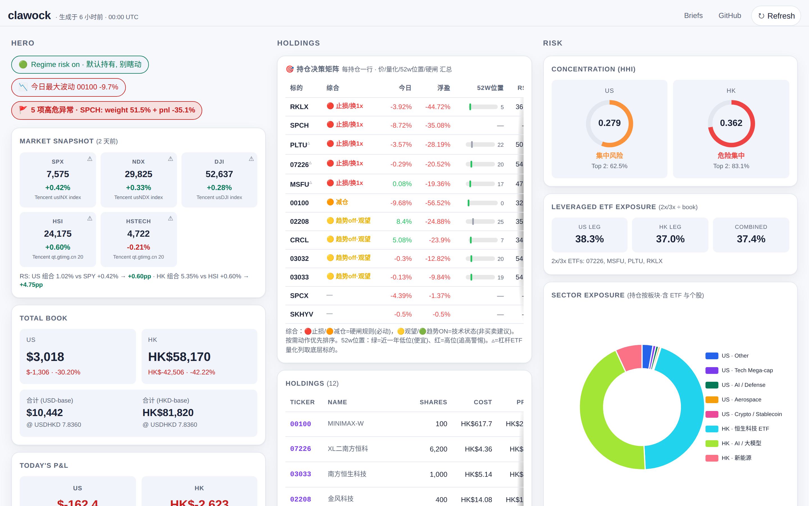
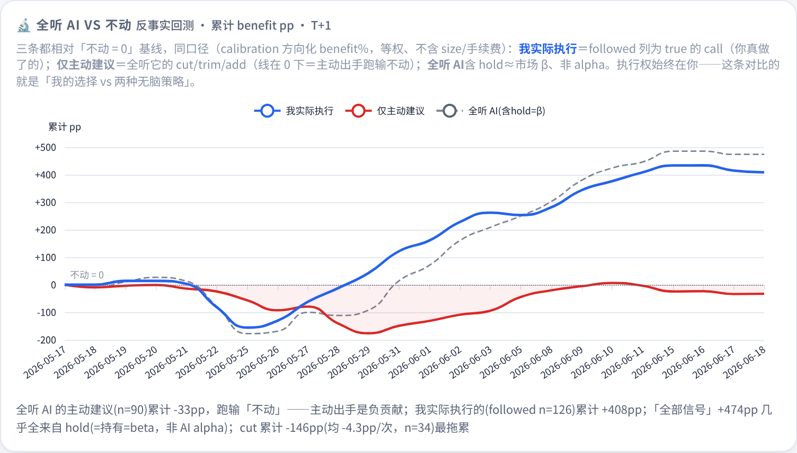

<div align="center">

# 📈 clawock

### An LLM swarm that watches my **real** HK + US money every trading day — and grades itself the next morning.

[](https://kcnyu.github.io/clawock/)
[](https://github.com/KCNyu/clawock/actions/workflows/harness-regression.yml)
[](https://github.com/KCNyu/clawock/actions/workflows/cron-health.yml)
[](https://github.com/KCNyu/clawock/actions/workflows/weekly-health.yml)
[](#-license)

[**🎯 Live Dashboard**](https://kcnyu.github.io/clawock/) · [**📅 Daily Briefs**](https://kcnyu.github.io/clawock/briefs.html) · [**How it works ↓**](#-the-60-second-version)

**English** · [**简体中文**](README.zh.md)

<br>

<a href="https://kcnyu.github.io/clawock/">
  
</a>

<sub>Real positions. Real P&L. The page updates after every cron run; this screenshot refreshes weekly via a <a href="https://github.com/KCNyu/clawock/actions/workflows/screenshot-refresh.yml">GitHub Action</a> so it never drifts.</sub>

<br>

<a href="https://kcnyu.github.io/clawock/"></a>

<sub>📱 Cycling all six tabs — Hero · Holdings · Risk · Signals · Plan · <b>Reflect</b> (the self-grading scorecard). Regenerated weekly alongside the screenshot.</sub>

<br><br>

🪞 **Grades its own trades** — and admits they lose to buy-and-hold &nbsp;·&nbsp; 💸 **Real money**, not a paper sim &nbsp;·&nbsp; 🗣️ **Bull-vs-bear AI debate** every morning &nbsp;·&nbsp; 🛡️ **Python does the math** — unit-tested, so the LLM can't fudge the score &nbsp;·&nbsp; 🌏 **Bilingual** HK + US &nbsp;·&nbsp; 🌐 **Live public dashboard**

<sub>If "an AI that's honest about being wrong" is your kind of thing — ⭐ it.</sub>

</div>

---

> **TL;DR** — A multi-agent LLM runs a real Hong-Kong + US stock portfolio, debates bull-vs-bear each morning, and back-tests its own calls every night. Its verdict on itself, in public: the active calls *lose to simply holding*. The honesty is the point.

## 🎰 The 60-second version

I gave an LLM a real brokerage portfolio — a Hong Kong leg and a US leg, actual money — and wired up a small machine around it.

Every trading day, on its own, the system:

- 🌅 wakes up **~10 times** (HK open, mid, close → US open, intraday, overnight, close),
- 📥 pulls fresh prices, FX, volatility, earnings calendars, macro (VIX/DXY/10Y), Reddit + news sentiment, even **Trump/Musk market-movers**,
- 🧠 hands the clean data to the best-available LLM — playing a blunt persona named **Rick** — to write the take,
- 📲 pushes a briefing to my **WeChat**, and
- 🌐 refreshes a **public dashboard** you can open right now.

That's the gimmick: *a whole AI desk that trades alongside me and never sleeps.*

But here's the part most "AI trader" demos skip 👇

## 🪞 It grades its own homework — and admits it's losing

Every brief doesn't just talk. It commits a structured **`plan.json`**: each call gets a trigger, a confidence number, and a simulated entry price. The next morning the system reads it back, checks which triggers actually fired, simulates the P&L, and logs the result to a rolling scorecard.

So I can tell you, with receipts, how the AI is *actually* doing:

| What the AI did | Sample | Hit rate | Honest verdict |
|---|---:|---:|---|
| **cut / trim / add** (active calls) | n=166 | **50%** | basically a coin flip |
| high-conviction calls (confidence ≥ 0.75) | n=14 | **43%** | still overconfident |
| **just `hold`** | n=188 | **60%** | this is β, not α |
| 🔴 "chasing a high" warning | n=58 | 57% | flags the move, can't time it |
| 🟡 "oversold, might bounce" | n=140 | 36% | catching knives |

> Read that again: on this sample, **the model's active signals underperform simply holding.** The system *says so itself*, in public, because the scorecard is computed in Python and the LLM isn't allowed to fudge it. The honesty is the feature — most of the value of an "AI analyst" is knowing when to ignore it.

**There's now a curve for it.** A counterfactual *"if you'd followed every call"* backtest (the LLM only advises — execution is always mine) reuses the same direction-signed benefit% the scorecard already logs, and plots three lines against a `do-nothing = 0` baseline on the **Reflect** tab: **what I actually followed**, **follow-only-active**, and **follow-everything**. The active-only line sits **−33pp below doing nothing** (T+1; −46pp at T+5); the "all signals" line's +474pp is almost entirely `hold` = market β; and *what I actually did* tracks that beta (I mostly held) — so you can see my real path against both naive policies, and *watch* the active calls bleed relative to a hold.

<p align="center"></p>

<sub>Numbers are point-in-time from `memory/calibration.csv`, `quant_signal_review.json`, `t0_setup_review.json` and move as samples grow. Factors with n < 20 are shown but **barred from influencing decisions** until they earn it.</sub>

> 💸 **And the real book?** As of Jul 2026, on a peak-net-principal basis the live combined portfolio sits at **−22%** — US leg **+41%**, HK leg **−37%**, leverage cutting both ways (realized +\$2.9k, unrealized −\$5.8k; 30-day Sharpe −6.5). It's on the dashboard in real time. *That's* the number the honesty is about — not a backtest I get to re-run, but the one book I actually have to live with.

**The scorecard is built not to fool itself.** Three guards stop a noisy number from masquerading as edge:

- **95% confidence intervals on every rate.** "catalyst 70%" is really `[63–90]` at n=84 — the one driver whose band clears 50%. Any rate whose band straddles 50% (macro, peer) is flagged `edge_significant: false`: statistically indistinguishable from a coin flip.
- **A risk-adjusted verdict, not just hit-rate.** By *frequency* the LLM's calls look **+4.4pp** ahead of a hold. By *return* that shrinks to **+0.42pp** — indistinguishable from zero — against a portfolio β of **3.4**. So a leveraged-beta "win" is never mistaken for skill.
- **Catalyst-gate discipline.** Only `catalyst` has a CI-proven edge, so an active cut/trim/add must name the hard catalyst that justifies it (and the one that would *invalidate* its thesis). The dashboard tracks how many actually do — currently ~7%, i.e. most active calls are still filter-grade technicals.

---

## 🎯 How it actually decides

Behind the persona is a fixed decision framework — not freeform vibes. Every call is attributed, gated, and bucketed before it's allowed to count.

**1. Attribution-first — and the edge is measured.** Every call is tagged by *what drove it*, then scored over time. On the live record:

| Driver | Hit rate | How it's used |
|---|---:|---|
| **catalyst** (earnings, FOMC, dated event) | **70%** (n=84) | the only driver allowed to *initiate* an action |
| **technical** (trend / RSI / levels) | **52%** (n=231) | a filter, never the thesis |
| macro | 50% (n=20) | context; a coin-flip on its own |
| **peer / 抱团 read-across** | **31%** (n=13) | the worst — herd reasoning is actively distrusted |

**2. Hard catalyst vs. soft sentiment.** Soft sentiment (Reddit, mood, a single tweet) can only nudge a *confidence* number — it can never flip the action bucket. Only a hard, dated catalyst can.

**3. Falsify, don't confirm.** In a risk-on tape the default is `HOLD`. A *confirming* bullish story doesn't trigger a buy; the model first has to clear a disconfirming check and a "is this already priced in?" test (the last-5-day move).

**4. Conviction is capped by hard risk gates.** However sure it feels: single name ≤35%, Top-2 ≤70%, leverage-ETF sleeve ≤50%, portfolio β ≤3.0, stop at −18%. Position size is bounded by construction, not by mood.

**5. Leverage is dialed by regime, not timed.** A 200-day-trend × volatility dial sets a multiplier (×1 / ×0.5 / ×0) on the leverage-ETF cap. The backtest lesson behind it: the alpha was in *de-leveraging in the wrong regime*, not in calling tops.

**6. Quant signals must earn the right to speak.** A factor layer (MA cross, 12-1 momentum, RSI-14, z-score, ATR chandelier stop, vol-target sizing) runs in Python — but each factor is **barred from influencing a decision until it clears n≥20 and proves a hit rate.** Unproven factors are shown, never obeyed.

Everything resolves into an action bucket with an explicit trigger — `cut` / `trim-on-rebound` / `hold` / `T-only` / `add-only-on-trigger`. That bucket list *is* the `plan.json` graded the next morning: **the strategy and the scorecard are the same object.**

---

## 🗣️ Every morning, the desk argues with itself

The 08:00 deep brief isn't one model's monologue — it's a structured **multi-agent debate**, borrowed from [TradingAgents](https://github.com/TauricResearch/TradingAgents) and adapted for a dual-leg book:

- **Tier 1 — four analyst lenses.** Fundamental / technical / sentiment / sector-rotation each read the *same* `context.json` and merge into one table. Numbers only, no vibes.
- **Tier 2 — Bull vs Bear.** Two researchers build opposing cases (hold/add vs trim/cut), each citing ≥2 concrete Tier-1 data points. The hard rule: **they must genuinely disagree on at least one position** — unanimous agreement means the debate failed and is thrown out.
- **Tier 3 — three risk voices + a Judge.** Aggressive, Conservative and Neutral each argue their corner; a **Judge** weighs them, names which strategy frame is driving each decision, and resolves the argument into concrete bucketed actions with triggers.

The goal isn't consensus — it's **forcing a real bear case to exist before anything is held**, so the book never just talks itself into its own positions. The Judge's verdict *is* the `plan.json` that gets graded the next morning.

---

## 📅 What a day actually looks like

```
03:00  🌙  memory "dreaming" — promote yesterday's lessons into long-term notes
08:00  📊  daily deep brief   — multi-tier analysis + a judge model, ships to WeChat
09:30  🇭🇰  HK open  → 10:00–11:30 / 14:00–15:30 intraday → 12:00 mid → 16:00 close
21:30  🇺🇸  US open  → 22:00–02:30 intraday (incl. overnight) → 04:00 close
            ↑ every run also refreshes the public dashboard
weekend 🛰️  macro / sentiment / influencer / news scans keep the page warm
```

All times HKT. Markets closed? A **holiday + weekend gate** skips the run instead of burning tokens and writing a stale price as if it were live.

---

## 🏗️ The whole machine on one page

Not just "a cron daemon calling scripts." The *deterministic* half is — prices, FX, delivery and reconciliation should never ride on a model's mood. The **agent** half is eleven independent LLM turns wrapped inside those scripts, the brief's debate swarm, watchdogs supervising them, and a reconciliation layer arbitrating shared state. **Deterministic scaffolding, agentic judgment — that split *is* the architecture:**


The **solid path** (schedulers → harness → shared state → gates → publish) is the deterministic backbone that runs whether or not a model behaves. The **agents** — eleven `LLM turn` instances plus the `swarm` — only ever write *opinions* into shared state; everything factual is arbitrated by code. The **dotted edges** are the parts people forget: the watchdog that catches a stalled turn, and the self-learning loop that grades yesterday's `plan.json` and feeds the score back in. That's what makes it a multi-agent desk, not a scripted report generator.

---

## 🛡️ Why it doesn't quietly break

Running real automation for months taught me that the hard part isn't the prompt — it's everything that goes wrong *around* it. Three ideas carry the whole thing:

<table>
<tr><td width="33%" valign="top">

**1. Harness pattern**

Every job is `preflight (Python) → LLM → postflight (Python)`. Deterministic work — prices, FX, HHI, signal counting — runs 100% in code. The LLM only writes the *opinion*. Forget FX, miss a snapshot, skip a >3% mover → postflight catches it and flags the report. The money math is **unit-tested**, and a **pre-push gate refuses to publish a book that doesn't reconcile** — the numbers can't silently drift.

</td><td width="33%" valign="top">

**2. Self-learning loop**

`plan.json` today → graded tomorrow. The scorecard feeds confidence calibration back into the next brief, so the model is continuously confronted with its own track record instead of vibing forever.

</td><td width="33%" valign="top">

**3. Defense in depth**

Four independent layers — cron → GitHub Action backstop → system-crontab watchdogs → health sentinels. A single LLM stall, a missed cron, or a flaky data source **never silently drops a report**.

</td></tr>
</table>

<details>
<summary><b>🔧 Under the hood</b> — model chain, write reconciliation, the genuinely tricky bits</summary>

<br>

**Models.** Interactive chat runs on Claude (via the `claude-cli` runtime, reusing my Claude Code login — no key in the repo). The unattended briefs/reports run on a pinned **`MiniMax-M3`** with a fallback chain behind it (`GLM → DeepSeek → GPT → Claude → Haiku`). Mixed protocols: Claude/MiniMax speak `anthropic-messages` (thinking is its own block); GLM/DeepSeek/OpenAI speak `openai-completions`. A third-party reasoning model **must** be registered with `"reasoning": true` or its thinking silently locks off — a trap I paid for once.

**Write reconciliation (the one genuinely hard part).** `dashboard.json` is 100% derived, yet many jobs touch `master` — the cron daemon, ~11 GitHub Actions, system-crontab backstops, ad-hoc sessions. Months of race-condition incidents converged on one rule: **one writer per file.**

- **The frontend reads the scan sidecars directly.** `macro / sentiment / influencer_feed / us_news_digest / em_news` are no longer embedded into `dashboard.json`; `index.html` fetches each file itself at load. So a GitHub Action only ever commits its *own* disjoint sidecar — those writers can't conflict, and a scan appears on the page the instant its commit lands, with no rebuild. (GH Actions still serialize among themselves via `concurrency: group: data-write`.)
- **`dashboard.json` has exactly one publisher path.** Only the local harness postflights and a flock-guarded `publish_dashboard.sh` crontab rebuild it; both hold the same `/tmp/dashboard_publish.lock`, so two rebuilds can never interleave. The publisher re-commits **only on a semantic diff** (wall-clock fields stripped), so a freshness tick alone never spams a no-op commit.
- **Everyone pushes through `safe_push.sh`** — rebase-retry, abort (don't loop) on a real conflict; a committed conflict marker is **rejected at the push hook** so a broken `dashboard.json` can never reach Pages.
- **Portfolio numbers are gated at the door.** `portfolio.json` — the single source of truth — is written under an advisory `flock` + read-fresh-then-overlay (`mutate_json`, atomic `os.replace`), closing the load-modify-write race class. A **pre-push hook blocks any push whose book fails a money-conservation identity** (`TCV = Σ value`, `cash = baseline + trades + adjustments`, `cost = moving-weighted`), so an un-reconciled edit can't reach Pages — and those pure derivations are pinned by a `pytest` suite in CI.

</details>

---

## 📐 House rules the code enforces

The constraints `postflight` won't let the model violate. Quant readers will recognize why each exists:

- **🪙 FX — HKD and USD never sum directly.** Totals are always shown in both views with the rate + timestamp stamped (`USDHKD = 7.83, source Frankfurter, <ts>`). Adding two currencies naively is a meaningless number.
- **🔢 Manual-entry guards.** The few hand-typed values (cash balances, gold-fund reconciliation) get fat-finger checks: a cash number that jumps ≥5× vs the last snapshot, or a gold avg-cost that diverges from NAV, is flagged before it silently corrupts total assets.
- **📊 Concentration — HHI per leg.** `HHI = Σ wᵢ²`, plus Top-2 weight. Buckets: `<0.15` ✅ · `0.15–0.25` 🟡 · `0.25–0.40` 🟠 · `>0.40` 🔴. Computed per leg, never blended.
- **🎲 Leverage ETFs — judge the underlying.** Tickers whose name carries a leverage marker (`倍`, `Direxion`, `T-Rex`, `ProShares`, `2X/3X Long`, …) skip fundamentals entirely — for a daily-reset 2×/3× product, fundamentals are noise; a **regime dial** (200-day trend × volatility) caps how much leverage is allowed instead.
- **💵 Return basis — peak net principal.** Return % uses `true_principal` = peak net deposit from the cash-flow ledger, *not* `cost − realized`. A realized win shrinks `cost − realized` and fakes a higher return; the ledger basis doesn't move.

---

## 🧬 Stack & sources

[Claude Code](https://claude.com/claude-code) · [openclaw](https://openclaw.com) (cron daemon) · [ECharts 5.5](https://echarts.apache.org/) · Jekyll + GitHub Pages · Python 3.11 · pure-static frontend

**Public data** Tencent · stooq · yfinance · Frankfurter · SEC EDGAR · Finnhub · Nasdaq · Eastmoney · Polygon · Alpha Vantage · Reddit JSON · Google News RSS · Trump Truth Social feed

<sub>The news layer is deliberately **bilingual**: Finnhub + Google News (English/US) *and* Eastmoney company news + 7×24 快讯 (Chinese/HK), since half the book is Hong Kong and HK catalysts surface in Chinese sources first. Information breadth is the one axis kept wide on purpose — it's what an LLM is best at — separate from the deliberately-narrow decision layer.</sub>

<details>
<summary><b>📊 Data toolkit — 26 endpoints across 8 layers, with per-host reachability</b></summary>

<br>

Every fetcher is **no-key-first** (public endpoints before any API key; the one that needs a key — Finnhub — has a key-free fallback) and **multi-source** (a dead primary falls through to the next; an empty fetch keeps the prior value instead of overwriting). The **Reach** marks are measured on the live server IP, not claimed: ✅ stable · 🟡 flaky / rate-limited · 🔴 IP-banned here (code kept — works from another IP).

| Layer | Endpoints | Primary sources |
|---|:---:|---|
| 1 · Market | 5 | Tencent gtimg · Yahoo v8 · Eastmoney fund |
| 2 · Fundamentals & filings | 2 | SEC EDGAR · Eastmoney datacenter |
| 3 · Capital flow | 1 | Eastmoney push2his |
| 4 · News | 3 | Eastmoney · Finnhub · Google News |
| 5 · Macro & sentiment | 4 | Yahoo · Reddit · Truth Social |
| 6 · Quant signals | 4 | derived (pure arithmetic) |
| 7 · FX & integrity | 2 | Frankfurter · local invariants |
| 8 · Backtest & calibration | 5 | local snapshots + daily bars |

- **1 · Market** — `fetch_us_stocks` US live prices, multi-provider chain ✅ · `analyze_us_stocks` US refresh + RSI ✅ · `analyze_hk_stocks` HK live + HSI/HSTECH + news + signals ✅ · `fetch_benchmark_history` SPY/HSI/HSTECH daily bars ✅ · `fetch_gold_dca` gold-fund 000217 NAV ✅
- **2 · Fundamentals** — `fetch_us_filings` 10-K/10-Q · Form 4 · 13F · XBRL (SEC EDGAR) ✅ · `fetch_fundamentals_em` US/HK statements + key metrics ✅
- **3 · Capital flow** — `fetch_fundflow_em` daily main/large/mid/small net order flow 🟡
- **4 · News** — `fetch_em_news` HK company news + 7×24 flash (Chinese) ✅ · `gh_action_news_digest` US holdings news → actionable bullets ✅ · `fetch_catalysts` next-14-day earnings/events 🟡
- **5 · Macro & sentiment** — `fetch_macro` VIX + macro read ✅ · `fetch_sentiment` Reddit WSB/stocks/investing 🟡 · `fetch_influencer_feed` Trump/Musk market-movers 🟡 · `fetch_peers` peer prices + 5-day P&L ✅
- **6 · Quant signals** (pure arithmetic, zero external deps) — `compute_quant_signals` dual-MA/momentum/RSI/ATR/vol-target ✅ · `compute_regime` leverage dial (200DMA + vol band) ✅ · `compute_t0_setups` T+0 setup grading + chase detection ✅ · `portfolio_risk_metrics` β / Cov-Var / drawdown / concentration ✅
- **7 · FX & integrity** — `fetch_fx` USDHKD, 3-route fallback ✅ · `preflight_integrity` money-conservation gate (TCV/PNL/FX/cash) ✅
- **8 · Backtest & calibration** — `backtest_hstech_regime` · `backtest_us_leverage` · `backtest_combined_regime` · `shadow_backtest` ("what if I'd followed every AI call") · `quant_signal_review` + `t0_setup_review` (T+1/T+5 hit-rate self-audit) ✅

**Anti-ban** — all Eastmoney calls route through one wrapper `_em_http.em_get()`: in-process serialization (≥1s gap + random jitter), single reused `Session`, 3 retries then graceful `None`. Full per-file catalog: [`scripts/data/README.md`](scripts/data/README.md).

</details>

<details>
<summary><b>📂 Repository layout</b></summary>

<br>

```
clawock/
├─ index.html  briefs.md                    ← Pages landing
├─ assets/data/        built by harness + GH Actions, never hand-edited
│   ├─ dashboard.json  risk.json  catalysts.json  fx.json
│   ├─ macro.json  sentiment.json  influencer_feed.json  us_news_digest.json  ← scan sidecars, fetched straight by the frontend
│   ├─ quant_signals.json  quant_signal_review.json     ← factor scorecard
│   └─ t0_setups.json  t0_setup_review.json             ← intraday setup scorecard
├─ portfolio.json                           ← single source of truth (atomic writes)
├─ tests/                                    ← pytest: money-conservation derivations (CI-gated)
├─ MEMORY.md  DREAMS.md                      ← iron rules + nightly "dreaming" promotion
├─ memory/
│   ├─ {date}-pre-open.md  {date}-plan.json  ← brief output + structured plan
│   ├─ calibration.csv                       ← the self-grading scorecard
│   └─ snapshots/{date}.json
├─ scripts/
│   ├─ data/      fetchers · build_dashboard.py · risk/quant/regime/t0 compute · safe_push.sh
│   └─ harness/   {brief,report,intraday}_{pre,post}flight.py · watchdogs
└─ skills/{name}/SKILL.md
```

</details>

---

## ⚠️ Disclaimer

This repo contains **real, live trading positions** — that's the whole point of sharing it, and also the reason to take everything in it with a fistful of salt. It is a personal record and a portable workspace. It is **not investment advice**, not a recommendation, and **not something you should copy** — the scorecard above literally shows the active calls underperforming a hold. Every number is point-in-time and may be stale by the time you read it. `Rick` is opinionated by design; that doesn't make him right.

## 📄 License

Personal-use repository. No license granted for derivative trading systems, automated copy-trading, or commercial use. The *patterns* (harness layout, fallback-chain design, HHI formulation, atomic IO, the self-grading loop) may be adapted under any compatible open-source license if reused independently.

---

<div align="center">

### ⭐ Star it if "an AI that's honest about being wrong" is your kind of thing.

[**🎯 Live Dashboard**](https://kcnyu.github.io/clawock/) &nbsp;·&nbsp; [**📅 Daily Briefs**](https://kcnyu.github.io/clawock/briefs.html) &nbsp;·&nbsp; [**简体中文**](README.zh.md)

<sub>Built and maintained by <a href="https://github.com/KCNyu">Shengyu Li (kcn)</a> and Rick · 2026</sub>

</div>
