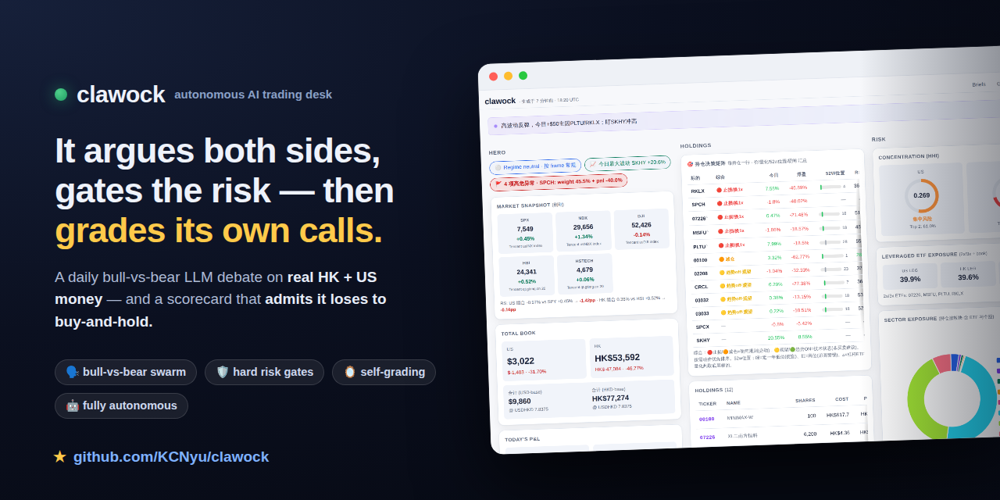
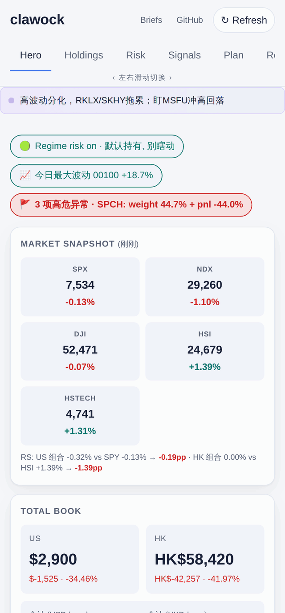
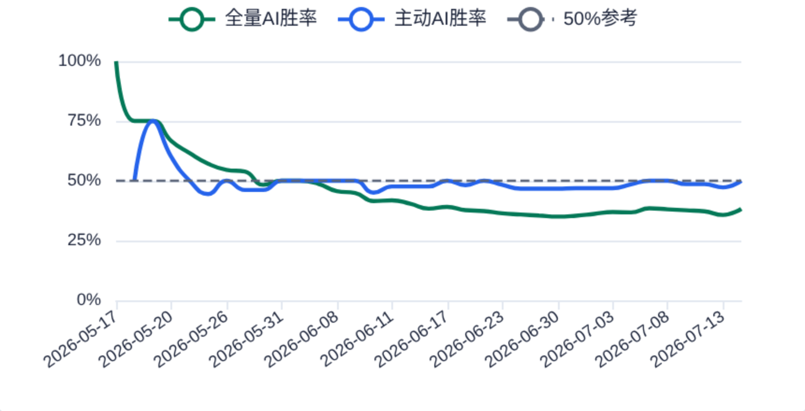
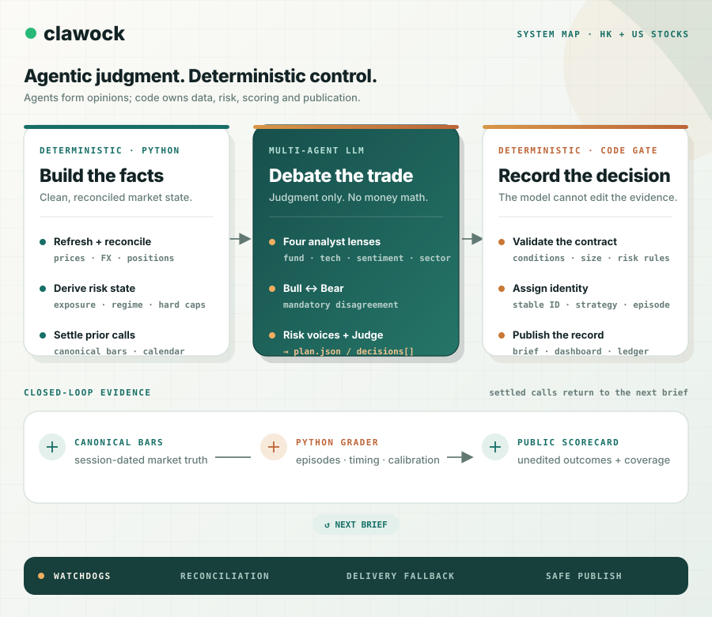

<div align="center">

# 📈 clawock

### 一群 LLM,每个交易日盯着我**真金白银**的港股 + 美股仓位 —— 而且第二天早上会给自己打分。

[](https://kcnyu.github.io/clawock/)
[](https://github.com/KCNyu/clawock/actions/workflows/harness-regression.yml)
[](https://github.com/KCNyu/clawock/actions/workflows/cron-health.yml)
[](https://github.com/KCNyu/clawock/actions/workflows/weekly-health.yml)
[](#-许可)

[**🎯 实时仪表盘**](https://kcnyu.github.io/clawock/) · [**📅 每日简报**](https://kcnyu.github.io/clawock/briefs.html) · [**它怎么跑的 ↓**](#-60-秒看懂)

[**English**](README.md) · **简体中文**

<br>

<a href="https://kcnyu.github.io/clawock/">
  
</a>

<sub>真实持仓,真实盈亏。这张卡片和截图每周由 <a href="https://github.com/KCNyu/clawock/actions/workflows/screenshot-refresh.yml">GitHub Action</a> 自动刷新,永不过期。</sub>

<br>

<a href="https://kcnyu.github.io/clawock/"></a>

<sub>📱 循环六个标签页 — 总览 · 持仓 · 风控 · 信号 · 计划 · <b>诚实</b>(自评战绩卡)。跟截图一起每周自动重生。</sub>

<br><br>

🪞 **给自己打分**——数字什么样就公开什么样,每天更新 &nbsp;·&nbsp; 💸 **真金白银**,不是模拟盘 &nbsp;·&nbsp; 🗣️ 每天早上一场 **AI 牛熊辩论** &nbsp;·&nbsp; 🛡️ **成绩由 Python 另算**——模型评不了自己 &nbsp;·&nbsp; 🌏 **双语** 港股 + 美股 &nbsp;·&nbsp; 🌐 **实时公开仪表盘**

<sub>如果"一个敢承认自己错的 AI"对你胃口 —— ⭐ 一下。</sub>

</div>

---

> **一句话** —— 一群 LLM 跑着一个真实的港股 + 美股组合,每天早上牛熊辩论,每晚回测自己的判断。它对自己的判决**每个交易日更新、公开可查,难看也不改**——主动建议至今没显出优势。诚实本身就是卖点。

## 🎰 60 秒看懂

我把一个真实的券商组合 —— 一条港股腿、一条美股腿,真金白银 —— 交给一个 LLM,然后在它周围搭了台小机器。

每个交易日,它自己:

- 🌅 醒来 **约 10 次**(港股开盘、午盘、收盘 → 美股开盘、盘中、隔夜、收盘),
- 📥 抓最新价格、汇率、波动率、财报日历、宏观(VIX/DXY/10Y)、Reddit + 新闻舆情,甚至 **Trump/Musk 的市场异动**,
- 🧠 把洗干净的数据交给当前可用的最佳 LLM —— 扮演一个嘴很直的人格 **Rick** —— 写出观点,
- 📲 把简报推到我的**微信**,并
- 🌐 刷新一个**公开仪表盘**(你现在就能打开)。

这就是噱头所在:*一整张永不打烊、和我一起盯盘的 AI 交易台。*

但大多数"AI 炒股"演示会跳过下面这一段 👇

## 🪞 它按策略 episode 打分，不拿每日重复 call 凑样本

每份简报提交 v2 `plan.json`。同一股票可以同时存在多个策略，例如长期 `core_position`、日内 `intraday_t` 与组合层 `risk_rebalance`；不同时间尺度同日结论不同是正常的，不再被压成一条综合动作。

唯一权威账本是 `memory/decisions.jsonl`。每条决策都有稳定 ID、策略、条件、仓位、置信度、驱动源、执行状态和评估状态。触发与结算走 `memory/bars/` 里**未复权的逐日行情**（单一 canonical 行情源，非交易所直连），按各自市场的交易日历计算——未收盘的 session 永远不参与打分。跳空穿过触发价的按开盘价成交，不按触发价：假装能在跳空前的价位成交，等于白送一段收益。休市、需人工核实、或标的当日无交易的，标为无法评分并公示条数，而不是悄悄从分母里消失。同一策略/动作的连续重申合并成一个 episode，因此连续五天写 hold 不会伪造五个样本——把触发价重锚到股价已经跑到的位置，仍然是重申，不是新的 call。一个 episode 的成绩取其内部已结算 call 的**平均值**，而不是推选其中某一条——做过多次 call 的 episode 经常自己跟自己矛盾，让首条或末条代表全组，能仅凭这个选择就把主动 call 胜率推过 50% 线。

Reflect 仪表盘展示：

- 累计 episode 胜率对 50% 方向命中线；
- 嘴上说的把握 vs 实际胜率，并与「留一法常数预测」对照 —— 这是信心值想有意义必须先跨过的门槛；
- 按日期聚类的 bootstrap 区间，避免把同日 call 当独立证据；
- 执行率拆成「要动手的」和「不用动的」两类分别统计 —— 因为「照做 HOLD」＝坐着没动，它自己给自己打 ~97%；混在一起平均出的 ~50% 不描述任何人。

**这里不发布「听 AI 多赚多少」的金额指标。** 现有快照缺少稳定的时点口径，日内高低价也可能跨交易日复用，同时多数建议没有真实成交可供核对，因此无法可靠区分实际执行与反事实结果。逐交易日行情已经有了；还缺的是真实成交记录和明确的「同股数当天收盘就卖」对照账本，所以金额指标继续不发。

这份战绩只量择时。风控硬闸和 HOLD 纪律不在里面，而在这个组合上恰恰是它们在真正干活 —— `assets/data/guardrail_history.jsonl` 从 2026-07-15 起开始积累证据。

LLM 只提交决策，不能写入或修改评估结果；ID、触发、分组和指标由 Python 流程按已记录的数据机械计算。这个隔离防止模型自评，但**不保证行情输入、触发判断或指标口径正确**；当前战绩仅作诊断，不作收益证明。

<p align="center"></p>

<sub>累计 episode 胜率，50% 为方向命中参考线；只是方向判断的命中率，不代表收益。v1 历史已迁入 v2 episode 账本；由 GitHub Actions 每周刷新。</sub>

---

## 🎯 它到底怎么决策

人格背后是一套**固定的决策框架,不是凭感觉**。每个判断在被允许"算数"之前,都要经过归因、闸门、归桶三道。

**1. 归因优先 —— 而且 edge 动态计算。** 每条决策标注唯一主导源；当前样本数、平均 benefit、胜率和日期聚类区间全部来自 `decision_metrics.by_driver`，README 不再写死某个时点的命中率。

**2. 硬催化 vs 软情绪。** 软情绪(Reddit、氛围、一条推)只能微调*置信度*数字,**永远翻不动操作分桶**。只有有日期的硬催化才能。

**3. 证伪,不证实。** risk-on 行情里默认 `HOLD`。一条*印证*利好的消息**不触发买入**;模型得先过一道证伪检查 + 一道"是不是已经 price in 了?"(近 5 日涨跌)测试。

**4. 信心被硬风控闸封顶。** 不管多笃定:单票 ≤35%、Top-2 ≤70%、杠杆 ETF 腿 ≤50%、组合 β ≤3.0、止损 −18%。仓位由结构约束,不由情绪。

**5. 杠杆按 regime 拨档,不择时。** 一个"200 日趋势 × 波动率"的刻度盘给杠杆 ETF 上限一个乘子(×1 / ×0.5 / ×0)。背后的回测教训:alpha 在*在错的 regime 里降杠杆*,不在抄顶。

**6. 量化信号必须挣到话语权。** 一层因子(双均线、12-1 动量、RSI-14、z-score、ATR 吊灯止损、波动目标仓位)在 Python 里跑 —— 但**每个因子在清过 n≥20 并证明命中率之前,禁止进入决策**。没证过的因子只展示、绝不照做。

所有东西最终落进一条或多条带明确条件的策略决策。同股的 `core_position`、`risk_rebalance`、`intraday_t`、`event_trade`、`tactical_entry` 可以并存，并在各自 episode 中结算。

---

## 🗣️ 每天早上，这张桌子自己跟自己吵

08:00 的深度简报不是单个模型的独白 —— 是一场结构化的**多智能体辩论**,借鉴 [TradingAgents](https://github.com/TauricResearch/TradingAgents) 并针对双腿组合改造:

- **Tier 1 —— 4 个分析师视角。** 基本面 / 技术面 / 情绪面 / 板块轮动,各自读*同一份* `context.json`,合并成一张大表。只准用数字,不准 vibes。
- **Tier 2 —— Bull vs Bear。** 两个研究员组装对立的案子(持有/加仓 vs 减仓/砍仓),各自至少引 2 个具体的 Tier-1 数据点。硬规则:**至少要在 1 个仓位上真分歧** —— 一致同意 = 辩论失败,直接作废。
- **Tier 3 —— 3 个风险声音 + 一个 Judge。** Aggressive、Conservative、Neutral 各自争自己那一方;一个 **Judge** 给它们称重、点名每个决策由哪个 strategy frame 驱动,把争论收敛成带条件的策略决策。

目的不是达成共识 —— 是**逼着一个真实的空头案在任何持仓被保留之前先存在**,这样这张组合永远不会只是自己把自己说服进自己的仓位。Judge 的裁决*就是*次日被打分的 `plan.json`。

---

## 📅 一天到底长什么样

```
03:00  🌙  记忆「做梦」—— 把昨天的教训提升进长期笔记
08:00  📊  每日深度简报 —— 多层分析 + 一个裁判模型,推送到微信
09:30  🇭🇰  港股开盘 → 10:00–11:30 / 14:00–15:30 盘中 → 12:00 午盘 → 16:00 收盘
21:30  🇺🇸  美股开盘 → 22:00–02:30 盘中(含隔夜)→ 04:00 收盘
            ↑ 每次运行都会顺手刷新公开仪表盘
周末   🛰️  宏观 / 舆情 / 影响力 / 新闻扫描,让页面保持新鲜
```

全部 HKT。休市怎么办?一道**节假日 + 周末闸**会跳过运行,而不是烧 token、把一个隔夜旧价当成实时价写进去。

---

## 🏗️ 一页看懂整台机器

不只是"一个 cron 在调脚本"。**确定性**那一半确实是——报价、汇率、投递、对账,绝不能押在模型的心情上。而 **agent** 那一半,是被脚本包住的十一个独立 LLM turn、简报里的辩论 swarm、监督它们的 watchdog,以及仲裁共享状态的对账层。**确定性脚手架 + 需要判断处的 agent —— 这个切分本身就是架构:**



**实线路径**(调度器 → harness → 共享状态 → 闸 → 发布)是不管模型乖不乖都照跑的确定性骨架。**agent**——十一个 `LLM turn` 加那个 `swarm`——只往共享状态里写**观点**,事实性的东西全由代码仲裁。**虚线边**是大家容易忘的部分:捕捉卡死 turn 的 watchdog,以及给昨天 `plan.json` 打分再喂回来的自学习闭环。这些才让它是一张 multi-agent 交易桌,而不是脚本化的报告机。

---

## 🛡️ 为什么它不会悄悄崩

把真实自动化跑了几个月,我学到:难的不是 prompt,而是它*周围*所有会出错的东西。三个想法撑起了整套系统:

<table>
<tr><td width="33%" valign="top">

**1. Harness 模式**

每个 job 都是 `preflight(Python)→ LLM → postflight(Python)`。确定性的活 —— 价格、FX、HHI、信号计数 —— 100% 在代码里跑。LLM 只负责写*观点*。忘了 FX、漏了快照、跳过 >3% 异动 → postflight 抓出来并给报告打标记。算账函数有**单元测试**;**pre-push 闸会拒绝发布违反资金守恒的组合账本**。它挡的是账本自相矛盾,不保证行情口径正确。

</td><td width="33%" valign="top">

**2. 自学习闭环**

今天的 `plan.json` → 明天被打分。战绩表把置信度校准反馈回下一份简报,让模型不断被自己的真实战绩打脸,而不是永远凭感觉。

</td><td width="33%" valign="top">

**3. 纵深防御**

四层独立兜底 —— cron → GitHub Action 兜底 → 系统 crontab 看门狗 → 健康哨兵。单点 LLM stall、漏跑的 cron、抽风的数据源,**都不会让一份报告被静默丢掉**。

</td></tr>
</table>

<details>
<summary><b>🔧 引擎盖下面</b> —— 模型链、写入对账、真正棘手的部分</summary>

<br>

**模型。** 交互式聊天跑在 Claude 上(走 `claude-cli` runtime,复用我的 Claude Code 登录态 —— 仓库里没有 key)。无人值守的简报/报告跑在 pin 死的 **`MiniMax-M3`** 上,后面挂一条 fallback 链(`GLM → DeepSeek → GPT → Claude → Haiku`)。协议混合:Claude/MiniMax 走 `anthropic-messages`(thinking 是独立 block);GLM/DeepSeek/OpenAI 走 `openai-completions`。第三方 reasoning 模型**必须**注册 `"reasoning": true`,否则 thinking 会静默锁 off —— 这个坑我踩过一次。

**写入对账(唯一真正难的地方)。** `dashboard.json` 是 100% 派生产物,却有一堆 job 在动 `master` —— cron 守护进程、约 11 个 GitHub Actions、系统 crontab 兜底、临时 session。几个月的竞态事故最后收敛成一条铁律:**一个文件只有一个写者。**

- **前端直接读 scan 子文件。** `macro / sentiment / influencer_feed / us_news_digest / em_news` 不再被嵌进 `dashboard.json`,`index.html` 加载时各自 fetch。于是一个 GitHub Action 永远只提交它*自己*那个互不相交的子文件 —— 这些写者不可能冲突,而且一次 scan 的 commit 一落地就立刻上页面,无需任何重建。(GH Actions 之间仍靠 `concurrency: group: data-write` 串行。)
- **`dashboard.json` 只有唯一一条发布路径。** 只有本地 harness 的 postflight 和一个 flock 守护的 `publish_dashboard.sh` crontab 会重建它;两者抢同一把 `/tmp/dashboard_publish.lock`,所以两次重建绝不会交错。发布者**只在语义 diff 时**才重新提交(墙钟字段全部剥掉),所以单纯的新鲜度跳动永远不会刷出空提交。
- **所有人都经 `safe_push.sh` push** —— rebase 重试、遇真冲突 abort(不死循环);提交进来的冲突标记会在 **push hook 被拒**,坏掉的 `dashboard.json` 永远到不了 Pages。
- **组合数字在门口就被闸住。** `portfolio.json` —— 唯一真值源 —— 写入走 advisory `flock` + 锁内重读再覆盖(`mutate_json`,原子 `os.replace`),根治 load-modify-write 竞态。**pre-push hook 会拦下任何账本违反资金守恒恒等式的 push**(`TCV = Σ 市值`、`现金 = 基线 + 成交 + 存取款`、`成本 = 移动加权`),所以没对账的改动到不了 Pages —— 而这些纯派生函数由 CI 里的 `pytest` 套件钉死。

</details>

---

## 📐 代码强制的「铁律」

`postflight` 不允许模型违反的约束。量化的读者一看就懂每条为什么存在:

- **🪙 FX —— HKD 和 USD 绝不直接相加。** 总额永远以两种口径展示,并盖上汇率 + 时间戳(`USDHKD = 7.83,来源 Frankfurter,<ts>`)。两种货币裸加是个毫无意义的数。
- **🔢 手填值 fat-finger 闸。** 少数手敲的值(现金余额、黄金定投对账)带笔误检测:现金较上一快照跳变 ≥5×、或黄金隐含均价偏离 NAV,会在静默污染总资产前被标出来。
- **📊 集中度 —— 每条腿单独算 HHI。** `HHI = Σ wᵢ²`,外加 Top-2 权重。分档:`<0.15` ✅ · `0.15–0.25` 🟡 · `0.25–0.40` 🟠 · `>0.40` 🔴。逐腿计算,绝不混算。
- **🎲 杠杆 ETF —— 看标的本身。** 名字带杠杆标记(`倍`、`Direxion`、`T-Rex`、`ProShares`、`2X/3X Long`……)的标的直接跳过基本面 —— 对每日重置的 2×/3× 产品,基本面是噪音;改用一个**杠杆刻度盘**(200 日趋势 × 波动率)来限制允许的杠杆上限。
- **💵 回报口径 —— 峰值净本金。** 回报 % 用 `true_principal` = 现金流账本里的峰值净投入,*不是* `cost − realized`。一笔已实现盈利会缩小 `cost − realized`、虚抬回报;账本口径不动。

---

## 🧬 技术栈与数据源

[Claude Code](https://claude.com/claude-code) · [openclaw](https://openclaw.com)(cron 守护进程)· [ECharts 5.5](https://echarts.apache.org/) · Jekyll + GitHub Pages · Python 3.11 · 纯静态前端

**公开数据** 腾讯 · stooq · yfinance · Frankfurter · SEC EDGAR · Finnhub · Nasdaq · 东财 · Polygon · Alpha Vantage · Reddit JSON · Google News RSS · Trump Truth Social feed

<sub>消息层刻意**双语**:Finnhub + Google News(英文/美股)*和* 东财公司新闻 + 7×24 快讯(中文/港股)——半个组合在香港,港股催化常在中文源先出。**信息广度是唯一刻意做宽的轴**(LLM 最擅长信息收集),与刻意收窄的决策层分开。</sub>

<details>
<summary><b>📊 数据工具包 — 8 层 26 端点，含每源本机可达性</b></summary>

<br>

每个 fetcher **无 key 优先**（能用公开端点绝不要 key；唯一需 key 的 Finnhub 有免 key fallback）+ **多源降级**（主源挂了自动落下一个；抓空保留旧值不整片覆盖）。**可达** 列是本机服务器 IP 实测，不是文档宣称：✅ 稳定 · 🟡 flaky/限流 · 🔴 本机被封（保留代码，换 IP 可用）。

| 层 | 端点 | 主数据源 |
|---|:---:|---|
| 1 · 行情 | 5 | 腾讯 gtimg · Yahoo v8 · 东财基金 |
| 2 · 基本面/申报 | 2 | SEC EDGAR · 东财 datacenter |
| 3 · 资金面 | 1 | 东财 push2his |
| 4 · 消息面 | 3 | 东财 · Finnhub · Google News |
| 5 · 宏观/情绪 | 4 | Yahoo · Reddit · Truth Social |
| 6 · 量化因子 | 4 | 派生(纯算术) |
| 7 · 汇率/校验 | 2 | Frankfurter · 本地不变量 |
| 8 · 回测/自省 | 5 | 本地快照 + 日线 |

- **1 · 行情** — `fetch_us_stocks` 美股实时价·多provider链 ✅ · `analyze_us_stocks` 美股刷新+RSI ✅ · `analyze_hk_stocks` 港股实时+HSI/HSTECH+新闻+信号 ✅ · `fetch_benchmark_history` SPY/HSI/HSTECH 日线 ✅ · `fetch_gold_dca` 黄金定投 000217 净值 ✅
- **2 · 基本面** — `fetch_us_filings` 10-K/10-Q·Form4·13F·XBRL(SEC) ✅ · `fetch_fundamentals_em` 美/港财报三表+关键指标 ✅
- **3 · 资金面** — `fetch_fundflow_em` 日级主力/超大/大/中/小单净流入 🟡
- **4 · 消息面** — `fetch_em_news` 港股个股中文新闻+7×24快讯 ✅ · `gh_action_news_digest` 美股持仓新闻→可执行要点 ✅ · `fetch_catalysts` 未来14天财报/事件 🟡
- **5 · 宏观/情绪** — `fetch_macro` VIX+宏观速读 ✅ · `fetch_sentiment` Reddit 情绪 🟡 · `fetch_influencer_feed` Trump/Musk 言论 🟡 · `fetch_peers` 同业现价+5日P&L ✅
- **6 · 量化因子**(纯算术零外部依赖) — `compute_quant_signals` 双均线/动量/RSI/ATR/vol-target ✅ · `compute_regime` 杠杆刻度盘(200DMA+波动带) ✅ · `compute_t0_setups` T+0牌面评级+追高检测 ✅ · `portfolio_risk_metrics` β/Cov-Var/回撤/集中度 ✅
- **7 · 汇率/校验** — `fetch_fx` USDHKD 3路fallback ✅ · `preflight_integrity` 钱守恒硬闸(TCV/PNL/FX/cash) ✅
- **8 · 回测/自省** — `decision_v2` episode 回测 · `backtest_hstech_regime` · `backtest_us_leverage` · `backtest_combined_regime` · `quant_signal_review` + `t0_setup_review` ✅

**防封** — 所有东财调用统一走 `_em_http.em_get()`：进程内串行(≥1s + 随机抖动)、单 `Session` 复用、3 次重试后优雅 `None`。完整逐文件目录见 [`scripts/data/README.md`](scripts/data/README.md)。

</details>

<details>
<summary><b>📂 仓库结构</b></summary>

<br>

```
clawock/
├─ index.html  briefs.md                    ← Pages 着陆页
├─ assets/data/        由 harness + GH Actions 生成,绝不手改
│   ├─ dashboard.json  risk.json  catalysts.json  fx.json
│   ├─ macro.json  sentiment.json  influencer_feed.json  us_news_digest.json  ← scan 子文件,前端直接 fetch
│   ├─ quant_signals.json  quant_signal_review.json     ← 因子战绩表
│   ├─ t0_setups.json  t0_setup_review.json             ← 盘中牌面战绩表
│   └─ guardrail_history.jsonl                          ← 每份简报里风控闸拦下了什么(2026-07-15 起积累)
├─ portfolio.json                           ← 唯一真值源(原子写入)
├─ tests/                                    ← decision-v2 + 资金守恒回归闸
├─ MEMORY.md  DREAMS.md                      ← 铁律 + 每夜「做梦」提升
├─ memory/
│   ├─ {date}-pre-open.md  {date}-plan.json  ← 简报输出 + 结构化计划
│   ├─ decisions.jsonl                       ← v2 决策/episode 权威账本
│   └─ snapshots/{date}.json
├─ scripts/
│   ├─ data/      抓取器 · build_dashboard.py · risk/quant/regime/t0 计算 · safe_push.sh
│   └─ harness/   {brief,report,intraday}_{pre,post}flight.py · 看门狗
└─ skills/{name}/SKILL.md
```

</details>

---

## ⚠️ 免责声明

本仓库包含**真实、在场的交易持仓** —— 这正是分享它的意义所在,也正是你该对里面一切持保留态度的原因。它是一份个人记录、一个可移植的工作区。它**不是投资建议**、不是推荐、**更不是你该照抄的东西** —— 上面那张实时战绩表不会为了好看被改,而主动判断至今没显出优势。每个数字都是时点值,你读到时可能已经过期。`Rick` 生来就爱下断言;那不代表他是对的。

## 📄 许可

个人使用仓库。不授予任何衍生交易系统、自动跟单或商业用途的许可。其中的*模式*(harness 结构、fallback 链设计、HHI 公式、原子 IO、自我打分闭环)若独立复用,可在任意兼容的开源许可下改编。

---

<div align="center">

### ⭐ 如果"一个敢承认自己错的 AI"对你胃口,点个 star。

[**🎯 实时仪表盘**](https://kcnyu.github.io/clawock/) &nbsp;·&nbsp; [**📅 每日简报**](https://kcnyu.github.io/clawock/briefs.html) &nbsp;·&nbsp; [**English**](README.md)

<sub>由 <a href="https://github.com/KCNyu">Shengyu Li (kcn)</a> 与 Rick 构建维护 · 2026</sub>

</div>
