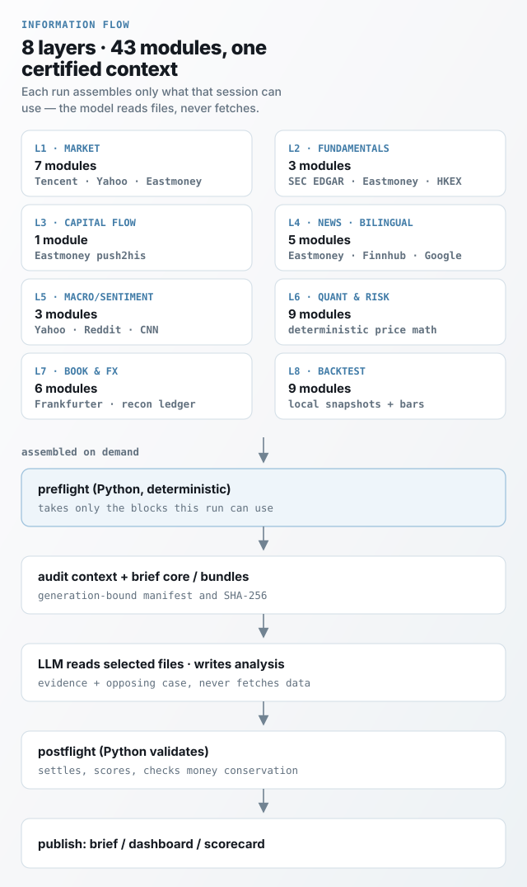

<div align="center">

<h1></h1>

> **它跑了一百多天,公开结算 177 条判断,真实账户收益 −15.95%;主动判断至今没跑赢买入持有(完整对照见[持仓页](https://kcnyu.github.io/clawock/#drill))。每一笔亏损都摆在页面上,[原始决策记录](https://github.com/KCNyu/clawock/blob/master/memory/decisions.jsonl)可查。**

### AI 争辩。代码结算。连亏损都摆在明面上。

8 层 40 模块信息流 · 多 Agent 辩论 · Python 确定性结算。一套真实港美股 AI 投研系统,打包成任何 Agent 可装的投资决策工作流,全程公开运行。

[](https://kcnyu.github.io/clawock/)
[](https://github.com/KCNyu/clawock/actions/workflows/harness-regression.yml)
[](https://github.com/KCNyu/clawock/actions/workflows/dashboard-artifact-gate.yml)
[](https://github.com/KCNyu/clawock/actions/workflows/harness-regression.yml)
[](LICENSE)
[](https://github.com/deepseek-ai/deepseek-harness)

[**实时仪表盘**](https://kcnyu.github.io/clawock/) &nbsp;·&nbsp; [**每日简报**](https://kcnyu.github.io/clawock/briefs.html) &nbsp;·&nbsp; [**证据与反证**](https://kcnyu.github.io/clawock/evidence.html) &nbsp;·&nbsp; [**English**](README.md)

<br>

<a href="https://kcnyu.github.io/clawock/">
  
</a>

<sub><i>“市场不在乎模型有多自信。”</i></sub>

<a href="https://kcnyu.github.io/clawock/"></a>

<sub>真实持仓、真实盈亏、公开打分。预览图每周刷新;实时仪表盘随交易日更新。</sub>

</div>

---

## 装起来

**甩给 AI(默认):** 把本仓库地址丢给你的 Agent(Claude Code / Codex / OpenClaw / DeepSeek Harness 都行),约 60 秒就能验证一条完整决策(真实决策另需你自己的模型 API):

1. `python -m pip install clawock`
2. 跑 `bash examples/minimal-run/run.sh` 验证一条完整决策(无模型,不联网)
3. 走真实决策时按 [`dsh-plugin/skills/investment-decision/SKILL.md`](dsh-plugin/skills/investment-decision/SKILL.md) 的三步流程:prepare → 写 `decision.json` → publish

**或者手动:** Python ≥ 3.11,然后:

```bash
python -m pip install clawock
clawock workflow install investment-decision --workspace ./my-decision
clawock init ./my-decision --workflow investment-decision
clawock run prepare --workspace ./my-decision
```

`run prepare` 产出一份带指纹的请求文件,你的 Agent 写出 `decision.json`,`run publish` 校验(证据、反方、资金与汇率对账)并给出生成回执。

**一条命令看完整闭环**(无模型、不联网,跑完你会看到):

```
$ bash examples/minimal-run/run.sh
==> installing into a clean virtualenv
==> clawock init
initialized clawock workspace: .../book
==> clawock run prepare
==> clawock run publish
==> checking the receipt
isolated run published 9c07e83a19b046b089f443829eb9a06e
```

跑完你就拿到了第一张被 Python 校验过的决策回执。换 harness?[`examples/harness-agnostic`](examples/harness-agnostic/README.md) 五种跑法同一条契约;DSH 用户还有现成 skill 包(发布后 `dsh plugin --profile web add clawock-dsh`)。

**装完以后:** 每天 08:00 微信收一份深度简报,盘中每 30 分钟一次轻量盯盘(可关);模型费用走你自己的 API key,clawock 本身免费开源。

## 这是什么

clawock 是一套真实港美股账户上运行的 AI 投研系统,解决一个问题:**AI 建议满天飞,谁为结果负责?** 它让模型提议、Python 结算、战绩全公开——模型永远不能给自己打分。卖点不是「赚得更多」,而是「骗不了人」。打包成 `pip install clawock`,装进任何 Agent(Claude Code、Codex、OpenClaw、DeepSeek Harness 都行)。

每天 08:00 它读完 8 层 40 模块的信息流,组织一场多 Agent 辩论(四视角分析师 + 多空对立 + 裁判归因)给出决策;Python 独立结算,战绩连亏损都公开。不跟单、不代下单。

## 多 Agent 辩论

**全员一致不是共识,而是警示信号。** 两名研究员各自举证、记录真实分歧——如果所有声音都同意,结论不是被采信,而是带着警示进裁判复审。所以你看不到"全员看多"的假共识。

每天 08:00,一份证据包喂给**四位分析师**(基本面 / 技术面 / 情绪面 / 板块轮动)读同一份上下文;**两名研究员必须建立多空对立论点**并记录分歧;激进 / 保守 / 中性**三位风险官**各陈其词;一位**裁判**点名策略框架,收敛成 `plan.json` 进入打分流水线(改编自 [TradingAgents](https://github.com/TauricResearch/TradingAgents))。


## 先看结果

<sub><i>“市场不在乎模型有多自信。”</i></sub>

截至 2026-08,这个投研台已经公开结算了 **177 条判断**,Python 独立打分:

| 组 | 方向命中率 | 样本 |
|---|---|---|
| 主动操作(cut / trim / 加仓) | 53% | n=73 |
| 只是躺着 hold | 36% | n=104 |
| 高信心主动判断 | 55% | n=33 |

方向命中率 ≠ 赚到钱:真实账户收益 −15.95%,收益对比买入持有仍然落后;影子组合(模拟,非实盘)的对比在[持仓页](https://kcnyu.github.io/clawock/#drill)如实展示。**没有一条结果被挑过——[原始账本](https://github.com/KCNyu/clawock/blob/master/memory/decisions.jsonl)在此,欢迎查账。**

**查账不是读文档,战绩可以复算:** `clawock audit-resettle` 重新结算整本决策账(默认不写入)、`clawock reconcile` 复算全部组合派生、`clawock integrity` 校验资金与行情不变量。判定规则(什么是 win / loss、怎么归组、怎么处理缺数据)全部在代码里版本化,**对不上算我们输**——README 上每个数字,都能从命令跑出来。

**账本长什么样**(真实记录,dec-5227ea7f77a2 · 2026-08-10):

```
action: hold_and_watch        driven_by: catalyst
episode: ep-20260731-spcx-hold
evaluation: loss(按基准行情结算, trigger session 2026-08-10)
```

640 条这样的记录全部公开。**大部分判断从未被执行**(实际成交 0 笔——建议都停在账上),影子组合专门暴露这一点,而不是藏起来。

诚实到数字层面:主动操作 53% 命中率,样本 73 条,95% 置信区间约 42%–64%;高信心组 55%,样本 33 条,区间约 38%–72%——**全部跨过 50% 线,统计上还不能算优势**。这正是我们不做收益宣传的原因:该是噪声的地方,就标成噪声——而分辨「edge 还是手痒」,就是这套系统唯一在卖的东西:它不替你赚钱,它替你证明每一笔判断值不值得信。

命中率 = 模型判断的方向对不对(按基准行情结算);账户收益 = 实盘执行结果。两回事,都公开。

这套系统每天 08:00 产出深度简报,盘中每 30 分钟盯盘,收盘结算,推送到微信并刷新公开仪表盘;港股按 HKT、美股按 ET,cron 随纽约夏令时自动切换。

[**实时仪表盘**](https://kcnyu.github.io/clawock/) · [**每日简报**](https://kcnyu.github.io/clawock/briefs.html) · [**证据与反证**](https://kcnyu.github.io/clawock/evidence.html) · [**排程表**](docs/operations/cron-schedules.md)

## 为什么这份战绩可信

这 7 条就一个意思:**分数不是模型自己打的,账也不是模型自己记的。**

- **结算用的是不可改写的行情**:单一基准供应商的逐日不复权行情,按各市场自己的交易日历;未完成场次永不打分,缺口按开盘价成交
- **一个论点只算一次**:同一论点的重复喊单收敛为一个案例,连喊五天「持有」不会变出五个样本
- **因子要过样本外检验**:bootstrap 区间必须整体落在 50% 一侧才能进决策;截面层预注册,回溯结果永远不能把它打开
- **风控上限每次简报都查**:单票 ≤35%、Top-2 ≤70%、杠杆 ETF ≤50%、组合 β ≤3.0、−18% 止损
- **软情绪不能单独翻转交易**:一条推文只能微调置信度,硬负面催化才可触发防守动作
- **账本必须对得上**:每次发布前检查资金守恒,现金/持仓/盈亏不平就什么都不发
- **改进是有界的**:结算结果只能提议参数调整,不能重写策略

## LLM 是怎么做决策的

LLM 从不自己抓数据,也不自己结算。它只做一件事:**读一份 Python 组装好的上下文文件,写一份带证据、带反方的分析**。剩下全是代码的事。



### 信息流:8 层 40 个模块,港股美股双语覆盖

| 层 | 模块(命令) | 来源 |
|---|---|---|
| 1 · 行情(7) | `analyze-hk` `analyze-us` `us-quotes` `fetch-peers` `daily-bars` `benchmark` `clawock-gold-fetch` | 腾讯 · Yahoo · 东财 · Polygon |
| 2 · 基本面/申报(3) | `filings` `fundamentals` `earnings` | SEC EDGAR · 东财 · 港交所 |
| 3 · 资金面(1) | `fundflow` | 东财 |
| 4 · 消息面与催化剂(5,双语) | `em-news` `catalysts` `mover-evidence` `news-evidence` `clawock-news-digest` | 东财 · Finnhub · Google News |
| 5 · 宏观/情绪(3) | `macro` `sentiment` `clawock-influencer-scan` | Yahoo · Reddit · CNN |
| 6 · 量化与风险(8) | `quant` `quant-review` `cross-factor` `peer-residual` `t0` `t0-review` `portfolio-risk` `regime` | 价格历史确定性计算 |
| 7 · 账本/汇率校验(6) | `fx` `integrity` `reconcile` `aggregates` `cash` `realized` | Frankfurter · 对账账本 |
| 8 · 回测/自省(7) | `evaluate-hstech-regime` `evaluate-us-leverage` `evaluate-combined-regime` `validate-regime-dial` `shadow` `audit-resettle` `evaluate-add-alpha` | 本地快照 + 基准行情 |

抓取层优雅降级:东财统一走节流网关,报价/汇率多源兜底,抓空保留旧值。哪个模块属于哪一层由 [`config/information-layers.json`](config/information-layers.json) 声明,CI 对着它核对,模块搬了家数字不会留在原地;完整命令与 provider 目录见[命令参考](docs/reference/commands.md)。

### 热点捕获:影响者雷达

系统每 48 小时扫描**特朗普(Truth Social 一手源)、马斯克(新闻聚合)**等影响者的公开动态,LLM 过滤后自动关联持仓与板块:标出立场(endorse / oppose)、相关度,并生成中文摘要。谁说了什么、和你的持仓有没有关系,盘前简报里直接可见——不用自己刷社交媒体。

例:2026-08-13 特朗普宣布 de minimis 免税漏洞案胜诉,雷达自动命中零售/电商板块并关联到恒生科技持仓,摘要进次日盘前简报;**8-14 那次扫描 3 条动态零持仓命中(held_hits=0),简报如实记空**——命中或落空都照实进简报,这里展示的只是一次命中。

### 每次运行,LLM 拿到什么

采集面宽,但每次运行只拿到这次能用得上的块:

| 运行 | 时机 | 块数 | 核心内容 |
|---|---|---|---|
| 盘前深度简报 | 工作日 08:00 HKT | 38 | 持仓真值、风控、量化信号、新闻/催化剂、论点登记册、历史复盘、当日计划 |
| 开 / 午 / 收报告 | 港 09:30·12:00·13:30·16:00,美开收 | 16 | 新鲜行情、异动催化探针、待成交决策 |
| 盘中盯盘 | 开市每 30 分钟 | 27 | 行情、信号计数、T+0 牌面、异动标记、盘中重跑的入场 setup |

催化探针只对已经异动的票触发,一手源优先(SEC 受理时间戳、港交所公告),找不到就明写 `no_recent_filing`,不让空块读成「什么都没发生」。

### 策略框架

同一只股票可以同时挂好几条策略,每条在自己的案例里独立打分:

| 策略 | 干什么 |
|---|---|
| `core_position` | 长线核心仓位 |
| `risk_rebalance` | 风控再平衡:降杠杆、止损、换仓 |
| `intraday_t` | 日内 T+0 |
| `event_trade` | 事件驱动(财报、催化剂) |
| `tactical_entry` | 战术建仓 |

加仓不是拍脑袋:量化因子与同行残差合并为一个 price_relative 证据族,时点新闻 surprise/attention 构成另一个证据族,**两族必须同时成立**;负面信息优先阻断;未验证信号只能进有上限的试探仓位,永远不能直接进决策。

### 配套研究技能(skills)

除内置流程外,还有一套可复用的研究入口,产物单向串联、每步写版本化文件:

| 问题 | 入口 | 复用范围 |
|---|---|---|
| 分析一家美股公司 | [`us-stock-analysis`](skills/us-stock-analysis/SKILL.md) | 可随 clawock 工作区复用 |
| 分析一家港股公司 | [`hk-stock-analysis`](skills/hk-stock-analysis/SKILL.md) | 可随 clawock 工作区复用 |
| 检查当前组合 | [`portfolio-risk-review`](skills/portfolio-risk-review/SKILL.md) / [`portfolio-swarm-review`](skills/portfolio-swarm-review/SKILL.md) | 依赖已配置的真实组合 |
| 复盘一个已披露的报告期 | [`earnings-review`](skills/earnings-review/SKILL.md) | 可复用,产物落 `memory/earnings/` |
| 判断新标的值不值得深研 | [`entry-gate`](skills/entry-gate/SKILL.md) | 可复用,产物落 `memory/entry-gates/` |

串联顺序:建仓前研究闸 → 一手财报证据 → 规范论点 → 决策 / 风控 / 结算回路。每一步写带版本的产物给下一步读,后一步永远无法用文案重推前一步。

## 底层是怎么组织的

以下两段是工程细节,普通用户可以直接跳过。

<details>
<summary><b>战绩怎么打分(硬规则)</b></summary>

<br>

<p align="center"></p>

<sub>累计案例胜率对 50% 方向命中基线 —— 衡量方向对了多少次,不是赚了多少;买入持有对比在持仓页的影子组合里。每周刷新。</sub>

- 触发与标记来自单一基准供应商的逐日不复权行情;未完成场次永不打分,缺口按开盘价成交
- 置信度只保留为审计字段;严格前向的 beta-binomial 分层模型,稀疏小组向宽层先验收缩
- 择时单独计价:只问触发成交比当日收盘好或差多少,从不画累计金额曲线
- 影子组合(模拟,非实盘):两本现金+库存账重放同一时间线,一本跟主动建议、一本买入持有
- 杠杆刻度盘样本外打分,择时能力对照环形位移原假设;当前结论:不可与随机区分,页面如实写着
- 页面从产物生成,不能与产物脱节;引用回测数字必须指向仍含该数字的运行卡,CI 两条都查

</details>

<details>
<summary><b>工程细节:架构与写入协调</b></summary>

<br>


- 仪表盘产物整体发布到数据面(data plane);前端直接读扫描旁路文件(sidecar),写者互不冲突
- 所有写入走 `ops/publish/safe_push.sh`:rebase 重试、真冲突中止,冲突标记在 push hook 被拒
- `portfolio.json` 是唯一真源:advisory 文件锁 + 原子替换,pre-push hook 拦下账目不平的 push
- 模型选择属于外部 runtime,仓库不存任何供应商密钥
- 仓库结构、排程契约等细节见[项目文档](docs/README.md)

</details>

## 许可与免责

本仓库包含**真实交易持仓**,是个人记录与可携带工作区——**不是投资建议、不是推荐、也不是跟单系统**。结算规则与方法学变更都在代码里版本化,任何一条结果都不是人工挑选的;主动判断至今没显出优势,你读到时每个数字都可能已经过时。

原创代码 [MIT](LICENSE);改编第三方代码保留原许可与署名,见 [NOTICE](NOTICE) 与 [`THIRD_PARTY_LICENSES/`](THIRD_PARTY_LICENSES/)。行情、新闻、社交内容与 API 访问**不**被 MIT 重新授权,见[第三方数据与服务](docs/legal/third-party-data.md)。

用 [Claude Code](https://claude.com/claude-code)、[openclaw](https://openclaw.com) cron 守护进程、Jekyll + GitHub Pages 与 Python 构建。

<div align="center">
<br>

**[实时仪表盘](https://kcnyu.github.io/clawock/)** &nbsp;·&nbsp; **[每日简报](https://kcnyu.github.io/clawock/briefs.html)** &nbsp;·&nbsp; **[English](README.md)**

<sub>由 <a href="https://github.com/KCNyu">Shengyu Li (kcn)</a> 与 Rick 构建维护 · 2026</sub>

</div>
