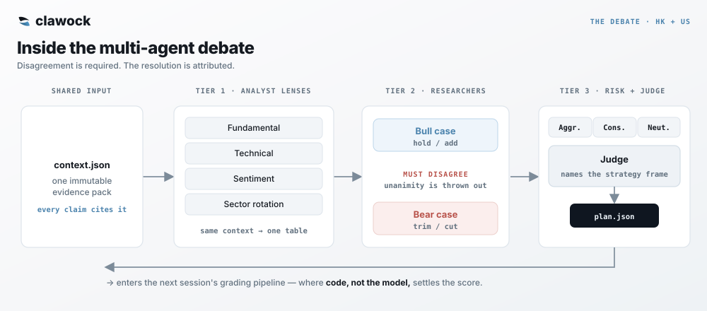

<div align="center">

<h1></h1>

### AI 争辩。代码结算。连亏损都摆在明面上。

一个真实的港股 + 美股组合,由多个 LLM 辩论、交给 Python 打分 —— 每条判断都在明面上结算,而主动判断至今仍落后于买入持有。

[](https://kcnyu.github.io/clawock/)
[](https://github.com/KCNyu/clawock/actions/workflows/harness-regression.yml)
[](LICENSE)

[**实时仪表盘**](https://kcnyu.github.io/clawock/) &nbsp;·&nbsp; [**每日简报**](https://kcnyu.github.io/clawock/briefs.html) &nbsp;·&nbsp; [**English**](README.md)

<br>

<a href="https://kcnyu.github.io/clawock/">
  
</a>

<sub><i>“市场不在乎模型有多自信。”</i></sub>

<a href="https://kcnyu.github.io/clawock/"></a>

<sub>真实持仓、真实盈亏、公开打分。预览图每周刷新;实时仪表盘随交易日更新。</sub>

</div>

---

## 这是什么

clawock 是一个持续运行的、公开的**纪律化、自评式** AI 投资实验 —— 不是一夜暴富的机器人,也不是跟单服务。

一套多 Agent 投研台监控一个真实券商账户(港股与美股分账)、辩论证据、给出交易建议;执行留给账户所有者。这个项目的核心产品就是这份实时记录:真实持仓、不断累积的决策历史,以及公开战绩。模型负责提议;价格、风控上限、账本、结算与评分,全部由 Python 负责。

### 有什么不一样

- **真金白银,公开打分。** 一个在跑的港股 + 美股真实券商账户,公开战绩保留每一条符合条件的结果 —— 亏损也在内,包括主动判断至今没跑赢买入持有。
- **模型不能给自己打分。** LLM 提出交易建议;Python 独立结算并计算战绩。
- **一个论点,只算一个 episode。** 同一论点的重复意见只计一次。每个 episode 都用指定基准供应商的行情结算;缺 session 时按公开的补齐规则处理。
- **账本必须对得上。** 每次 push 前都检查资金守恒;现金、持仓与盈亏不平,就什么都不发布。
- **为持续运行而建。** 定时的港股与美股 session 产出双语简报,并在交易日里刷新实时仪表盘。

## 怎么跑的

这套系统把**概率性判断**和**确定性控制**分开:LLM 读市场、吵交易;代码决定什么被允许、实际发生了什么、记录上写什么。


每个交易日,系统拉取最新价格、汇率、波动率、财报与宏观上下文,以及新闻与社交情绪;把这份归一化的上下文交给多 Agent 辩论;在 Python 里施加确定性的风控、schema 与账本闸门;把简报送到微信;并更新公开仪表盘。

## 信息层

读市场是 LLM 干的大部分活,所以整套系统最宽的一环是数据收集。仓库编录了 **8 层、26 个抓取与计算模块**,**港股与美股双语覆盖** —— 实时报价、SEC + 东财申报、资金流、财报日历、宏观(VIX / DXY / 10Y)、Reddit 与新闻情绪,以及能撬动行情的社交 feed。每份简报只取与该市场、该 session 相关的子集。信息收集保持宽,决策层保持窄。

| 层 | 模块 | 主要来源 |
|---|:---:|---|
| 1 · 行情 | 5 | 腾讯 · Yahoo · 东财 |
| 2 · 基本面/申报 | 2 | SEC EDGAR · 东财 datacenter |
| 3 · 资金面 | 1 | 东财 push2his |
| 4 · 消息面(双语) | 3 | 东财 · Finnhub · Google News |
| 5 · 宏观/情绪 | 4 | Yahoo · Reddit · 社交 feed |
| 6 · 量化与风险 | 4 | 对价格历史做确定性计算 |
| 7 · 汇率/校验 | 2 | Frankfurter · 本地不变量 |
| 8 · 回测/自省 | 5 | 本地快照 + 基准行情 |

抓取层优雅降级:所有现役东财调用统一走**一个节流网关**,关键路径(报价、汇率)用**多源兜底**,而一次抓空会**保留旧值**,不会用空白覆盖一条好序列。公开来源包括腾讯、stooq、yfinance、Frankfurter、SEC EDGAR、Finnhub、Nasdaq、东财、Polygon、Alpha Vantage、Reddit 与 Google News —— 逐端点目录与各 host 可达性见 [`scripts/data/README.md`](scripts/data/README.md)。

## 怎么做决策

分析最终落成明确的、带闸门的策略决策 —— 而同一只股票可以同时挂好几条。

- **多条策略,分别打分。** `core_position`、`risk_rebalance`、`intraday_t`、`event_trade`、`tactical_entry` 可以在同一只标的上并存,因为长线论点和日内交易本就可能合理地分歧。每条在自己的 episode 里打分。
- **归因优先。** 每条决策按其主导驱动打标签,而那个驱动的 edge 是从记录里*动态*测出来的 —— 逻辑里不硬编码任何命中率。
- **证伪,不证实。** 风偏向上的行情里默认 HOLD。一个看多的故事在跨过一道证伪检查、以及一道「这是不是已经被 price in 了?」的近几日涨幅测试之前,不会触发买入。
- **regime 高于择时。** 杠杆不做择时;200 日趋势 × 波动率的拨盘给它封顶。回测的教训是:edge 在*于错误 regime 里降杠杆*,不在抄顶。

## 辩论

每日深度简报跑一场结构化的**多 Agent 辩论**,改编自 [TradingAgents](https://github.com/TauricResearch/TradingAgents),为港股与美股分账适配。Agent 更多不是重点:协议**要求给出对立论点**,裁判**把每条结论归因**到一个具名策略框架。



- **分析师视角。** 基本面、技术面、情绪面、板块轮动 Agent 读*同一份*上下文,汇成一张表。每个论点都必须引用数值上下文。
- **多头 vs 空头。** 两名研究员建立对立论点,各自引用具体的分析师数据点。协议要求他们**在至少一个仓位上真正分歧**并记录下来,所以一致同意读作警示,而不是证据。
- **风险声音 + 一位裁判。** 激进、保守、中性各自陈词。一位裁判权衡他们、**点名驱动每条决策的策略框架**,并把争论收敛成 `plan.json` —— 进入下一场的打分流水线。

## 公开战绩

每条判断都被机械地结算并发布 —— 赢的、输的、以及没法打分的,一并公开。事后绝不手工调。

1. **记录** —— 模型提交一条带版本的决策,含策略、条件、regime、仓位、置信度。权威账本是 `memory/decisions.jsonl`。
2. **触发** —— Python 用基准供应商的逐日不复权行情、按各市场自己的交易日历评判。未完成的 session 不打分;缺口直接穿过触发价的按开盘价成交 —— 绝不给它一个从未出现过的价。
3. **归组** —— 同一策略的重复判断收敛成一个 *episode*,所以连喊五个早上「持有」不会凭空变出五个样本。
4. **打分并发布** —— 代码结算结果、对着一条朴素的方向基线评分、再渲染。休市 session、需要人工证据的判断、当天没成交的标的,会公开标为「不可评」—— 移出胜率分母,但保留在 coverage 覆盖计数里可见,而不是被悄悄丢掉。

模型只提交决策;它永远不能写或改自己的评估。这种隔离让投研台没法给自己打分 —— 但它**并不**让市场数据或指标定义变得正确。**把这份记录当诊断,而不是收益的证明。**

<p align="center"></p>

<sub>累计 episode 胜率对 50% 方向命中基线 —— 衡量的是方向对了多少次,不是赚了多少。买入持有的对比是影子组合(在下方 details 和 Reflect 里),那是另一个问题。由 GitHub Actions 每周刷新;实时数字见<a href="https://kcnyu.github.io/clawock/">诚实(Reflect)标签页</a>。</sub>

<details>
<summary><b>打分怎么处理那些难缠的边界情况</b></summary>

<br>

- **未完成 session 与缺失行情。** 触发与标记来自 `memory/bars/` —— 单一基准供应商的逐日不复权行情,不是交易所直连。未完成的 session 永不打分。
- **重申(reaffirmation)。** 对同一策略/动作的连续重申算一个 episode。把触发价重新锚到股票现在的位置,仍是重申,不是一条新判断。
- **episode 聚合。** 一个 episode 取它自己已结算判断的*均值*,而不是选出一条代表 —— 让第一条或最后一条代言整组,能仅凭这个选择就把主动胜率在 50% 线两侧来回甩。
- **置信度校准。** 声称的置信度只保留为审计字段。严格按日期前向的 beta-binomial 分层模型只用更早日期,估计 action × driver × condition × regime 概率;稀疏小组向宽层先验收缩,证据或后验下界不足时不允许拿信号扩仓。
- **择时,单独计价。** 一个单事件诊断只问:触发成交比当日收盘执行好或差多少,严格按同票/同日/同方向/同股数配对。它有意从不画累计金额曲线。
- **影子组合(模拟 · 非实盘)。** 两本现金+库存账重放同一条时间线:一本跟每一条触发的主动建议,另一本买入持有。两者的累计差被报为*模拟择时 alpha*。它把美元与港币分开、暴露真正被执行过的建议有多少、并披露不复权行情的偏差。来源:`assets/data/shadow_portfolio.json`。它是策略模拟,不是对实盘赚了多少的声称。

</details>

## 代码强制执行的规矩

模型只写观点。可能污染记录的算术都跑在 Python 里、有单元测试。

| 规矩 | 代码做的事 |
|---|---|
| **两种货币不直接相加** | 港币与美元同时以两种口径展示,并盖上汇率+时间戳;把两种货币生硬相加是个没意义的数。 |
| **风控上限,每份简报都核查** | 单一标的 ≤35%、Top-2 ≤70%、杠杆 ETF 仓位 ≤50%、组合 β ≤3.0、−18% 止损。Python 算出每一条 breach,并对任何没用 trim/cut 或明确 override 回应它的 plan 打旗标。执行仍然是人。 |
| **集中度按腿计算** | 每本账 `HHI = Σ wᵢ²`:`<0.15` ✅ · `0.15–0.25` 🟡 · `0.25–0.40` 🟠 · `>0.40` 🔴。绝不跨币种混算。 |
| **杠杆按 regime 拨挡** | 200 日趋势 × 波动率的拨盘给杠杆 ETF 仓位封顶(×1 / ×0.5 / ×0);每日重置的 2×/3× 产品完全跳过基本面。 |
| **回报基于峰值本金** | 回报率用现金流账本里的峰值净投入,而不是 `成本 − 已实现` —— 一笔已实现盈利不该伪造出更高的回报。 |
| **软情绪不能翻转交易** | 一条推文或一种情绪只能微调置信度数字;只有硬的、带日期的催化剂才能改动作。风偏向上的行情里默认 HOLD。 |
| **未验证的信号只展示、绝不遵从** | 一层量化因子跑在代码里,但在它跨过最小样本量并证明命中率之前,被禁止影响任何决策。 |

可靠性走同一条原则。每个市场播报任务都是 **preflight(Python)→ LLM → postflight(Python)**:确定性工作全在代码里,一个 push 前的闸门拒绝发布一本对不上账的账。若风险算不出来,卡片显示 **「风险无法计算」**,绝不显示绿色的「无」。多层排程、一个兜底 workflow、加上看门狗,意味着单个 LLM 卡死不再是无声的 —— 尽管这里不承诺在任何故障下都能送达。

## 每日节奏

```
凌晨    记忆「做梦」—— 把昨天的教训提炼进长期笔记
早上    深度简报 —— 多层辩论 + 一位裁判,推送到微信
港股    开盘 → 定时盘中监控 → 收盘
美股    开盘 → 拆分盘中监控 → 收盘
             ↑ 每次成功的播报都会发布仪表盘变更
穿插    盘前宏观 / 情绪 / 事件扫描,再加一份美股盘前新闻摘要
每周    归档、体检、复盘与视觉刷新任务
```

港股时间按 HKT;美股 session 时间按 ET,其 cron 表达式随纽约夏令时自动切换。节假日 + 周末闸门跳过休市 session。精确的生成表见 [CRON_SCHEDULES.md](CRON_SCHEDULES.md)。

## 逛一逛这套系统

- [**实时仪表盘**](https://kcnyu.github.io/clawock/) —— 持仓、风控,以及自评战绩。
- [**每日简报**](https://kcnyu.github.io/clawock/briefs.html) —— 已发布的早读。
- [**排程表**](CRON_SCHEDULES.md) —— 生成的 cron 表。
- [**数据脚本**](scripts/data/README.md) —— fetcher 与计算目录。

用 [Claude Code](https://claude.com/claude-code)、[openclaw](https://openclaw.com) cron 守护进程、纯静态 Jekyll + GitHub Pages 前端,以及 Python 构建。行情、新闻、宏观、情绪来自有文档的公开源并带多源兜底;复用任何抓取内容前请先看[第三方数据与服务条款](THIRD_PARTY_DATA.md)。

<details>
<summary><b>底层细节</b> —— 模型、写入协调与完整性闸门</summary>

<br>

**模型。** 交互式聊天目前跑在 Claude 上;无人值守的市场任务通过 Anthropic Messages API 固定一个模型,并带一个可选兜底。供应商凭据与兜底策略放在这个公开仓库之外,可以在不改 harness 的情况下变更。这里不存任何供应商密钥。

**写入对账。** dashboard 构建产物 —— `dashboard.json`、`decision_audit.json`、`shadow_portfolio.json` —— 都是派生的,而 cron 守护进程、远端 workflow、crontab publisher 和临时 session 都可能更新 `master`。规则是:隔离 scan-sidecar 写者,并串行化同一 host 上的 dashboard builder。

- **前端直接读 scan sidecar。** 宏观 / 情绪 / 新闻 / 影响者 feed 在加载时逐文件抓取,所以一个 GitHub Action 只提交它自己那份不相交的 sidecar —— 写者之间不会冲突,一份扫描在它的 commit 落地那一刻就出现在页面上,无需重建。
- **dashboard builder 共用一把锁、一份契约。** on-host 重建在一把共享 `flock` 上串行;每个 builder 跑同一个语义-diff 助手,所以只改时钟的重写被还原,而三份生成文件的真实变更被一起 stage。
- **所有人都走 `safe_push.sh`** —— rebase 重试、真冲突即中止,提交进来的冲突标记在 push hook 处被拒,所以一份坏掉的 `dashboard.json` 永远到不了 Pages。
- **组合数字在门口就被把关。** `portfolio.json` —— 唯一真源 —— 在一把 advisory `flock` 下、以「读最新再覆盖 + 原子替换」写入。一个 pre-push hook 拦下任何账目对不上资金守恒恒等式(`TCV = Σ value`、`cash = baseline + trades + adjustments`、`cost = 移动加权`)的 push,这些纯派生由 CI 里的 `pytest` 套件钉死。
- **排程有受检契约。** 运行时真源来自实时 cron 列表;一份被追踪的配置驱动生成的排程表、夏令时同步、payload/看门狗检查与 CI 体检。

</details>

<details>
<summary><b>仓库结构</b></summary>

<br>

```
clawock/
├─ index.html  briefs.md                    ← Pages 落地页
├─ assets/data/        由 harness + GH Actions 构建,从不手改
│   ├─ dashboard.json  risk.json  catalysts.json
│   ├─ macro.json  sentiment.json  *_news*.json  influencer_feed.json  ← scan sidecar,前端直接抓
│   └─ *_review.json  guardrail_history.jsonl                          ← 因子 / setup 记分卡 + 风控闸拦下了什么
├─ portfolio.json                           ← 唯一真源(原子写入)
├─ tests/                                    ← decision-v2 + 资金守恒回归闸
├─ MEMORY.md  DREAMS.md                      ← 铁律 + 每夜「做梦」提炼
├─ memory/
│   ├─ {date}-pre-open.md  {date}-plan.json  ← 简报产出 + 结构化 plan
│   ├─ decisions.jsonl                       ← 权威决策/episode 账本
│   ├─ bars/{ticker}.json                    ← 基准不复权 OHLC —— 结算触发的依据
│   └─ snapshots/{date}.json
├─ scripts/
│   ├─ data/      fetcher · build_dashboard.py · 风控/量化/regime 计算 · safe_push.sh
│   └─ harness/   {brief,report,intraday}_{pre,post}flight.py · 看门狗
└─ skills/{name}/SKILL.md
```

</details>

---

## 范围、免责与许可

本仓库包含**真实交易持仓**。它是一份个人记录和可携带的工作区 —— **不是投资建议、不是推荐、也不是跟单系统**。这套投研台只分析和建议;它不替你下单。任何一条结果都不是人工挑选的 —— 结算规则与方法学变更都在代码里版本化 —— 主动判断至今没显出优势,而你读到时每个数字都可能已经过时。

原创代码采用 [MIT 许可证](LICENSE)。改编的第三方代码保留其原有许可与署名,见 [NOTICE](NOTICE) 与 [`THIRD_PARTY_LICENSES/`](THIRD_PARTY_LICENSES/)。第三方行情、新闻、社交内容、文件、商标与 API 访问**不**被 MIT 重新授权 —— 见[第三方数据与服务](THIRD_PARTY_DATA.md)。

<div align="center">
<br>

**[实时仪表盘](https://kcnyu.github.io/clawock/)** &nbsp;·&nbsp; **[每日简报](https://kcnyu.github.io/clawock/briefs.html)** &nbsp;·&nbsp; **[English](README.md)**

<sub>由 <a href="https://github.com/KCNyu">Shengyu Li (kcn)</a> 与 Rick 构建维护 · 2026</sub>

</div>
