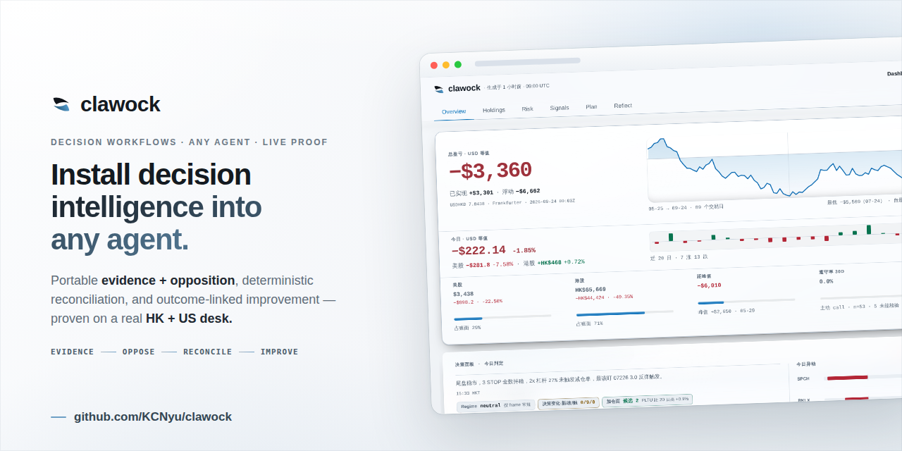
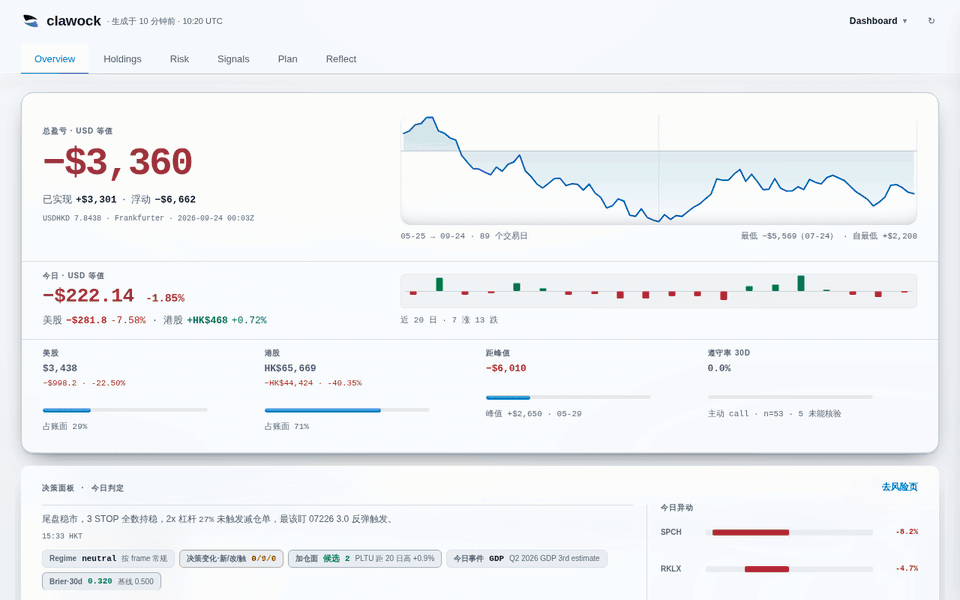
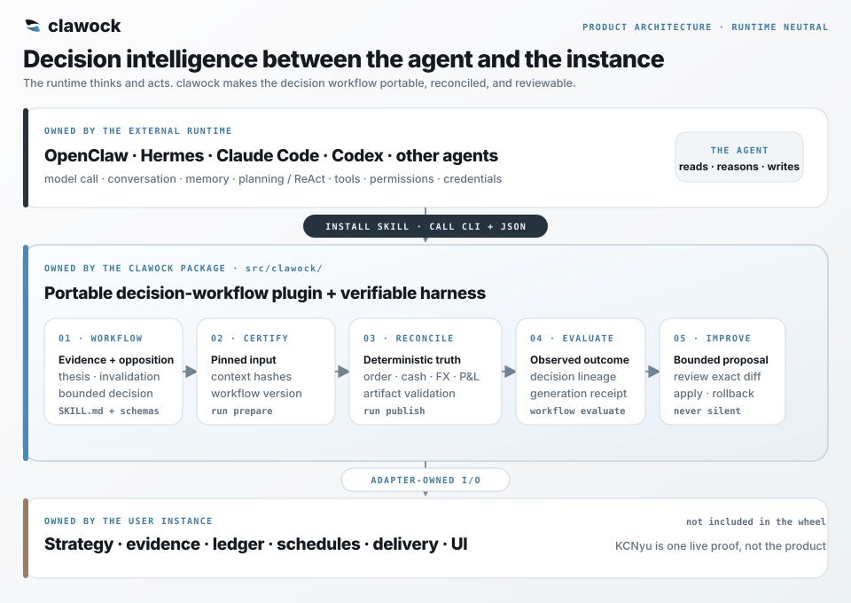
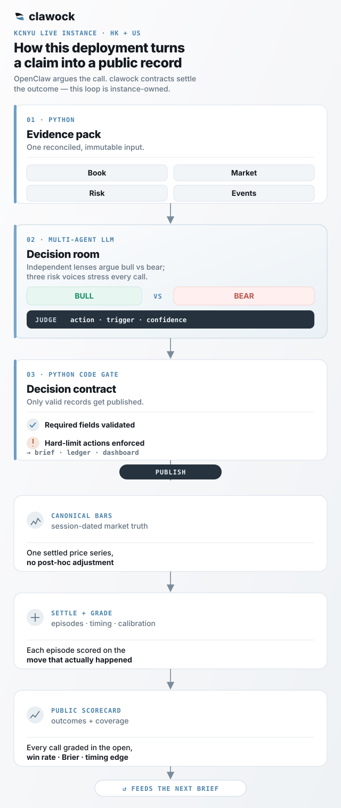
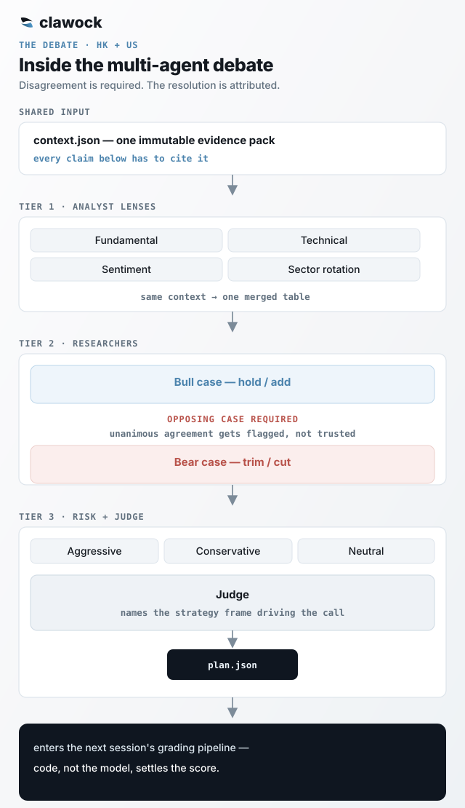
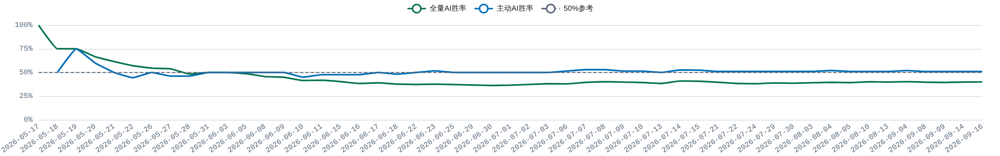

<div align="center">

<h1></h1>

### AI 争辩。代码结算。连亏损都摆在明面上。

把这套真实港股 + 美股投研台背后的决策能力装进任何 Agent —— 证据、反方、确定性对账，以及连接结果的改进。

[](https://kcnyu.github.io/clawock/)
[](https://github.com/KCNyu/clawock/actions/workflows/harness-regression.yml)
[](https://github.com/KCNyu/clawock/actions/workflows/dashboard-artifact-gate.yml)
[](https://github.com/KCNyu/clawock/actions/workflows/harness-regression.yml)
[](LICENSE)

[**实时仪表盘**](https://kcnyu.github.io/clawock/) &nbsp;·&nbsp; [**每日简报**](https://kcnyu.github.io/clawock/briefs.html) &nbsp;·&nbsp; [**证据与反证**](https://kcnyu.github.io/clawock/evidence.html) &nbsp;·&nbsp; [**English**](README.md)

<br>

<a href="https://kcnyu.github.io/clawock/">
  
</a>

<sub><i>“市场不在乎模型有多自信。”</i></sub>

<a href="https://kcnyu.github.io/clawock/"></a>

<sub>真实持仓、真实盈亏、公开打分。预览图每周刷新;实时仪表盘随交易日更新。</sub>

</div>

---

## 这是什么

clawock 是一套**面向 Agent 的投资决策 workflow plugin kit，加上一层可验证
harness**。OpenClaw、Hermes、Claude Code、Codex 或其它外部 runtime 负责模型
调用、对话、记忆、规划、工具、权限和凭证；clawock 安装可复用 workflow，负责
认证证据、强制反方、校验资金和汇率、连接结果，并让每个改进提案可审、可回滚。

它发布在 PyPI 上 —— `pip install clawock` —— 而且
[在你自己的账本上跑](#在你自己的账本上跑)不需要这个仓库。

这个仓库也是第一套持续运行的证明：一个真实港股 + 美股组合上的纪律化、公开、
自评式 AI 投资实验 —— 不是一夜暴富的机器人，也不是跟单服务。

一套多 Agent 投研台监控一个真实券商账户(港股与美股分账)、辩论证据、给出交易建议;执行留给账户所有者。这个项目的核心产品就是这份实时记录:真实持仓、不断累积的决策历史,以及公开战绩。模型负责提议;价格、风控上限、账本、结算与评分,全部由 Python 负责。

### 有什么不一样

- **是 workflow plugin，不是另一个 Agent。** 外部 runtime 保留自己的模型、聊天、
  memory、skills engine、tool loop 与权限；clawock 让投资决策契约跨 runtime 迁移。
- **闭环不会停在答案。** 证据、反方、thesis、decision、execution 与 observed
  outcome 共用一条 lineage。结果可以提出有边界的参数改动，却不能暗改策略。
- **真金白银,公开打分。** 一个在跑的港股 + 美股真实券商账户,公开战绩保留每一条符合条件的结果 —— 亏损也在内,包括主动判断至今没跑赢买入持有。
- **模型不能给自己打分。** LLM 提出交易建议;Python 独立结算并计算战绩。
- **一个论点,只算一个 episode。** 同一论点的重复意见只计一次。每个 episode 都用指定基准供应商的行情结算;缺 session 时按公开的补齐规则处理。
- **账本必须对得上。** 每次 push 前都检查资金守恒;现金、持仓与盈亏不平,就什么都不发布。
- **为持续运行而建。** 定时的港股与美股 session 产出双语简报,并在交易日里刷新实时仪表盘。

## 怎么跑的

产品边界很简单：外部 Agent 负责读取与推理；clawock 负责可迁移的决策 workflow
和周围的确定性真值。



KCNyu 部署再把这个产品边界用于一个真实组合。下面第二张是实例架构，不是可复用
package 架构。



每个交易日,系统拉取最新价格、汇率、波动率、财报与宏观上下文,以及新闻与社交情绪;把这份归一化的上下文交给多 Agent 辩论;在 Python 里施加确定性的风控、schema 与账本闸门;把简报送到微信;并更新公开仪表盘。

## 信息层

读市场是 LLM 干的大部分活,所以整套系统最宽的一环是数据收集。仓库编录了 **8 层、40 个抓取与计算模块**,**港股与美股双语覆盖** —— 实时报价、SEC + 东财申报、资金流、财报日历、宏观(VIX / DXY / 10Y)、Reddit 与新闻情绪,以及能撬动行情的社交 feed。每份简报只取与该市场、该 session 相关的子集。信息收集保持宽,决策层保持窄。

| 层 | 模块 | 主要来源 |
|---|:---:|---|
| 1 · 行情 | 7 | 腾讯 · Yahoo · 东财 · Polygon |
| 2 · 基本面/申报 | 3 | SEC EDGAR · 东财 datacenter · 港交所 |
| 3 · 资金面 | 1 | 东财 push2his |
| 4 · 消息面与催化剂(双语) | 5 | 东财 · Finnhub · Google News · 交易所公告 |
| 5 · 宏观/情绪 | 3 | Yahoo · Reddit · CNN · 社交 feed |
| 6 · 量化与风险 | 8 | 对价格历史做确定性计算 |
| 7 · 账本/汇率校验 | 6 | Frankfurter · 对账账本 · 本地不变量 |
| 8 · 回测/自省 | 7 | 本地快照 + 基准行情 |

抓取层优雅降级:所有现役东财调用统一走**一个节流网关**,关键路径(报价、汇率)用**多源兜底**,而一次抓空会**保留旧值**,不会用空白覆盖一条好序列。公开来源包括腾讯、stooq、yfinance、Frankfurter、SEC EDGAR、Finnhub、Nasdaq、东财、Polygon、Alpha Vantage、Reddit 与 Google News —— 完整命令、provider 与产物目录见[命令参考](docs/reference/commands.md),它的清单和上面这张表核对的是同两份 registry,由生成器产出。哪个模块属于哪一层本身也是一份产物 —— [`config/information-layers.json`](config/information-layers.json),每条打包命令要么进某一层,要么带着「为什么它不算收集」的理由列在排除表里 —— 上面那张表由 CI 对着它核,模块搬了家,数字不会还留在原地。

### 每种运行实际拿到什么

采集面很宽，但没有哪次运行拿全部。每个排程任务的 preflight 只组装这次能用得上的块，写进 context 文件，模型读文件而不是自己去抓。

```
数据源 ──► preflight（Python，确定性）──► context.json ──► LLM 散文 ──► postflight（Python）──► 发布
```

| | 盘前深度简报 | 开盘 / 午盘 / 午后 / 收盘 | 盘中盯盘 |
|---|---|---|---|
| **什么时候** | 工作日 08:00 HKT | 港股 09:30 · 12:00 · 13:30 · 16:00 · 美股开收盘 | 开市期间每 30 分钟 |
| **块数** | 38 | 16 | 21 |
| **持仓真值** | 持仓、账面合计、集中度、杠杆看穿 | 新鲜行情块 | 新鲜行情块 |
| **风控** | 护栏、纪律账本、β/波动/回撤、解套算术 | 只在信号要求时出风险段 | 信号计数与明细 |
| **信号** | 量化因子及其命中率复核、截面因子、同业残差、T+0 牌面 | 板块 / 同业扫描 | 板块 / 同业扫描、T+0 牌面、异动标记、盘中重跑的入场 setup |
| **消息与事件** | 证据图、中文公司新闻、催化日历、宏观、Reddit 与社交源 | 只对异动票的催化探针 | 只对异动票的催化探针 |
| **研究状态** | thesis registry、研究待办队列（该复盘的财报、逾期承诺、没过闸的仓位） | 异动票的 thesis 与红线 | 异动票的 thesis 与红线 |
| **历史** | 回顾、决策指标、反思、数据完整性报告 | — | heartbeat slot 状态 |
| **当日计划** | 由它写出 | 本腿今早还没成交的决策 | 本腿今早还没成交的决策 |

催化探针是里面最讲时效的一条：**只对已经异动的票**触发，一手源优先（SEC 受理时间戳、港交所公告），每条分成 interrupt / context / noise 三级，找不到就明写 `no_recent_filing`——不让一个空块被读成「什么都没发生」。

**刻意不给的**同样重要：盘中回路里不做研究生产、30 分钟节奏不烧付费搜索、盘中也不重建证据图——它是日级产物，盘中天然过期。

## 怎么做决策

分析最终落成明确的、带闸门的策略决策 —— 而同一只股票可以同时挂好几条。

- **多条策略,分别打分。** `core_position`、`risk_rebalance`、`intraday_t`、`event_trade`、`tactical_entry` 可以在同一只标的上并存,因为长线论点和日内交易本就可能合理地分歧。每条在自己的 episode 里打分。
- **归因优先。** 每条决策按其主导驱动打标签,而那个驱动的 edge 是从记录里*动态*测出来的 —— 逻辑里不硬编码任何命中率。

### 低频加仓 campaign

加仓使用有状态的交互信号，不把均线包装成 alpha。港美分别排名：截面因子和同行残差合并为一个 `price_relative` 证据族；时点新闻通过可靠的正向 surprise，或相对同一只票自身历史突然加速的 source-weighted attention，形成另一个证据族。两族必须同时成立，负面信息或同行 laggard 证据优先阻断。进入和退出使用不同 rank 阈值，为已开启 campaign 提供滞回，避免一次小幅排名抖动反复开关权限。

权限、仓位和执行三层分开。warming policy 每只票、每个 policy version 只允许采一批 2.5% exploration；它不等于 validated，也不能用于每日重置杠杆产品。不可分割的最小交易单位只有在仍低于该市场账 3% exploration 硬上限时才能补成一股/一手，昂贵 board lot 不能伪装成小样本。validated campaign 才能分多批向目标靠近。技术价位只负责把已经授权的一批安排在未来五个本地交易日：最早下一 session、先判失效、跳空按开盘、港美分别使用日历和交易单位。

每个持仓都会显示 `eligible`、`waiting_timing`、`risk_blocked`、`already_at_target`、`constraint_blocked` 或 `insufficient_evidence`。所以零订单可以是正常结果，但不能再只给一个裸的 `add=0`。`clawock evaluate-add-alpha` 分别比较 setup-only、price-relative、information 和 interaction 的 T+1/T+5/T+20；当前 universe 与旧新闻快照的 replay 只标 diagnostic / survivorship-limited，绝不冒充 validated alpha。
- **证伪,不证实。** 风偏向上的行情里默认 HOLD。一个看多的故事在跨过一道证伪检查、以及一道「这是不是已经被 price in 了?」的近几日涨幅测试之前,不会触发买入。
- **regime 高于择时。** 杠杆不做择时;200 日趋势 × 波动率的拨盘给它封顶。回测的教训是:edge 在*于错误 regime 里降杠杆*,不在抄顶。

## 辩论

每日深度简报跑一场结构化的**多 Agent 辩论**,改编自 [TradingAgents](https://github.com/TauricResearch/TradingAgents),为港股与美股分账适配。Agent 更多不是重点:协议**要求给出对立论点**,裁判**把每条结论归因**到一个具名策略框架。



- **分析师视角。** 基本面、技术面、情绪面、板块轮动 Agent 读*同一份*上下文,汇成一张表。每个论点都必须引用数值上下文。
- **多头 vs 空头。** 两名研究员建立对立论点,各自引用具体的分析师数据点。协议要求他们**在至少一个仓位上真正分歧**并记录下来,所以一致同意读作警示,而不是证据。
- **风险声音 + 一位裁判。** 激进、保守、中性各自陈词。一位裁判权衡他们、**点名驱动每条决策的策略框架**,并把争论收敛成 `plan.json` —— 进入下一场的打分流水线。

## 公开战绩

每条判断都被机械地结算并发布 —— 赢的、输的、以及没法打分的,一并公开。事后绝不手工调。

1. **记录** —— 模型提交一条带版本的决策,含策略、条件、regime、仓位、置信度。权威账本是 `memory/decisions.jsonl`。
2. **触发** —— Python 用基准供应商的逐日不复权行情、按各市场自己的交易日历评判。未完成的 session 不打分;缺口直接穿过触发价的按开盘价成交 —— 绝不给它一个从未出现过的价。
3. **归组** —— 同一策略的重复判断收敛成一个 *episode*,所以连喊五个早上「持有」不会凭空变出五个样本。
4. **打分并发布** —— 代码结算结果、对着一条朴素的方向基线评分、再渲染。休市 session、需要人工证据的判断、当天没成交的标的,会公开标为「不可评」—— 移出胜率分母,但保留在 coverage 覆盖计数里可见,而不是被悄悄丢掉。

模型只提交决策;它永远不能写或改自己的评估。这种隔离让投研台没法给自己打分 —— 但它**并不**让市场数据或指标定义变得正确。**把这份记录当诊断,而不是收益的证明。**

<p align="center"></p>

<sub>累计 episode 胜率对 50% 方向命中基线 —— 衡量的是方向对了多少次,不是赚了多少。买入持有的对比是持仓(Holdings)里的 Shadow Portfolio,那是另一个问题。由 GitHub Actions 每周刷新;实时数字见<a href="https://kcnyu.github.io/clawock/#drill">持仓(Holdings)标签页</a>。</sub>

<details>
<summary><b>打分怎么处理那些难缠的边界情况</b></summary>

<br>

- **未完成 session 与缺失行情。** 触发与标记来自 `memory/bars/` —— 单一基准供应商的逐日不复权行情,不是交易所直连。未完成的 session 永不打分。
- **重申(reaffirmation)。** 对同一策略/动作的连续重申算一个 episode。把触发价重新锚到股票现在的位置,仍是重申,不是一条新判断。
- **episode 聚合。** 一个 episode 取它自己已结算判断的*均值*,而不是选出一条代表 —— 让第一条或最后一条代言整组,能仅凭这个选择就把主动胜率在 50% 线两侧来回甩。
- **置信度校准。** 声称的置信度只保留为审计字段。严格按日期前向的 beta-binomial 分层模型只用更早日期,估计 action × driver × condition × regime 概率;稀疏小组向宽层先验收缩,证据或后验下界不足时不允许拿信号扩仓。
- **择时,单独计价。** 一个单事件诊断只问:触发成交比当日收盘执行好或差多少,严格按同票/同日/同方向/同股数配对。它有意从不画累计金额曲线。
- **影子组合(模拟 · 非实盘)。** 两本现金+库存账重放同一条时间线:一本跟每一条触发的主动建议,另一本买入持有。两者的累计差被报为*模拟择时 alpha*。它把美元与港币分开、暴露真正被执行过的建议有多少、并披露不复权行情的偏差。来源:`assets/data/shadow_portfolio.json`。它是策略模拟,不是对实盘赚了多少的声称。

</details>

## 测了什么，什么没通过

战绩说的是发生了什么。这一节说的是**检验了什么，以及什么没通过检验**。

一层能力要影响决策，得先过一条事先定好的线——线在结果出来之前就划好：

- **因子 edge** 的 date×ticker 双向聚类 bootstrap 区间必须整体落在 50% 一侧。区间跨过 50% 意味着样本还不够，这和「因子无效」是两句不同的话——两者都不进决策，但区别会被公开写出来。
- **截面层是预注册的**：只有注册时点之后记录的快照才计入激活条件，回溯结果永远不能把它打开。
- **杠杆刻度盘按样本外打分**：阈值在前一段窗口上标定、在下一段上评分；择时能力对照的是一个环形位移的原假设——把同一条敞口路径整体平移，保留它的形状和在场时间，只破坏它与收益的对齐。

结果不管好看不好看都发。刻度盘的置换检验就是眼下的例子：在现有样本上，它的择时**不可与随机区分**，这句话被写在页面上而不是被略过。「未能拒绝原假设」不等于「已被证伪」，页面会说清楚是哪一种。

有两条性质让它不会退化成文案。页面是**从产物生成的**，不会悄悄和产物脱节；仓库里任何引用回测的数字，都必须引用一张**仍然包含这个数字**的 run card——失效引用指向的是真证据，但那份证据已经不再支持这句话，看起来最可信，实际是错的。这两条 CI 都会红。

[**证据与反证**](https://kcnyu.github.io/clawock/evidence.html)

## 代码强制执行的规矩

模型只写观点。可能污染记录的算术都跑在 Python 里、有单元测试。

这条链路由大量单元测试覆盖 —— 系统的稳定就靠它。

| 规矩 | 代码做的事 |
|---|---|
| **两种货币不直接相加** | 港币与美元同时以两种口径展示,并盖上汇率+时间戳;把两种货币生硬相加是个没意义的数。 |
| **风控上限,每份简报都核查** | 单一标的 ≤35%、Top-2 ≤70%、杠杆 ETF 仓位 ≤50%、组合 β ≤3.0、−18% 止损。每条 breach 都有持久化的年龄、确认、限时 override 与成交证据;回到合规前冻结同风险增仓。执行仍然是人。 |
| **集中度按腿计算** | 每本账 `HHI = Σ wᵢ²`:`<0.15` ✅ · `0.15–0.25` 🟡 · `0.25–0.40` 🟠 · `>0.40` 🔴。绝不跨币种混算。 |
| **杠杆按 regime 拨挡** | 200 日趋势 × 波动率的拨盘给杠杆 ETF 仓位封顶(×1 / ×0.5 / ×0);每日重置的 2×/3× 产品完全跳过基本面。 |
| **回报基于峰值本金** | 回报率用现金流账本里的峰值净投入,而不是 `成本 − 已实现` —— 一笔已实现盈利不该伪造出更高的回报。 |
| **软情绪不能单独翻转交易** | 一条推文或单一情绪只能微调置信度；source-weighted attention 只有同时满足自身历史加速和 price-relative 强度时，才可进入有上限的 exploration。硬的、带日期的负面催化仍可直接触发防守动作。 |
| **未验证信号只能进入 exploration 边界** | 量化因子在通过前瞻激活前不能声称 validated；warming-up 阶段只有预注册交互可以按 ticker/policy 采一批有上限的样本，账本单独标注证据等级。 |
| **加仓必须有量化 × 信息交互** | 因子和同行残差只算一个 price-relative family，不得冒充两票；还要有独立的时点新闻 surprise/attention family 才产生 exploration 或 validated tranche，技术价位只安排已经授权的资金。 |
| **对外研究里的数字必须两源** | 长文里的数字带 provenance manifest:精确 Decimal 运算、每个数字两个独立来源、tolerance 上限不能由 manifest 自己抬高。单源或两源不一致的数字,直接卡住引用它的产物准出。 |
| **thesis 只在有新证据时变** | 假设、红线、估值锚都落在带版本的 JSON 里。某个维度要变,必须有上次检查之后观察到的证据;价格波动只能改估值,动不了生意 / 护城河 / 管理层;红线的触发**和**解除都要证据。没有基线就诚实记 `unknown`,不靠文案补造历史。 |
| **盈利质量由代码算,不靠断言** | 现金转化、营运资本缺口、摊薄、SBC 占比、指引结果都由代码从至少四个可比期算出。中途换会计基准或币种直接判错,缺输入就写 `unavailable` 并给原因,脚注类结论必须有一手发行人文件。 |
| **新标的先过研究闸再花深研** | 信息丰富度与投资质量分开打分,所以来源单薄只会得到 `gray_needs_evidence`,不会被判死。四条硬否决在任何计分之前结算,行业例外按板块写进配置而不是临场发挥,行情只认 workspace 自己的取价链。 |

可靠性走同一条原则。每个市场播报任务都是 **preflight(Python)→ LLM → postflight(Python)**:确定性工作全在代码里,一个 push 前的闸门拒绝发布一本对不上账的账。若风险算不出来,卡片显示 **「风险无法计算」**,绝不显示绿色的「无」。多层排程、一个兜底 workflow、加上看门狗,意味着单个 LLM 卡死不再是无声的 —— 尽管这里不承诺在任何故障下都能送达。

## 每日节奏

```
凌晨    记忆「做梦」—— 把昨天的教训提炼进长期笔记
早上    深度简报 —— 多层辩论 + 一位裁判,推送到微信
港股    开盘 → 定时盘中监控 → 收盘
美股    开盘 → 拆分盘中监控 → 收盘
             ↑ 每次成功的播报都会发布仪表盘变更
穿插    盘前宏观 / 情绪 / 事件扫描,再加一份美股盘前新闻摘要
每周    归档、体检、复盘与视觉刷新任务
```

港股时间按 HKT;美股 session 时间按 ET,其 cron 表达式随纽约夏令时自动切换。节假日 + 周末闸门跳过休市 session。精确的生成表见 [docs/operations/cron-schedules.md](docs/operations/cron-schedules.md)。

## 在你自己的账本上跑

package lifecycle 已经不再焊死在这个账户目录上。它通过 GitHub trusted publishing
发布到 PyPI —— 没有 API token，且发布任务会先证明一个干净环境能装上这个 artifact
并跑完一次完整运行，然后才上传：

```bash
python -m pip install clawock
clawock workflow install investment-decision --workspace ./my-decision
clawock init ./my-decision --workflow investment-decision
clawock run prepare --workspace ./my-decision
```

输出的 request 交给外部 Agent。Agent 写出 `decision.json`，再由
`clawock run publish` 校验并产生关联的 generation receipt。包内 example 可以在
不调用模型时 smoke lifecycle；真实 adapter 则把模型调用完全留在 runtime。

KCNyu compatibility surface 仍由 `clawock doctor`、`clawock context audit` 和
`CLAWOCK_WORKSPACE` 检查或指向实际账本。它们会直说缺什么，不假装任意外来
workspace 都能直接运行这套 live desk。

包本身拥有 lifecycle 契约、generation-pinned artifacts、上下文组装、校验与
CLI，但不会另写一套 Agent loop。这个实例今天用 OpenClaw 作为无人值守 runtime
adapter；其它 runner 可以消费同一套 context/tool 契约。live adapter 仍假设这张
桌子的两个账本、registry 和 schedules；`doctor` 与 `context audit` 会如实说明能力，
不会假装任意外来 workspace 已可直接上生产。

## 逛一逛这套系统

- [**实时仪表盘**](https://kcnyu.github.io/clawock/) —— 持仓、风控,以及自评战绩。
- [**每日简报**](https://kcnyu.github.io/clawock/briefs.html) —— 已发布的早读。
- [**排程表**](docs/operations/cron-schedules.md) —— 生成的 cron 表。
- [**命令参考**](docs/reference/commands.md) —— 全部 installed command（清单由 registry 生成）+ 手写的 provider 与 harness 细节。
- [**项目文档**](docs/README.md) —— 运维、参考、法律说明与历史设计。

### 研究入口

| 问题 | 入口 | 数据 / 运行契约 | 复用范围 |
|---|---|---|---|
| 分析一家美股公司 | [`us-stock-analysis`](skills/us-stock-analysis/SKILL.md) | 本地行情兜底、SEC 文件、基本面、新闻 | 可随 clawock workspace 复用 |
| 分析一家港股公司 | [`hk-stock-analysis`](skills/hk-stock-analysis/SKILL.md) | 腾讯 / 东财行情对账、港股基本面、市场环境 | 可随 clawock workspace 复用 |
| 检查当前组合 | 单次走 [`portfolio-risk-review`](skills/portfolio-risk-review/SKILL.md);深度辩论走 [`portfolio-swarm-review`](skills/portfolio-swarm-review/SKILL.md) | `portfolio.json`、新鲜行情、风控与决策账本 | 依赖已配置的真实组合 |
| 压测一条供应链 thesis | [`serenity-skill`](skills/serenity-skill/SKILL.md) | 当前公开证据 + 本地评分卡 | 可作为手动研究框架复用 |
| 复盘一个已披露的报告期并追踪管理层承诺 | [`earnings-review`](skills/earnings-review/SKILL.md) | 一手 filing / 港交所公告、XBRL 或东财结构化交叉验证、provenance 准出闸 | 可复用;产物落在 `memory/earnings/` |
| 判断一个新标的值不值得做深度研究 | [`entry-gate`](skills/entry-gate/SKILL.md) | workspace 行情链、instrument registry、证据来源分级、确定性硬否决 | 可复用;产物落在 `memory/entry-gates/` |

这几个入口是单向串起来的——先过建仓前研究闸,再做一手财报证据,再落到 canonical thesis 与只认证据的 drift,最后才进已有的决策、风控、结算回路。每一步都写下带版本的产物给下一步读,所以后面的环节永远没法拿文案把前面那步重新推一遍。

这些入口原生依赖 workspace,不是一条命令即可独立安装的通用产品。它们要求 clawock 的脚本、数据契约和记忆 / SOP 文件;公开持仓及其运行历史只属于当前这套部署。

用 [Claude Code](https://claude.com/claude-code)、[openclaw](https://openclaw.com) cron 守护进程、纯静态 Jekyll + GitHub Pages 前端,以及 Python 构建。行情、新闻、宏观、情绪来自有文档的公开源并带多源兜底;复用任何抓取内容前请先看[第三方数据与服务条款](docs/legal/third-party-data.md)。

<details>
<summary><b>底层细节</b> —— 模型、写入协调与完整性闸门</summary>

<br>

**模型。** 模型选择属于外部 runtime，不属于 clawock。live OpenClaw 实例可以为
每个 scheduled job 分别固定 primary 与 fallback；供应商凭据与路由策略放在公开
仓库之外，可以在不改 workflow 的情况下变化。这里不存任何供应商密钥。

**写入对账。** dashboard 产物是一代整体发布到 data plane 的派生状态；scan sidecar 与其他 runtime 状态各有自己的 producer。规则是:隔离 scan-sidecar 写者、串行化同一 host 上的 dashboard builder，并只保留一个发布实现。

- **前端直接读 scan sidecar。** 宏观 / 情绪 / 新闻 / 影响者 feed 在加载时逐文件抓取,所以一个 GitHub Action 只提交它自己那份不相交的 sidecar —— 写者之间不会冲突,一份扫描在它的 commit 落地那一刻就出现在页面上,无需重建。
- **dashboard builder 共用一把锁、一份契约。** on-host 重建在一把共享 `flock` 上串行;每个 builder 跑同一个语义-diff 助手,所以只改时钟的重写被还原,完整 generation 一起发布到 data plane。
- **所有人都走 `ops/publish/safe_push.sh`** —— rebase 重试、真冲突即中止,提交进来的冲突标记在 push hook 处被拒,所以一代坏产物永远到不了 Pages。
- **组合数字在门口就被把关。** `portfolio.json` —— 唯一真源 —— 在一把 advisory `flock` 下、以「读最新再覆盖 + 原子替换」写入。一个 pre-push hook 拦下任何账目对不上资金守恒恒等式(`TCV = Σ value`、`cash = baseline + trades + adjustments`、`cost = 移动加权`)的 push,这些纯派生由 CI 里的 `pytest` 套件钉死。
- **排程有受检契约。** 运行时真源来自实时 cron 列表;一份被追踪的配置驱动生成的排程表、夏令时同步、payload/看门狗检查与 CI 体检。

</details>

<details>
<summary><b>仓库结构</b></summary>

<br>

| 路径 | 所有权 |
|---|---|
| `src/clawock/` | 可移植 package、workflow 契约、schema 与 CLI |
| `instances/kcnyu/` | 只属于 KCNyu 的 adapter phase 与 watchdog 实现 |
| `site/` | Jekyll/dashboard 源码、浏览器代码、SVG、截图与 social 资产 |
| `ops/{host,publish,ci,growth,pages}/` | 明确归属的 host、发布、CI、增长与 Pages wiring；不允许通用 data 桶 |
| `docs/`、`tests/` | 产品/运维文档与高价值不变量检查 |
| 根 context 文件、`skills/`、`memory/` | OpenClaw 兼容面；保留在 runtime 要求的位置 |
| `portfolio.json`、`assets/data/` | live 账本与生成发布状态；永不进入 package |
| `LICENSE`、`NOTICE`、`THIRD_PARTY_LICENSES/` | 标准 legal/package 入口，由 Pages staging 复制 |

</details>

---

## 范围、免责与许可

本仓库包含**真实交易持仓**。它是一份个人记录和可携带的工作区 —— **不是投资建议、不是推荐、也不是跟单系统**。这套投研台只分析和建议;它不替你下单。任何一条结果都不是人工挑选的 —— 结算规则与方法学变更都在代码里版本化 —— 主动判断至今没显出优势,而你读到时每个数字都可能已经过时。

原创代码采用 [MIT 许可证](LICENSE)。改编的第三方代码保留其原有许可与署名,见 [NOTICE](NOTICE) 与 [`THIRD_PARTY_LICENSES/`](THIRD_PARTY_LICENSES/)。第三方行情、新闻、社交内容、文件、商标与 API 访问**不**被 MIT 重新授权 —— 见[第三方数据与服务](docs/legal/third-party-data.md)。

<div align="center">
<br>

**[实时仪表盘](https://kcnyu.github.io/clawock/)** &nbsp;·&nbsp; **[每日简报](https://kcnyu.github.io/clawock/briefs.html)** &nbsp;·&nbsp; **[English](README.md)**

<sub>由 <a href="https://github.com/KCNyu">Shengyu Li (kcn)</a> 与 Rick 构建维护 · 2026</sub>

</div>
