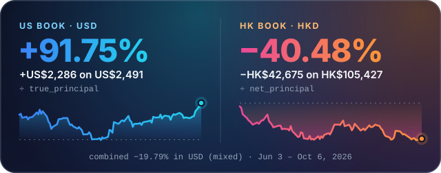
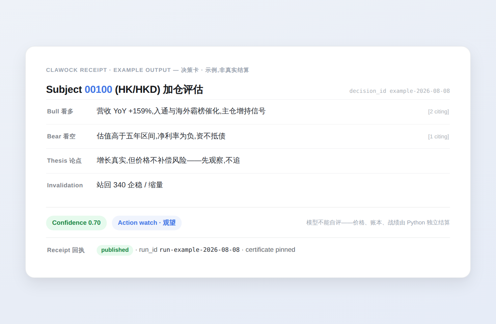
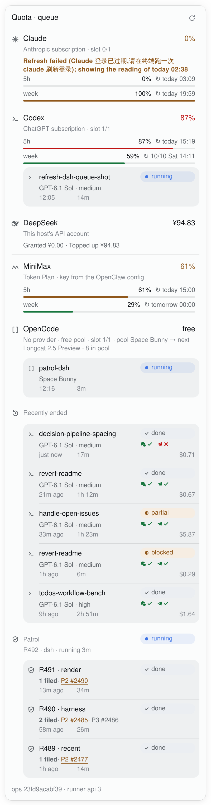
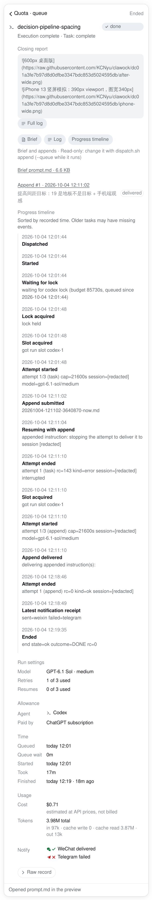
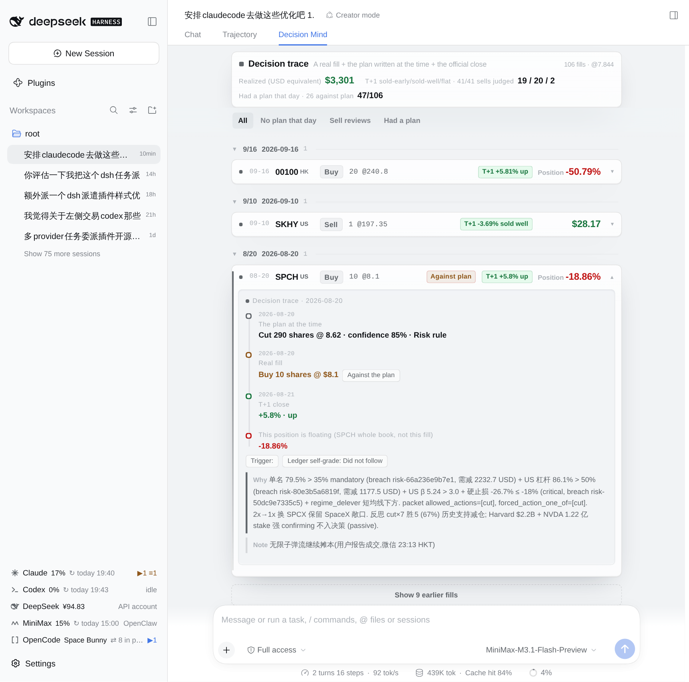

<div align="center">

<h1></h1>

### AI 争辩。代码结算。连亏损都摆在明面上。

[](https://pypi.org/project/clawock/)
[](https://www.npmjs.com/package/clawock-dsh)
[](https://github.com/KCNyu/clawock/actions/workflows/ci.yml)
[](https://github.com/KCNyu/clawock/actions/workflows/dashboard-artifact-gate.yml)
[](https://github.com/KCNyu/clawock/actions/workflows/ci.yml)
[](LICENSE)

[**实时仪表盘**](https://kcnyu.github.io/clawock/) &nbsp;·&nbsp; [**每日简报**](https://kcnyu.github.io/clawock/briefs.html) &nbsp;·&nbsp; [**证据与反证**](https://kcnyu.github.io/clawock/#reflect) &nbsp;·&nbsp; [**English**](README.md)

<a href="https://kcnyu.github.io/clawock/">
  
</a>

<sub><i>“市场不在乎模型有多自信。”</i></sub>

<a href="https://kcnyu.github.io/clawock/"></a>

<a href="https://kcnyu.github.io/clawock/#drill"><picture><source media="(max-width: 700px)" srcset="site/assets/books-narrow.svg"></picture></a>

| **<!-- CW_M:days -->142<!-- /CW_M:days -->** | **<!-- CW_M:rows -->985<!-- /CW_M:rows -->** | **<!-- CW_M:settled -->159<!-- /CW_M:settled -->** | **44** | **5** | **0** |
|:---:|:---:|:---:|:---:|:---:|:---:|
| 天,真实港美股账户实盘 | 条决策,账本全部公开 | 个案例由代码结算 | 8 层抓取与计算模块 | 种 Agent harness,同一份契约 | 条分数由模型给自己打 |

<sub>真实持仓、真实盈亏,亏损照样摆出来([原始决策记录](https://github.com/KCNyu/clawock/blob/master/memory/decisions.jsonl))。数字与图每周刷新;实时仪表盘随交易日更新。</sub>

</div>

## 你能得到什么

clawock 给你已经在用的 AI Agent 加一套投资决策纪律,用在你自己的股票账本上:Agent 读的是核验过的证据,必须写出反方,资金与汇率算术由 Python 核对;之后每一条判断由代码而不是模型公开打分。它跑在一个真实的港美股账户上,下单仍由你自己来。

<p align="center"><picture><source media="(max-width: 700px)" srcset="site/assets/start-here-narrow.svg"></picture></p>

- **开市前,一份计划。** 港股美股一份简报,看多理由旁边必须写着看空理由。
- **收盘后,一个分数。** Python 按真实日线逐条结算,模型碰不到自己的分数。
- **不承诺收益。** 主动建议至今没跑赢买入持有,页面照实写着。你拿到的是一份查得了的账。

## 五分钟跑起来

选你正在用的 Agent,点 logo 打开对应 harness 的可运行示例:

<div align="center">
<table>
<tr>
<td align="center" valign="top" width="120"><a href="examples/claude-code/CLAUDE.md"><br><b>Claude Code</b></a></td>
<td align="center" valign="top" width="120"><a href="examples/codex/AGENTS.md"><br><b>Codex</b></a></td>
<td align="center" valign="top" width="120"><a href="examples/openclaw/SKILL.md"><br><b>OpenClaw</b></a></td>
<td align="center" valign="top" width="120"><a href="examples/dsh/README.md"><br><b>DeepSeek Harness</b></a></td>
<td align="center" valign="top" width="120"><a href="examples/cli/run.sh"><br><b>自己的 / 纯 CLI</b></a></td>
</tr>
</table>
</div>

**最省事的办法:** 把本仓库地址丢给你的 Agent,让它 `python -m pip install clawock` 后跑 `bash examples/cli/minimal-run/run.sh`。不需要模型,也不需要任何 API 密钥,看到 `isolated run published <run_id>` 就是第一张被 Python 校验过的决策回执。

**手动跑**(Python ≥ 3.11),从空目录到一条已发布决策:

```bash
pip install clawock
clawock workflow install investment-decision --workspace ./my-book
clawock init ./my-book --workflow investment-decision
cd my-book && mkdir -p .clawock/work
clawock run prepare > .clawock/work/request.json
# 你的 Agent 读取请求,写出 decision.json
clawock run publish --request .clawock/work/request.json --artifact decision.json=decision.json
```

模型调用留在你自己的运行时里,费用走你自己的 API key;clawock 本身免费开源。[这一段](examples/cli/workflow-run/run.sh)每个 PR 都在干净虚拟环境里只装 wheel 原样跑一遍。

跑完拿到的是一张回执,多空两边都写在上面:

<p align="center"></p>

<sub>示例输出,不是真实结算。</sub>

把 `decision.json` 里的反方证据删掉,`publish` 直接拒收(退出码 1):

```json
{
  "status": "rejected",
  "validation_issues": [
    {"code": "insufficient_opposing_evidence", "message": "requires at least 1 opposing evidence item(s)"},
    {"code": "unsupported_bear_case", "message": "bear_case must cite opposing evidence"},
    ...
  ]
}
```

下图是 [`examples/claude-code`](examples/claude-code/CLAUDE.md) 指令在 Claude Code 里的一次真实运行:

<p align="center"></p>

不管对话在哪个 harness 里,判定都走同一条命令落账:`clawock record --source <harness>`,看空理由与失效条件必填。没有人手改 `decisions.jsonl`。

## 你账本上的一个交易日

- **08:03 HKT,计划送到。** Python 已经抓好行情、公告、资金流和中英文新闻;四位分析师、多空两位研究员、三位风险官和一位裁判读同一份证据,辩论出一份计划,发到微信、Telegram 和仪表盘。
- **盘中,卡片到手机。** 开盘、午间、收盘各一份播报,开市期间每 30 分钟一次盯盘;每张卡都写明早上计划里的触发价,现价已经碰到哪几条。
- **收盘后,打分。** 代码记下你实际执行了什么,按真实日线逐条结算。
- **第二天早上,它读自己的战绩。** 记分进入下一份简报。

<p align="center"><picture><source media="(max-width: 700px)" srcset="site/assets/decision-pipeline-narrow.svg"></picture></p>

作者自己的投研台用 OpenClaw 无人值守地跑这一套。每个任务都是 `clawock … preflight` → 模型写 → `clawock … postflight`:

<p align="center"></p>

<sub>由 <code>site/tools/shoot_openclaw_cron.js</code> 从主机真实的 <code>openclaw cron list --json</code> 渲染;任务 id、投递目标与 prompt 不出图。完整时刻表见<a href="docs/operations/cron-schedules.md">生成的排程表</a>。</sub>

## 战绩,亏损照样摆出来

截至 <!-- CW_M:as_of -->2026-10<!-- /CW_M:as_of -->,这个投研台已经公开结算了 **<!-- CW_M:settled -->159<!-- /CW_M:settled --> 条判断**,全部由 Python 机械结算后发布:赢的、输的、没法打分的都在。

<p align="center"><picture><source media="(max-width: 700px)" srcset="site/assets/scorecard-narrow.svg"></picture></p>

| 组 | 方向命中率 | 样本 |
|---|---|---|
| 主动建议(cut / trim / 加仓) | <!-- CW_M:active_pct -->50%<!-- /CW_M:active_pct --> | n=<!-- CW_M:active_n -->56<!-- /CW_M:active_n -->,95% 区间约 <!-- CW_M:active_ci -->37%–63%<!-- /CW_M:active_ci --> |
| 只是躺着 hold | <!-- CW_M:hold_pct -->32%<!-- /CW_M:hold_pct --> | n=<!-- CW_M:hold_n -->103<!-- /CW_M:hold_n --> |
| 高信心主动判断 | <!-- CW_M:hi_pct -->56%<!-- /CW_M:hi_pct --> | n=<!-- CW_M:hi_n -->16<!-- /CW_M:hi_n -->,95% 区间约 <!-- CW_M:hi_ci -->32%–80%<!-- /CW_M:hi_ci --> |

<p align="center"></p>

<sub>累计案例胜率对 50% 方向命中基线:衡量方向对了多少次,不是赚了多少。每周刷新;实时数字在<a href="https://kcnyu.github.io/clawock/#drill">持仓页</a>。</sub>

读这些数字,请带着四条限定:

- **是诊断,不是收益证明。** 方向命中率与盈亏无关;区间包含 50% 时统计上还不能算优势,该是噪声的地方就标成噪声。
- **真实账户另算。** 折美元合并 **<!-- CW_M:return_pct -->−19.79%<!-- /CW_M:return_pct -->**(实盘,已实现 + 浮动;美股、港股分开看见页首的图),对比买入持有仍然落后。
- **影子组合是模拟,不是实盘。** 跟随建议与买入持有在同一时间线上回放,见[持仓页](https://kcnyu.github.io/clawock/#drill)。
- **账户成绩是人机混合的成绩。** 跟不跟由账户所有者决定:<!-- CW_M:rows -->985<!-- /CW_M:rows --> 条记录里 followed <!-- CW_M:followed -->547<!-- /CW_M:followed --> / not_followed <!-- CW_M:not_followed -->383<!-- /CW_M:not_followed --> / unknown <!-- CW_M:unknown -->55<!-- /CW_M:unknown -->,每条都带执行状态。

杠杆刻度盘的择时能力目前不可与随机区分,[Reflect](https://kcnyu.github.io/clawock/#reflect) 照实写着。战绩可以复算:`clawock audit-resettle` 重新结算整本决策账(默认不写入),`clawock scorecard-provenance --check` 核对公开记分出自账本的哪几行。[原始账本全部公开](https://github.com/KCNyu/clawock/blob/master/memory/decisions.jsonl) · [打分硬规则](docs/how-the-desk-works.zh.md#战绩怎么打分硬规则) · [测了什么、什么没通过](docs/how-the-desk-works.zh.md#测了什么什么没通过)。

## 模型不被允许做的事

分数不是模型自己打的,账也不是模型自己记的。可能把记录算坏的算术都在 Python 里,有单元测试钉着。

<p align="center"><picture><source media="(max-width: 700px)" srcset="site/assets/guardrails-narrow.svg"></picture></p>

[全部 12 条,代码具体做什么](docs/how-the-desk-works.zh.md#代码强制执行的规矩)。

## 在 DeepSeek Harness 里委派

**交代任务、离开聊天、回来收结果。** `clawock-dsh` 把投资决策 skill、Decision Mind 标签页和 provider 面板带进 dsh 网页端。在装了 clawock **agent-dispatch** runner 的主机上,这块面板还让你随时看见并控制 Claude Code、Codex、OpenCode 这支后台团队:你在聊天里委派仓库改动并写明交付要求,runner 让任务独立跑完,插件让你随时看进度、改方向。

<p align="center"><picture><source media="(max-width: 700px)" srcset="site/assets/harnesses-narrow.svg"></picture></p>

- **看清正在发生什么。** 订阅用量与重置时刻、provider 余额、各 agent 的真实队列、模型、用时和按 API 标价估算的费用,都在同一块面板。
- **任务在跑,也能改方向。** 把排队任务往前移,在允许时改下一次尝试的模型,调整截止时间与重试预算,取消任务或续跑未完成的会话。
- **结果留得住。** 任务完成但消息发送失败仍然看得见;没收到消息不等于工作消失了。

<details>
<summary><b>展开完整队列截图</b> —— 真实主机上的插件</summary>

<br>

<p align="center"></p>

[队列能力与配置](examples/dsh/packages/clawock-dsh/README.md#dispatch-queue) · [runner 与 ops 契约](docs/architecture/task-queue.md)。

</details>

<details>
<summary><b>打开单个任务的历史</b> — 追加指令与进展时间线</summary>

<br>

<p align="center"></p>

</details>

问一句“0700.HK 能不能加点仓?”,投资 skill 会带着 agent 收集证据、做多空辩论、写出有边界的决策。**Decision Mind** 让你点开一笔真实成交,顺着**计划 → 执行 → T+1 → 盈亏**往下看。没有计划、尚未判定都明说,USD 与 HKD 分开,下单仍由你来。

<p align="center"></p>

```bash
python -m pip install clawock
dsh plugin --profile web add clawock-dsh
mkdir -p ~/.dsh/skills
cp -r ~/.dsh/profiles/web/node_modules/clawock-dsh/skills/investment-decision ~/.dsh/skills/
```

重启 web profile 后加载。后台队列控制还需要主机上的 runner;没装时面板仍显示 provider 额度与余额。[npm 包](https://www.npmjs.com/package/clawock-dsh) · [安装与队列配置](examples/dsh/packages/clawock-dsh/README.md)。

## 引擎盖下面

想看机器怎么转的读者,这里有四张图;图背后的文字在[投研台怎么运转](docs/how-the-desk-works.zh.md)。

**谁管什么。** 模型调用、对话、记忆、工具、权限和凭证都留在你的运行时里;clawock 只是围着它们的文件加 CLI。

<p align="center"><picture><source media="(max-width: 700px)" srcset="site/assets/product-architecture-narrow.svg"></picture></p>

**真实投研台。** 同一条边界落在一个真实组合上。

<p align="center"><picture><source media="(max-width: 700px)" srcset="site/assets/architecture-narrow.svg"></picture></p>

**证据从哪来。** Python 按有序的兜底链抓取,模型只读组装好的文件。港股基础覆盖与美股对齐,港股研究广度落后美股。

<p align="center"><picture><source media="(max-width: 700px)" srcset="site/assets/information-flow-narrow.svg"></picture></p>

**辩论怎么被逼出分歧。** 改编自 [TradingAgents](https://github.com/TauricResearch/TradingAgents):多空两位研究员必须有分歧并记录下来,全员一致是警示信号而不是共识;裁判点名每条决策背后的策略框架。

<p align="center"><picture><source media="(max-width: 700px)" srcset="site/assets/debate-flow-narrow.svg"></picture></p>

## 接着看

- [**实时仪表盘**](https://kcnyu.github.io/clawock/) —— 持仓、风控与代码结算的战绩。
- [**每日简报**](https://kcnyu.github.io/clawock/briefs.html) —— 已发布的早读。
- [**决策地图**](https://kcnyu.github.io/clawock/#reflect) —— 每条决策旁边并列当时的信号快照([阅读说明](docs/decision-map.md))。
- [**各 harness 示例**](examples/README.md) —— 同一条决策,五种 harness,外加 npm 上的 dsh 插件。
- [**投研台怎么运转**](docs/how-the-desk-works.zh.md) —— 信息层、每种运行读什么、决策闸、打分规则与 12 条代码规矩。
- [**影响者雷达**](docs/influencer-radar.md) —— 八个公开来源每个交易日扫两次并关联到持仓;落空也照实记空。
- [**命令参考**](docs/reference/commands.md) · [**术语表**](docs/glossary.md) · [**全部项目文档**](docs/README.md) · [**参与开发**](AGENTS.md#interactive-codexclaude-pr-workflow)

### 研究入口

| 问题 | 入口 | 复用范围 |
|---|---|---|
| 分析一家美股公司 | [`us-stock-analysis`](skills/us-stock-analysis/SKILL.md) | 可随 clawock 工作区复用 |
| 分析一家港股公司 | [`hk-stock-analysis`](skills/hk-stock-analysis/SKILL.md) | 可随 clawock 工作区复用 |
| 检查当前组合 | [`portfolio-risk-review`](skills/portfolio-risk-review/SKILL.md) / [`portfolio-swarm-review`](skills/portfolio-swarm-review/SKILL.md) | 依赖已配置的真实组合 |
| 压测一条供应链论点 | [`serenity-skill`](skills/serenity-skill/SKILL.md) | 可作为手动研究框架复用 |
| 复盘一个已披露的报告期 | [`earnings-review`](skills/earnings-review/SKILL.md) | 可复用,产物落 `memory/earnings/` |
| 判断一个新标的值不值得做深度研究 | [`entry-gate`](skills/entry-gate/SKILL.md) | 可复用,产物落 `memory/entry-gates/` |

它们依赖 clawock 的脚本、数据契约与记忆文件,不是独立的一键产品。

## 范围、免责与许可

**为什么要开源、图什么:** 这套系统本来就在跑——这是作者自己的真实账户,亏盈都是自己的钱。开源是把账本和流程摊开,不收费、无付费版、无荐股群;你装不装、跟不跟,和作者的收入没有任何关系。

本仓库包含**真实交易持仓**,是个人记录与可携带工作区——**不是投资建议、不是推荐、也不是跟单系统**。结算规则与方法学变更都在代码里版本化,任何一条结果都不是人工挑选的;主动建议至今没显出优势,你读到时每个数字都可能已经过时。

原创代码 [MIT](LICENSE);改编第三方代码保留原许可与署名,见 [NOTICE](NOTICE) 与 [`THIRD_PARTY_LICENSES/`](THIRD_PARTY_LICENSES/)。行情、新闻、社交内容与 API 访问**不**被 MIT 重新授权,见[第三方数据与服务](docs/legal/third-party-data.md)。

用 [Claude Code](https://claude.com/claude-code)、[openclaw](https://openclaw.com) cron 守护进程、Jekyll + GitHub Pages 与 Python 构建。

<div align="center">
<br>

**[实时仪表盘](https://kcnyu.github.io/clawock/)** &nbsp;·&nbsp; **[每日简报](https://kcnyu.github.io/clawock/briefs.html)** &nbsp;·&nbsp; **[English](README.md)**

<sub>由 <a href="https://github.com/KCNyu">Shengyu Li (kcn)</a> 与 Rick 构建维护 · 2026</sub>

</div>
