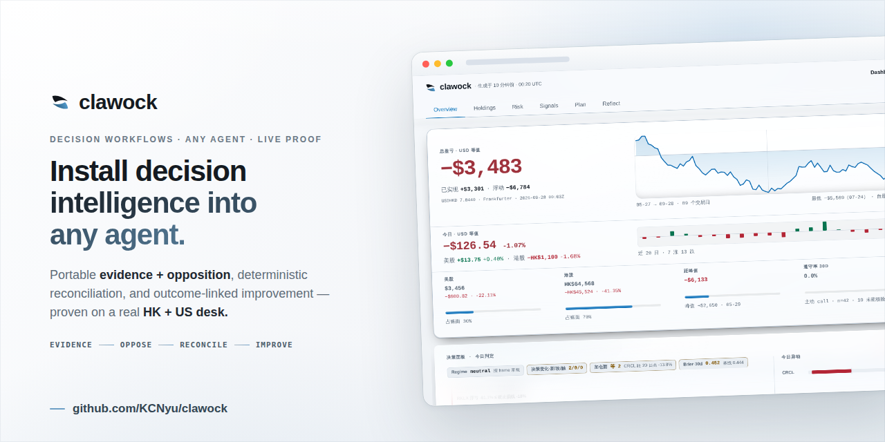
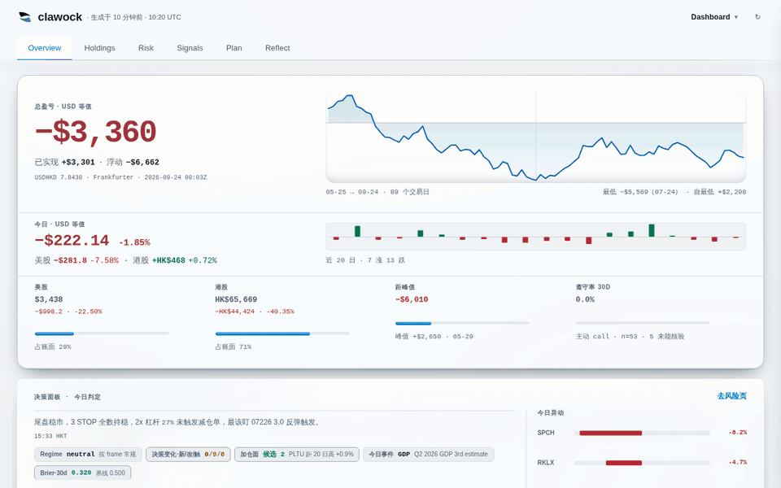
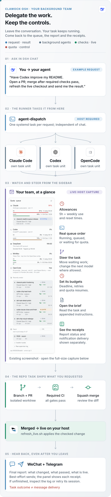
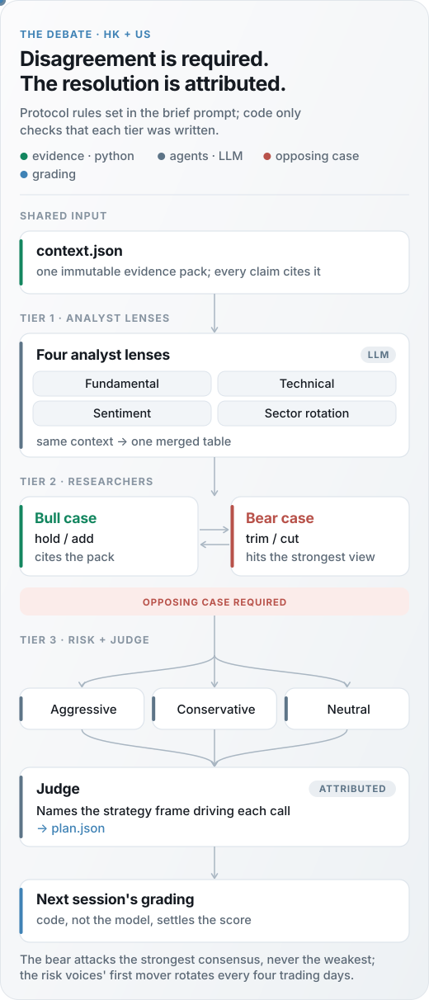
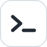
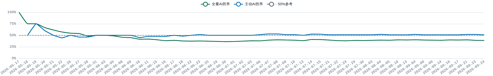

<div align="center">

<h1></h1>

### AI 争辩。代码结算。连亏损都摆在明面上。

[](https://pypi.org/project/clawock/)
[](https://www.npmjs.com/package/clawock-dsh)
[](https://github.com/KCNyu/clawock/actions/workflows/ci.yml)
[](https://github.com/KCNyu/clawock/actions/workflows/dashboard-artifact-gate.yml)
[](https://github.com/KCNyu/clawock/actions/workflows/ci.yml)
[](LICENSE)

[**实时仪表盘**](https://kcnyu.github.io/clawock/) &nbsp;·&nbsp; [**每日简报**](https://kcnyu.github.io/clawock/briefs.html) &nbsp;·&nbsp; [**证据与反证**](https://kcnyu.github.io/clawock/#reflect) &nbsp;·&nbsp; [**English**](README.md)

<a href="https://kcnyu.github.io/clawock/">
  
</a>

<sub><i>“市场不在乎模型有多自信。”</i></sub>

<a href="https://kcnyu.github.io/clawock/"></a>

| **<!-- CW_M:days -->134<!-- /CW_M:days -->** | **<!-- CW_M:rows -->936<!-- /CW_M:rows -->** | **<!-- CW_M:settled -->152<!-- /CW_M:settled -->** | **44** | **5** | **0** |
|:---:|:---:|:---:|:---:|:---:|:---:|
| 天,真实港美股账户实盘 | 条决策,账本全部公开 | 个案例由代码结算 | 8 层抓取与计算模块 | 种 Agent harness,同一份契约 | 条分数由模型给自己打 |

<sub>真实持仓、真实盈亏——实盘收益 <!-- CW_M:return_pct -->−22.33%<!-- /CW_M:return_pct -->,亏损照样摆出来([原始决策记录](https://github.com/KCNyu/clawock/blob/master/memory/decisions.jsonl))——公开打分。数字与静态预览图每周刷新;仪表盘 GIF 在手动触发时更新;实时仪表盘随交易日更新。</sub>

</div>

## 日常运行流程

每个交易日,clawock 把市场里的原始信息一路加工成可以打分的决策:

- **收集**:8 层、44 个抓取与计算模块——行情、SEC 与港交所公告、资金流、中英文新闻、Reddit 与影响者动态,多源兜底。Python 负责抓,模型只读组装好的上下文。
- **算因子**:量化因子、横截面排名、同业残差、趋势 × 波动率的杠杆刻度盘,全部由 Python 确定性计算。
- **检验与把关**:因子要取得已验证的决策权,聚类 bootstrap 区间须避开 50%;前瞻激活与有上限的探索各有规则。横截面层预先登记;杠杆刻度盘样本外打分。没通过的也公开在仪表盘的 [Reflect 视图](https://kcnyu.github.io/clawock/#reflect)。
- **决策**:四位分析师、多空两位研究员、三位风险官和一位裁判读同一份上下文,辩论出 `plan.json`。
- **投递**:Python postflight 校验计划、记决策账、渲染简报,发布到微信、Telegram 与仪表盘。
- **结算**:Python 按标准日线逐个 episode 结算,模型碰不到自己的分数,结果全部进公开战绩。

<p align="center"></p>

## 开发流程

这张投研台由 Claude Code、Codex 与 OpenCode 经共享的 runner、记忆和规则文件开发。下面画的是代码改动怎么进仓库;上面画的是市场证据怎么变成可打分的决策。

<p align="center"></p>

<sub>多个 coding agent 共用这张开发台:一个 runner 仲裁任务,一份记忆与规则文件保持一致,一道 PR 闸接收改动——接线说明见 <a href="docs/architecture/task-queue.md">docs/architecture/task-queue.md</a>。</sub>

参与开发按 [AGENTS.md](AGENTS.md#interactive-codexclaude-pr-workflow) 的约定走:

1. 从当前 `origin/master` 建独立 worktree,分支用 `codex/<task>` 或 `claude/<task>`。live checkout 留在 `master`,供定时任务写运行数据。
2. 修改、跑定向检查、commit、推任务分支、开 PR。GitHub Actions 跑全套;作者自查 diff,必需检查通过后才 squash-merge。
3. 本机用 `ops/host/refresh_live.sh` 应用合并;`--check` 查看待刷新项。它更新 editable checkout,并安装需要刷新的副本。

PyPI/npm 发版面向外部安装:版本号和 changelog 先走 PR,再用对应的 `v<version>` tag 触发 release 工作流。本机刷新与包发版是两个步骤,见[发版手册](docs/operations/release.md)。

---

## 这是什么

clawock 起步是一个账户,不是一个包。多 Agent 投研台在一个分港股、美股两本账的真实券商账户上辩论证据、提出交易,下单仍由账户主人自己来。留下来的是记录:真实持仓、不断增长的决策历史,以及模型无权插手的公开记分。它不是暴富机器人,也不是跟单服务。

clawock 是从这个投研台里拆出来、可以复用的那部分。模型调用、对话、记忆、工具、权限和凭证都留在你的运行时里;clawock 在上面加一份决策契约:带指纹的证据、必填的反方、核对过的资金与汇率算术,以及把结果连回当初那条决策。它就是文件加 CLI,换上面任何一个 harness 契约都不变。

真实投研台每个交易日盘前读取 8 层信息流,组织一场多 Agent 辩论(四视角分析师 + 多空对立 + 裁判归因)给出决策,Python 独立结算。账目都能从命令复算:`clawock audit-resettle` 结算决策账、`clawock reconcile` 复算组合派生、`clawock scorecard-provenance --check` 核对公开记分出自账本的哪几行。

复合因子、行情状态、打折夏普、CSCV、吊灯止损、运行卡……这些术语的中英文标准翻译,见 [术语表](docs/glossary.md)。

## 怎么跑的

大白话版:每天早 8 点,它把新闻、财报、公告全读一遍,让四个 AI 先吵一架,再让一个裁判拍板,最后自动记账。想赖账?代码不答应。

正经版:LLM 从不自己抓数据,也不自己结算。Python 留存完整上下文供审计;盘前深度简报给模型的是同一代次的清单、固定核心和按需读取的特性 bundle,风控细节独立成包。模型读选中的文件,写带证据、带反方的分析。剩下全是代码的事。

<p align="center"></p>

## 信息层

仓库编录了 **8 层、44 个抓取与计算模块**,港股美股双语覆盖:

<details>
<summary><b>全部 8 层,逐行展开</b> —— 模块数与主要来源</summary>

<br>

| 层 | 模块 | 主要来源 |
|---|---|---|
| 1 · 行情 | 7 | 腾讯 · Yahoo · 东财 · Polygon |
| 2 · 基本面/申报 | 3 | SEC EDGAR · 东财 datacenter · 港交所 |
| 3 · 资金面 | 1 | 东财 push2his |
| 4 · 消息面与催化剂(双语) | 6 | 东财 · Finnhub · Google News · Yahoo · 同花顺 · 交易所公告 |
| 5 · 宏观/情绪 | 3 | Yahoo · Reddit · CNN · 社交 feed |
| 6 · 量化与风险 | 9 | 对价格历史做确定性计算 |
| 7 · 账本/汇率校验 | 6 | Frankfurter · 对账账本 · 本地不变量 |
| 8 · 回测/自省 | 9 | 本地快照 + 基准行情 |

覆盖是双语的,但不对称,而且不对称的地方在研究广度不在基础面。行情、基本面、消息面、资金守恒都有真实的港股分支;两项研究广度能力没有:同业发现在美股侧自动抓取、在港股侧读人工策展的 peer-map([`peer_discovery.py`](src/clawock/market_data/peer_discovery.py) —— 机制已实测可用,闸仍关着,等 peer-residual 规则对着更宽的同业域重新登记之后再开),停牌在美股侧是结构化 feed、在港股侧只是一条要人工判读的公告([`mover_evidence.py`](src/clawock/market_data/mover_evidence.py))。即:港股基础覆盖对齐,港股研究广度落后美股。

抓取层优雅降级:东财统一走节流网关,报价/汇率多源兜底,抓空保留旧值。44 个模块的命令清单(`analyze-hk` `us-quotes` `filings` `fundflow` `em-news` `macro` `quant` `fx` `shadow` `evaluate-*` 等)由[命令参考](docs/reference/commands.md)按 registry 生成——上面的表格与清单由 CI 对着 [`config/information-layers.json`](config/information-layers.json) 核对,模块搬了家,数字不会留在原地。

</details>

### 热点捕获:影响者雷达

每个交易日两次,扫描特朗普、马斯克、Cathie Wood / ARK、Serenity、段永平、洪灏、Michael Burry、Pelosi 八个公开来源(滚动 48 小时),LLM 过滤后关联到真实持仓:谁说了什么、碰没碰你的仓,盘前简报里直接可见;落空也照实记空。来源、各源配额与一次命中/落空的实例见 [docs/influencer-radar.md](docs/influencer-radar.md)。

## 怎么做决策

分析最终落成明确的、带闸门的策略决策 —— 而同一只股票可以同时挂好几条,每条在自己的案例里独立打分:

| 策略 | 干什么 |
|---|---|
| `core_position` | 长线核心仓位 |
| `risk_rebalance` | 风控再平衡:降杠杆、止损、换仓 |
| `intraday_t` | 日内 T+0 |
| `event_trade` | 事件驱动(财报、催化剂) |
| `tactical_entry` | 战术建仓 |

加仓不是拍脑袋:量化因子与同行残差合并为一个 price_relative 证据族,时点新闻 surprise/attention 与「确认且未过热的 20 日突破」各构成一个证据族,**任意两族成立即可授权有上限的试探仓位**;已验证档仍要求价格与信息两侧都有可用证据,价格形态永远不会提拔杠杆仓;负面信息优先阻断;未验证信号只能进有上限的试探仓位,永远不能直接进决策。

### 每种运行实际拿到什么

盘前拿到的最多:持仓真值、风控、量化信号、新闻/催化剂、论点登记册、历史
复盘,还要写当日计划。开/午/收报告轻装上阵:一份新鲜行情,信号触发才带
风控段。盘中盯盘(开市每 30 分钟一次)居中:信号更细,但不产研究、不重建
证据图——那是日度产物,盘中重建等于用旧数据。

<details>
<summary><b>逐块拆解</b> —— 按频次分行对照</summary>

<br>

| | 盘前深度简报 | 开 / 午 / 收报告 | 盘中盯盘 |
|---|---|---|---|
| **什么时候** | 工作日 08:03 HKT | 港 09:30·12:00·13:30·16:00,美开收 | 开市每 30 分钟 |
| **块数** | 41 | 19 | 47 |
| **核心内容** | 持仓真值、风控、量化信号、**收盘确认的加仓面**、新闻/催化剂(含上次收盘以来的实时公告与新闻)、论点登记册、历史复盘、当日计划 | 新鲜行情、异动催化探针、全持仓实时公告与新闻、待成交决策、**计划触发线是否已破** | 行情、信号计数、T+0 牌面、异动标记、每档全持仓实时公告/新闻/7×24、盘中重跑的入场 setup、**计划触发线是否已破**(算术判定并印进块里,不指望模型自己看出来) |

块数 = 每个频次产出的 context 顶层块数,CI(`tests/test_readme_parity.py`)对着 preflight 自己的 context dict 数——标识包身份的信封键(`context_id` / `generation_id`)不计数,所以实际产物会多一个键。

催化探针只对已经异动的票触发,一手源优先(SEC 受理时间戳、港交所公告),找不到就明写 `no_recent_filing`,不让空块读成「什么都没发生」。

</details>

## 辩论

**全员一致不是共识,而是警示信号。** 两名研究员各自举证、记录真实分歧——如果所有声音都同意,结论不是被采信,而是带着警示进裁判复审。所以你看不到"全员看多"的假共识。

每天 08:03,一份证据包喂给**四位分析师**(基本面 / 技术面 / 情绪面 / 板块轮动)读同一份上下文;**两名研究员必须建立多空对立论点**并记录分歧;激进 / 保守 / 中性**三位风险官**各陈其词;一位**裁判**点名策略框架,收敛成 `plan.json` 进入打分流水线(改编自 [TradingAgents](https://github.com/TauricResearch/TradingAgents))。两条抗锚定机制:Bear 被指定为 **devil's advocate**,必须点名攻击当前最强共识(不许挑软柿子);三位风险官的**首位表态权每 4 个交易日轮换**,当日主导视角写进盘前简报——轮换只改表态顺序,不改 kcn 激进偏好的权重。

<p align="center"></p>

## 公开战绩

<sub><i>“市场不在乎模型有多自信。”</i></sub>

截至 <!-- CW_M:as_of -->2026-09<!-- /CW_M:as_of -->,这个投研台已经公开结算了 **<!-- CW_M:settled -->152<!-- /CW_M:settled --> 条判断**,Python 独立打分:

| 组 | 方向命中率 | 样本 |
|---|---|---|
| 主动建议(cut / trim / 加仓) | <!-- CW_M:active_pct -->51%<!-- /CW_M:active_pct --> | n=<!-- CW_M:active_n -->53<!-- /CW_M:active_n --> |
| 只是躺着 hold | <!-- CW_M:hold_pct -->32%<!-- /CW_M:hold_pct --> | n=<!-- CW_M:hold_n -->99<!-- /CW_M:hold_n --> |
| 高信心主动判断 | <!-- CW_M:hi_pct -->53%<!-- /CW_M:hi_pct --> | n=<!-- CW_M:hi_n -->15<!-- /CW_M:hi_n --> |

翻译成人话:**主动判断的方向命中率看上表实时数字；单凭它不能推断赚了多少钱。** 所以它只敢吹「不骗你」,不敢吹「赚多少」。

方向命中率 ≠ 赚到钱:真实账户收益自公开以来为负(数字见下方「四条线」表,由脚本刷新),收益对比买入持有仍然落后;影子组合(模拟,非实盘)的对比在[持仓页](https://kcnyu.github.io/clawock/#drill)如实展示。[**原始账本全部公开,欢迎查账。**](https://github.com/KCNyu/clawock/blob/master/memory/decisions.jsonl)

**查账不是读文档,战绩可以复算:** `clawock audit-resettle` 重新结算整本决策账(默认不写入)、`clawock reconcile` 复算全部组合派生、`clawock integrity` 校验资金与行情不变量。判定规则(什么是 win / loss、怎么归组、怎么处理缺数据)全部在代码里版本化,**对不上算我们输**——README 上每个数字,都能从命令跑出来。四个口径互不换算:别拿方向命中率去算账户收益,也别拿账本行数当已结算数。

**四条线,各算各的:**

| 线 | 数字 | 口径 |
|---|---|---|
| **决策账本** | <!-- CW_M:rows -->936<!-- /CW_M:rows --> 条记录 → **<!-- CW_M:settled -->152<!-- /CW_M:settled -->** 个已结算案例 | 含重申归组,同一论点重复喊单只算一次;全部公开 |
| **方向命中率** | 主动 **<!-- CW_M:active_pct -->51%<!-- /CW_M:active_pct -->**(n=<!-- CW_M:active_n -->53<!-- /CW_M:active_n -->) | 模型判断的方向对不对,按基准行情结算——**与盈亏无关** |
| **影子组合**(模拟,非实盘) | 跟随建议 vs 买入持有 | 同一时间线、同日收盘计价回放,见[持仓页](https://kcnyu.github.io/clawock/#drill) |
| **真实账户** | 收益 **<!-- CW_M:return_pct -->−22.33%<!-- /CW_M:return_pct -->**(实盘,已实现 + 浮动) | 决策执行:followed <!-- CW_M:followed -->513<!-- /CW_M:followed --> / not_followed <!-- CW_M:not_followed -->373<!-- /CW_M:not_followed --> 条 |

**谁决定跟进?账户所有者。** 每条跟进/不跟进都有记录与来源;在跟进规则集公开审计之前,请把账户收益当作**人机混合的成绩**,而不是模型单独的成绩——这一点我们明说,不藏。

**账本长什么样**(真实记录,dec-5227ea7f77a2 · 2026-08-10):

```
action: hold_and_watch        driven_by: catalyst
episode: ep-20260731-spcx-hold
evaluation: loss(按基准行情结算, trigger session 2026-08-10)
```

<!-- CW_M:rows -->936<!-- /CW_M:rows --> 条这样的记录全部公开。**每条建议都带执行状态**(followed <!-- CW_M:followed -->513<!-- /CW_M:followed --> / not_followed <!-- CW_M:not_followed -->373<!-- /CW_M:not_followed --> / unknown <!-- CW_M:unknown -->50<!-- /CW_M:unknown -->);影子组合用模拟成交回放,专门暴露「建议 → 成交」的配对差距,而不是藏起来。

## 测了什么，什么没通过

诚实到数字层面:主动建议 <!-- CW_M:active_pct -->51%<!-- /CW_M:active_pct --> 命中率,样本 <!-- CW_M:active_n -->53<!-- /CW_M:active_n --> 条,95% 置信区间约 <!-- CW_M:active_ci -->38%–64%<!-- /CW_M:active_ci -->;高信心组 <!-- CW_M:hi_pct -->53%<!-- /CW_M:hi_pct -->,样本 <!-- CW_M:hi_n -->15<!-- /CW_M:hi_n --> 条,区间约 <!-- CW_M:hi_ci -->28%–78%<!-- /CW_M:hi_ci -->——**点估计均跨过 50%,但 95% 置信区间包含 50%,统计上还不能算优势**。这正是我们不做收益宣传的原因:该是噪声的地方,就标成噪声——而分辨「edge 还是手痒」,就是这套系统唯一在卖的东西:它不替你赚钱,它替你证明每一笔判断值不值得信。

杠杆刻度盘按样本外打分,择时能力对照环形位移原假设;**当前结论:不可与随机区分,页面如实写着**。刻度盘是**风险预算控制,不是择时信号**:它能主张的价值是恶劣 regime 里少上杠杆,「预测顶底」恰好是无法与随机区分的那部分。「未能拒绝原假设」不等于「已被证伪」,页面会说清楚是哪一种。结果不管好看不好看都发,页面从产物生成,不能与产物脱节;引用回测数字必须指向仍含该数字的运行卡,CI 两条都查。

[**证据与反证**](https://kcnyu.github.io/clawock/#reflect)

## 代码强制执行的规矩

这 12 条就一个意思:**分数不是模型自己打的,账也不是模型自己记的。**两种货币
不直接相加、风控上限每份简报都核查(单一标的:杠杆 ≤35% 硬上限、非杠杆核心
≤60% 硬上限且 35–60% 为复核带;相关集群 ≤70%、组合 β ≤3.0、−18% 止损)、
论点只在有新证据时变,价格波动动不了这条。

<details>
<summary><b>全部 12 条,代码具体做什么</b></summary>

<br>

| 规矩 | 代码做的事 |
|---|---|
| **两种货币不直接相加** | 港币与美元同时以两种口径展示,并盖上汇率+时间戳;把两种货币生硬相加是个没意义的数。 |
| **风控上限,每份简报都核查** | 单一标的:杠杆 ≤35% 硬上限,非杠杆核心 ≤60% 硬上限、35–60% 是复核带(advisory,不强制卖);相关集群 ≤70%(按实测相关性聚类、覆盖足够才启用)、杠杆 ETF 仓位 ≤50%、组合 β ≤3.0、−18% 止损。每条 breach 都有持久化的年龄、确认、限时 override 与成交证据;回到合规前冻结同风险增仓。执行仍然是人。 |
| **集中度按腿计算** | 每本账 `HHI = Σ wᵢ²`；top2 是前两大持仓权重之和。简报只按 HHI，依次取首个满足条件的档位：`≤0.15` ✅ · `≤0.25` 🟡 · `≤0.40` 🟠 · 其余 🔴。面板同时检查两个维度，依次取首个满足条件的档位：`HHI<0.15 且 top2<40%` ✅ · `HHI<0.25 且 top2<60%` 🟡 · `HHI<0.40 且 top2<75%` 🟠 · 其余 🔴。绝不跨币种混算。 |
| **杠杆按 regime 拨挡** | 200 日趋势 × 波动率的拨盘给杠杆 ETF 仓位封顶(×1 / ×0.5 / ×0);每日重置的 2×/3× 产品完全跳过基本面。 |
| **回报基于峰值本金** | 回报率用现金流账本里的峰值净投入,而不是 `成本 − 已实现` —— 一笔已实现盈利不该伪造出更高的回报。 |
| **软情绪不能单独翻转交易** | 一条推文或单一情绪只能微调置信度;source-weighted attention 只有同时满足自身历史加速和 price-relative 强度时,才可进入有上限的试探。硬的、带日期的负面催化仍可直接触发防守动作。 |
| **未验证信号只能进入试探边界** | 量化因子在通过前瞻激活前不能声称已验证;热身阶段只有预注册交互可以按标的/策略版本采一批有上限的样本,账本单独标注证据等级。 |
| **加仓需要两个独立证据族** | 因子和同行残差只算一个 price-relative 证据族,不得冒充两票;price-relative / 时点新闻 surprise/attention / 确认且未过热的 20 日突破,任意两族即可授权有上限的试探批次;已验证批次仍要求价格与信息两侧都有可用证据,价格形态永远不会提拔杠杆仓。 |
| **对外研究里的数字必须两源** | 长文里的数字带来源清单(provenance manifest):精确 Decimal 运算、每个数字两个独立来源、tolerance 上限不能由清单自己抬高。单源或两源不一致的数字,直接卡住引用它的产物准出。 |
| **论点只在有新证据时变** | 假设、红线、估值锚都落在带版本的 JSON 里。某个维度要变,必须有上次检查之后观察到的证据;价格波动只能改估值,动不了生意 / 护城河 / 管理层;红线的触发**和**解除都要证据。没有基线就诚实记 `unknown`,不靠文案补造历史。 |
| **盈利质量由代码算,不靠断言** | 现金转化、营运资本缺口、摊薄、SBC 占比、指引结果都由代码从至少四个可比期算出。中途换会计基准或币种直接判错,缺输入就写 `unavailable` 并给原因,脚注类结论必须有一手发行人文件。 |
| **新标的先过研究闸再花深研** | 信息丰富度与投资质量分开打分,所以来源单薄只会得到 `gray_needs_evidence`(证据不足·灰),不会被判死。四条硬否决在任何计分之前结算,行业例外按板块写进配置而不是临场发挥,行情只认工作区自己的取价链。 |

</details>

## 每日节奏

```
凌晨    记忆「做梦」—— 把昨天的教训提炼进长期笔记
早上    深度简报 —— 多层辩论 + 一位裁判,推送到微信
港股    开盘 → 定时盘中监控 → 收盘
美股    开盘 → 拆分盘中监控 → 收盘
             ↑ 每次成功的播报都会发布仪表盘变更
穿插    盘前宏观 / 情绪 / 事件扫描,再加一份美股盘前新闻摘要
每周    归档、体检、复盘与视觉刷新任务
```

港股时间按 HKT;美股场次时间按 ET,其 cron 表达式随纽约夏令时自动切换。节假日 + 周末闸门跳过休市场次。精确的生成表见 [docs/operations/cron-schedules.md](docs/operations/cron-schedules.md)。

## 在你自己的账本上跑

日常运行流程可以装进你正在用的 Agent——点 logo 打开对应 harness 的可运行示例:

<div align="center">
<table>
<tr>
<td align="center" valign="top" width="120"><a href="examples/claude-code/CLAUDE.md"><br><b>Claude Code</b></a></td>
<td align="center" valign="top" width="120"><a href="examples/codex/AGENTS.md"><br><b>Codex</b></a></td>
<td align="center" valign="top" width="120"><a href="examples/openclaw/SKILL.md"><br><b>OpenClaw</b></a></td>
<td align="center" valign="top" width="120"><a href="examples/dsh/README.md"><br><b>DeepSeek Harness</b></a></td>
<td align="center" valign="top" width="120"><a href="examples/cli/run.sh"><br><b>自己的 / 纯 CLI</b></a></td>
</tr>
</table>
</div>

**甩给 AI(默认):** 把本仓库地址丢给你的 Agent(上面任何一个都行),约 60 秒就能验证一条完整决策(真实决策另需你自己的模型 API):

1. `python -m pip install clawock`
2. 跑 `bash examples/cli/minimal-run/run.sh` 验证一条完整决策(无模型,无需任何 API 密钥);跑完你会看到 `isolated run published <run_id>`,也就是第一张被 Python 校验过的决策回执
3. 走真实决策时按 [`examples/dsh/packages/clawock-dsh/skills/investment-decision/SKILL.md`](examples/dsh/packages/clawock-dsh/skills/investment-decision/SKILL.md) 的三步流程:prepare → 写 `decision.json` → publish

**或者手动**(Python ≥ 3.11)。从空目录到一条已发布决策——[`examples/cli/workflow-run/run.sh`](examples/cli/workflow-run/run.sh) 每个 PR 都在干净虚拟环境里只装 wheel 原样跑这一段:

```bash
pip install clawock
clawock workflow install investment-decision --workspace ./my-book
clawock init ./my-book --workflow investment-decision
cd my-book && mkdir -p .clawock/work
clawock run prepare > .clawock/work/request.json
# 你的 Agent 读取请求,写出 decision.json
clawock run publish --request .clawock/work/request.json --artifact decision.json=decision.json
```

`run prepare` 产出一份带指纹的请求文件,你的 Agent 写出 `decision.json`,`run publish` 校验(证据、反方、资金与汇率对账)并给出生成回执。把 `decision.json` 里的反方证据删掉,`publish` 会直接拒收(退出码 1):

```json
{
  "status": "rejected",
  "validation_issues": [
    {"code": "insufficient_opposing_evidence", "message": "requires at least 1 opposing evidence item(s)"},
    {"code": "unsupported_bear_case", "message": "bear_case must cite opposing evidence"},
    ...
  ]
}
```

### 同一份契约,换个 harness 长得完全不一样

每个 harness 走的都是同样三步——prepare、写 `decision.json`、publish——只是界面各不相同。**Claude Code** 是终端里的一个循环,下图是 [`examples/claude-code`](examples/claude-code/CLAUDE.md) 指令的一次真实运行:

<p align="center"></p>

**OpenClaw** 无人值守地跑。本投研台的调度器里每份简报、每场播报、每档盘中都是一个任务,每个 prompt 都是 `clawock … preflight` → 模型写 → `clawock … postflight`:

<p align="center"></p>

<sub>由 <code>site/tools/shoot_openclaw_cron.js</code> 从主机真实的 <code>openclaw cron list --json</code> 渲染;任务 id、投递目标与 prompt 不出图。</sub>

**Codex** 从 [`examples/codex/AGENTS.md`](examples/codex/AGENTS.md) 读同样的三步;**DeepSeek Harness** 有原生面板(见下一节)。不管对话在哪个 harness 里,判定都走同一条命令落账——`clawock record --source <harness>`(bear 与失效条件强制、情绪自认)——没有人手改 `decisions.jsonl`。

**装完你得到三件事:** ① 每天 08:03 微信一份带证据链的深度简报,盘中每 30 分钟轻量盯盘(可关);② 一套所有决策可复算、可查账的审计框架;③ 一个诚实的基线——以后任何策略、任何 Agent,都能拿它跟上线以来的实盘记录对比。它现在不能承诺「赚」,能承诺的是「每一笔都有据可查」。模型费用走你自己的 API key,clawock 本身免费开源。

## DeepSeek Harness 插件

一条命令装好 investment-decision skill 和 dsh 网页端的两个原生面板——[npm](https://www.npmjs.com/package/clawock-dsh) · [包 README](examples/dsh/packages/clawock-dsh/README.md):

```bash
dsh plugin --profile web add clawock-dsh
```

**Decision Mind**——每一笔真实成交,旁边摆着当时写下的计划。主轴是 `portfolio.json` 的成交,每行挂接软配对的决策(±3 天,来自 `decisions.jsonl`),卖出用 T+1 窗口内 `memory/bars/` 的规范收盘价判定卖飞/卖对,加仓判涨/跌。点开一条展开成**计划 → 执行 → T+1 → 盈亏**;没有计划的成交明说没有;USD/HKD 绝不混加。公开 dashboard 的 Reflect 卡片用另一套实现渲染同一份轨迹,由 `tests/test_decision_trace_parity.py` 钉在一起。

<p align="center"></p>

<table>
<tr>
<td width="46%" valign="top"></td>
<td valign="top">

**Provider 面板——额度、余额和任务队列在同一格。** 侧栏底部的折叠行(上图左下角)点开就是这块面板:

- Claude 与 Codex 订阅的**额度窗口**——5 小时与每周用量,带重置时间。
- DeepSeek 与 MiniMax 的**余额**;OpenCode 免费池和下一个模型。
- 在跑着 clawock agent-dispatch 的主机上显示**派发队列**:各 agent 运行中与排队的任务,带模型、开始时刻、用时与费用。
- **最近结束**的任务带微信/Telegram 送达回执,以及**巡检**轮次。
- 点一行打开详情层——重试、调优先级、换模型或取消,全部经版本化的 ops 入口([task-queue.md](docs/architecture/task-queue.md));已合并但未装机时页脚变红。

</td>
</tr>
</table>

## 逛一逛这套系统

- [**实时仪表盘**](https://kcnyu.github.io/clawock/) —— 持仓、风控与代码结算的战绩;手机上左右滑动六个视图,标签栏跟着当前页走。
- [**每日简报**](https://kcnyu.github.io/clawock/briefs.html) —— 已发布的早读。
- [**决策地图**](https://kcnyu.github.io/clawock/#reflect) —— Reflect 中并列展示决策与当时的信号快照、覆盖率及快照年龄([阅读说明](docs/decision-map.md))。
- [**排程表**](docs/operations/cron-schedules.md) —— 生成的 cron 表。
- [**命令参考**](docs/reference/commands.md) —— 全部 installed command(清单由 registry 生成)+ 手写的 provider 与 harness 细节。
- [**项目文档**](docs/README.md) —— 当前架构、产品指南、运维、参考与法律说明。

### 研究入口

| 问题 | 入口 | 复用范围 |
|---|---|---|
| 分析一家美股公司 | [`us-stock-analysis`](skills/us-stock-analysis/SKILL.md) | 可随 clawock 工作区复用 |
| 分析一家港股公司 | [`hk-stock-analysis`](skills/hk-stock-analysis/SKILL.md) | 可随 clawock 工作区复用 |
| 检查当前组合 | [`portfolio-risk-review`](skills/portfolio-risk-review/SKILL.md) / [`portfolio-swarm-review`](skills/portfolio-swarm-review/SKILL.md) | 依赖已配置的真实组合 |
| 压测一条供应链论点 | [`serenity-skill`](skills/serenity-skill/SKILL.md) | 可作为手动研究框架复用 |
| 复盘一个已披露的报告期 | [`earnings-review`](skills/earnings-review/SKILL.md) | 可复用,产物落 `memory/earnings/` |
| 判断一个新标的值不值得做深度研究 | [`entry-gate`](skills/entry-gate/SKILL.md) | 可复用,产物落 `memory/entry-gates/` |

串联顺序:建仓前研究闸 → 一手财报证据 → 规范论点 → 决策 / 风控 / 结算回路。每一步写带版本的产物给下一步读,后一步永远无法用文案重推前一步。

<details>
<summary><b>战绩怎么打分(硬规则)</b></summary>

<br>

<p align="center"></p>

<sub>累计案例胜率对 50% 方向命中基线 —— 衡量方向对了多少次,不是赚了多少;买入持有对比在持仓页的影子组合里。每周刷新。</sub>

- 触发与标记来自单一基准供应商的逐日不复权行情;未完成场次永不打分,缺口按开盘价成交
- 置信度只保留为审计字段;严格前向的 beta-binomial 分层模型,稀疏小组向宽层先验收缩
- 择时单独计价:只问触发成交比当日收盘好或差多少,从不画累计金额曲线
- 影子组合(模拟,非实盘):两本现金+库存账重放同一时间线,一本跟主动建议、一本买入持有
- 页面从产物生成,不能与产物脱节;引用回测数字必须指向仍含该数字的运行卡,CI 两条都查

</details>

<details>
<summary><b>工程细节:架构与写入协调</b></summary>

<br>

<p align="center"></p>

<p align="center"></p>

- 仪表盘七个必需产物验证后整体发布到[数据面](docs/architecture/data-plane.md),第八个证据文件在可用时单独发布:Pages 提供静态壳与冷启动快照,后续轮询读取 `data-plane` 分支;前端直接读扫描旁路文件(sidecar)
- `master` 写者走 `ops/publish/safe_push.sh`:rebase 重试、真冲突中止,冲突标记在 push hook 被拒;仪表盘代次走独立的数据面发布器
- `portfolio.json` 是唯一真源:advisory 文件锁 + 原子替换,pre-push hook 拦下账目不平的 push
- 模型选择属于外部 runtime;跟踪的排程契约把 MiniMax-M3.1-Flash-Preview 列为主模型、GPT-6 Luna 列为简报/报告/盘中任务的兜底之一;仓库不存供应商密钥
- 仓库结构、排程契约等细节见[项目文档](docs/README.md)

</details>

<details>
<summary><b>仓库结构</b></summary>

<br>

| 路径 | 所有权 |
|---|---|
| `src/clawock/` | 可移植包、工作流契约、schema 与 CLI |
| `config/profiles/` | 只含数值和资源引用的声明式 desk profile |
| `site/` | Jekyll/仪表盘源码、浏览器代码、SVG、截图与 social 资产 |
| `ops/{host,publish,ci,growth,pages}/` | 明确归属的 host、发布、CI、增长与 Pages 接线;不允许通用数据桶 |
| `docs/`、`tests/` | 产品/运维文档与高价值不变量检查 |
| 根上下文文件、`skills/`、`memory/` | OpenClaw 兼容面;保留在运行时要求的位置 |
| `portfolio.json`、`assets/data/` | live 账本与生成发布状态;永不进入包 |
| `LICENSE`、`NOTICE`、`THIRD_PARTY_LICENSES/` | 标准 legal/包入口,由 Pages staging 复制 |

</details>

## 范围、免责与许可

**为什么要开源、图什么:** 这套系统本来就在跑——这是作者自己的真实账户,亏盈都是自己的钱。开源是把账本和流程摊开,不收费、无付费版、无荐股群;你装不装、跟不跟,和作者的收入没有任何关系。

本仓库包含**真实交易持仓**,是个人记录与可携带工作区——**不是投资建议、不是推荐、也不是跟单系统**。结算规则与方法学变更都在代码里版本化,任何一条结果都不是人工挑选的;主动建议至今没显出优势,你读到时每个数字都可能已经过时。

原创代码 [MIT](LICENSE);改编第三方代码保留原许可与署名,见 [NOTICE](NOTICE) 与 [`THIRD_PARTY_LICENSES/`](THIRD_PARTY_LICENSES/)。行情、新闻、社交内容与 API 访问**不**被 MIT 重新授权,见[第三方数据与服务](docs/legal/third-party-data.md)。

用 [Claude Code](https://claude.com/claude-code)、[openclaw](https://openclaw.com) cron 守护进程、Jekyll + GitHub Pages 与 Python 构建。

<div align="center">
<br>

**[实时仪表盘](https://kcnyu.github.io/clawock/)** &nbsp;·&nbsp; **[每日简报](https://kcnyu.github.io/clawock/briefs.html)** &nbsp;·&nbsp; **[English](README.md)**

<sub>由 <a href="https://github.com/KCNyu">Shengyu Li (kcn)</a> 与 Rick 构建维护 · 2026</sub>

</div>
