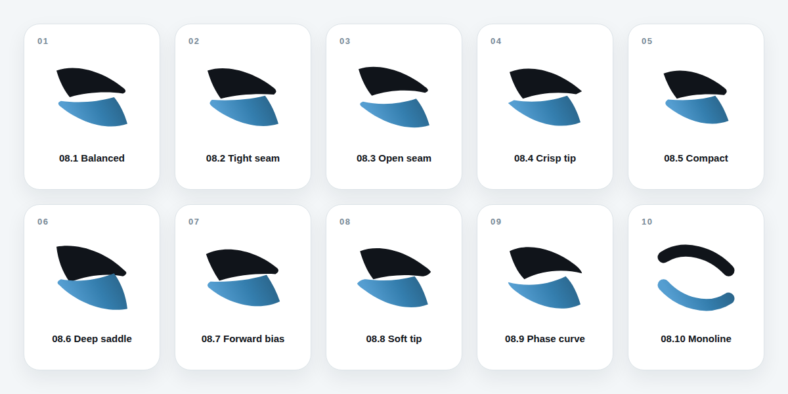

# Saddle Window refinement study

Ten optical refinements of concept 08. Every filled variant uses one canonical ribbon and a copy rotated exactly 180° around `(32,32)`. Only the seam width, saddle depth, tip treatment, compactness, and forward tension change.

| Number | Direction | Primary change |
| --- | --- | --- |
| 08.1 | Balanced | Baseline point-symmetric construction |
| 08.2 | Tight seam | More unified fields, narrower judge seam |
| 08.3 | Open seam | More independent judge counterform |
| 08.4 | Crisp tip | Controlled angularity |
| 08.5 | Compact | Strongest favicon footprint |
| 08.6 | Deep saddle | More mathematical curvature |
| 08.7 | Forward bias | Stronger market motion |
| 08.8 | Soft tip | Calmer optical terminals |
| 08.9 | Phase curve | Strongest sigmoid character |
| 08.10 | Monoline | Lightest, most reduced interpretation |
