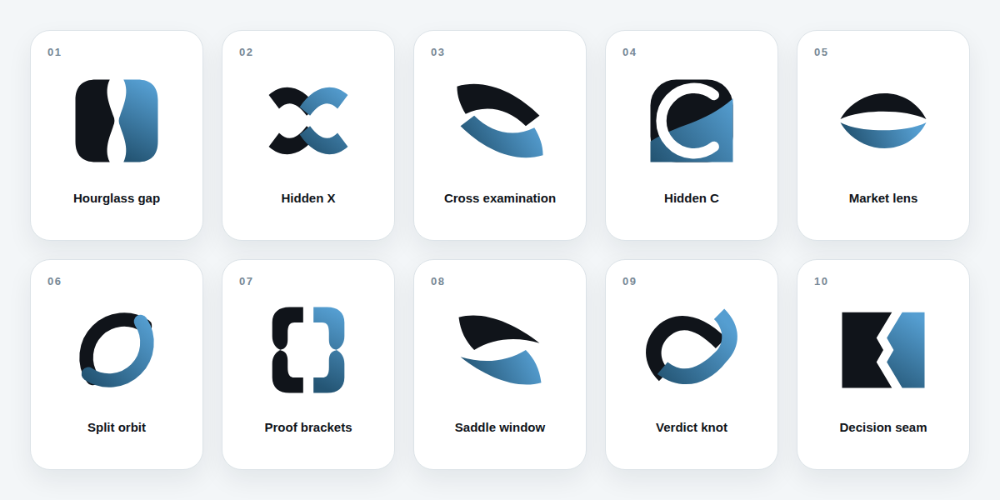

# Clawock negative-space logo study

Ten temporary 64×64 vector directions. Black is Bear / counterargument, blue is Bull / thesis, and the unpainted counterform is the AI judge or decision boundary.

**Selected for refinement:** 08 · Saddle window. [Compare ten focused 08 refinements](08-refinements/README.md).

<table>
  <tr>
    <td align="center"> <b>01 · Hourglass gap</b></td>
    <td align="center"> <b>02 · Hidden X</b></td>
    <td align="center"> <b>03 · Cross examination</b></td>
    <td align="center"> <b>04 · Hidden C</b></td>
    <td align="center"> <b>05 · Market lens</b></td>
  </tr>
  <tr>
    <td align="center"> <b>06 · Split orbit</b></td>
    <td align="center"> <b>07 · Proof brackets</b></td>
    <td align="center"> <b>08 · Saddle window</b></td>
    <td align="center"> <b>09 · Verdict knot</b></td>
    <td align="center"> <b>10 · Decision seam</b></td>
  </tr>
</table>

These are selection studies, not production assets. After one direction is selected, delete the other nine and propagate the winner through the canonical mark, app icons, architecture graphic, and social card.
