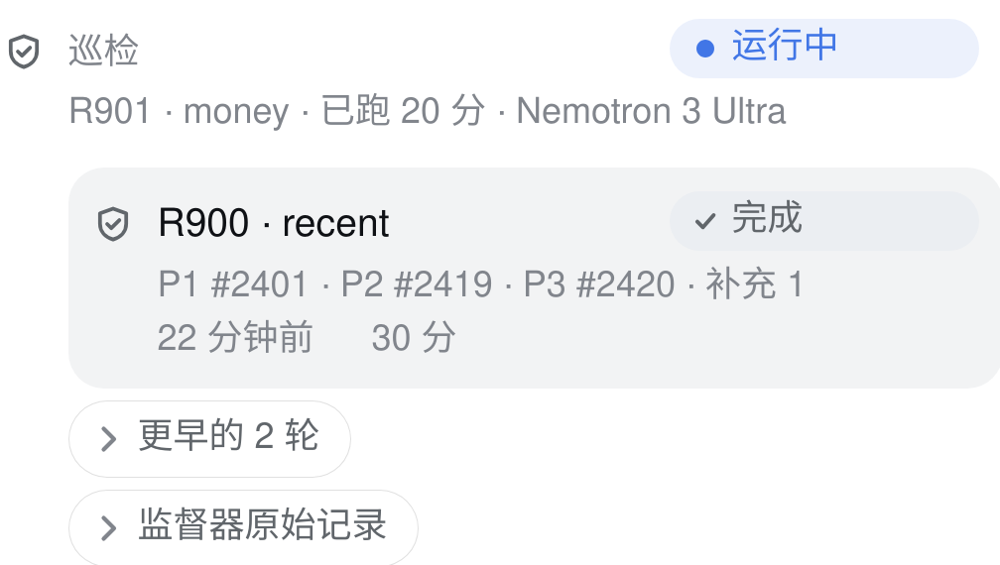
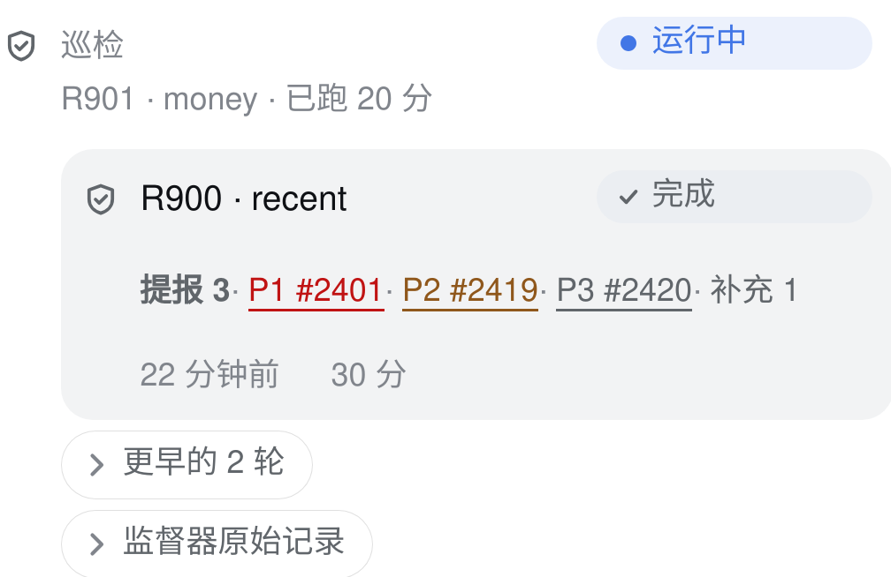
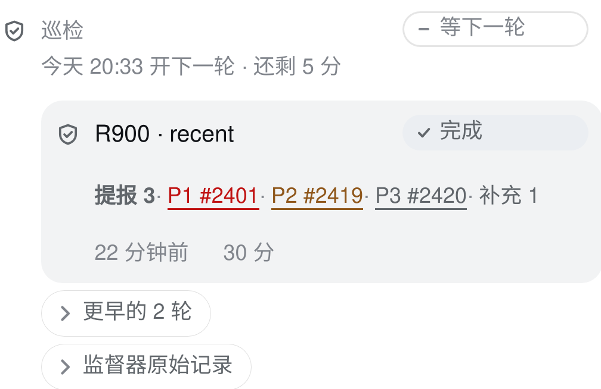

# Patrol task chip：信息密度与可点击产出

本轮主目标是巡检。保持 provider/lane、五轨栅格、内嵌底板和每行一枚状态 chip；不改数据源，不改 api 3。折叠详情的轻量修复另一个 PR 交付，避免把运维控制和巡检表达绑在一起。

## 已实测的依据与取舍

`readRounds()` 读 `rounds.tsv` 的轮次、轴、结果和耗时；结果第三段来自 `patrol_intel.py round-yield`，包含带 P0–P3 的 issue 编号、旧汇总数、同根因评论数。已核对宿主 R466–R471 的记录。它不包含每轮闸拒数，空字段也无法区分“没有提报”和“没记录到”，因此不展示虚构的零。实时轮次只取 journal 中明确的 R 编号；没有编号时保持轴名，不用上一轮加一猜。

| 加了 A | 放弃/替换 B | 为什么 |
| --- | --- | --- |
| 提报总数 + 可点击的 P0–P3 编号 | 产出行空着的 aside 列 | 先读数量，再点证据；复用原来的第二行，不另加一排 chip |
| 严重度文字与语义色、链接下划线 | 全部产出同一种灰字 | P0/P1 用错误字色，P2 用告警字色，P3 用正文次级色；编号和 P 等级在无色屏幕上仍成立。不是把轴/时间/数量各染一种颜色 |
| 下一轮计划时刻 + 剩余时间 | 同一说明行里多余的空间 | 不需要读时钟做减法；到时只说“已到计划时间”，不承诺 supervisor 已开下一轮 |
| 当前任务确实在等待时的原因 | 重复的模型名 | 模型已在 OpenCode 任务行；巡检说明行更该告诉人为什么等 |
| 原有折叠旧轮次与 journal | 更多常驻历史、宿主 sha、公平等待、闸拒计数 | 这次只优化 patrol，保持面板安静、不冗杂 |

390px 的 WebKit/iPhone 13 临时实例实测：面板组宽 336px，旧产出单元宽 164px；样例 `P1 #2401 · P2 #2419 · P3 #2420 · 补充 1` 的 scrollWidth 为 218px（约 33 个字符），装不下。现在产出单元宽 276px，含“提报 3”的内容 scrollWidth 为 276px，无单元溢出。使用空着的右侧列，并允许长列表自然换行；没有凭感觉把整个 patrol 拆成新布局。触屏上的链接目标高度为 44px，因此产出行从约 18px 到 46px；这笔空间花在可点证据上，桌面仍是紧凑文本。轮次的时间/用时仍在原来的列。

## 改前 / 改后实拍

独立端口 3097、隔离 DSH_HOME 的临时 dsh，客户端用本分支 rebuild 后的真实 bundle。API 拦截灌入构造状态：running、queued、quota、陈旧的 92% 读数，以及构造轮次 R900/R901。固定时钟 20:28 HKT，单引擎 WebKit，手机 390px 宽；生产服务没有重启。图片是同一构造数据的真实 DOM 截图；提报编号仅用于演示可点击入口，不代表这些 issue 属于真实 R900。

| 改前 | 改后 |
| --- | --- |
|  |  |

[改前完整面板](before-panel.png) · [改后完整面板](after-panel.png)

完整面板保留额度低的红色、陈旧读数的黄色（CSSOM 实测 `rgb(143, 87, 27)`）。已复核 #2389/#2368 对应修复 PR #2401，以及 PR #2360：严重度没有反转，stale 压过过期的用量档位，预算仍从 override → result → meta 读取。没有展示真实 session id、宿主路径、诊断文件内容；截图背景隐藏，任务标识使用构造值。

## 动效判据与结论

已读 apple-design、emil-design-eng、align、find-animation-opportunities、improve-animations，并补读 review-animations。使用前者的层级/克制与可预测响应、Emil 的频率/功能判据，以及 align 的固定列和数字对齐；本次只做静态信息表达。

| Before | After | Why |
| --- | --- | --- |
| 每 15 秒读一次的阶段和数量 | 静态更新，未加 pulse / crossfade / stagger | 每天可刷新 5760 次，频率闸拒绝；读数移动妨碍运维扫描 |
| 倒计时字段 | 随原有读取刷新，未加秒级 ticker 或动画进度条 | 时间用于判断，不是装饰；到计划时间也不推断服务已开始 |
| 原生 details 展开立即出现 | 保持原实现，无 height 动画 | 尊重既定折叠决策；键盘读取不能等动画 |
| 提报链接 | 文本、下划线与现有焦点环 | 可点性由常驻视觉提示表达，不需要 bounce 或 hover 位移 |

机会表：无新增动效建议通过频率、目的、速度、功能四闸。既有控件反馈与 reduced-motion 行为保留；本 diff 没有新增 animation/transition。审计与 review 结论：Approve（本轮动效范围）。

## 验证与生效条件

已实测：本分支 `npm ci --include=dev` 后 build，相关 10 个定向插件测试通过，包含 patrol 给路理由、链接与单芯片契约、五轨布局、quota windows、预算 override，以及 `/dispatch-list` 与面板同文；倒计时到期不会成为负数。临时实例看过实拍，并核对可见 issue 链接目标和 stale 颜色。全量与生成件漂移由 PR CI 验证。

待核：真实手机上的触屏点击感受，以及生产进程载入更新后的 host 半边。没有做性能测量或生产服务重启。

**生产面板要等宿主安排一次 dsh 重启才会完整生效。** 本次仅安装/落盘不重启；浏览器 client 可从新文件加载，运行中的 host 半边不会因此自动换版本。OpenClaw 的 `/dispatch-list` 代码同样等待宿主安排 gateway 重启。
