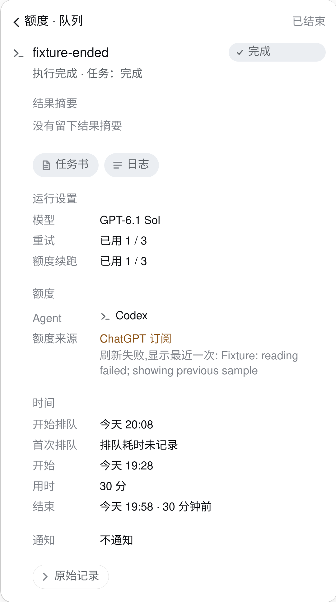
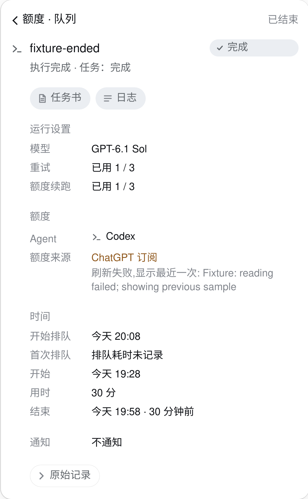
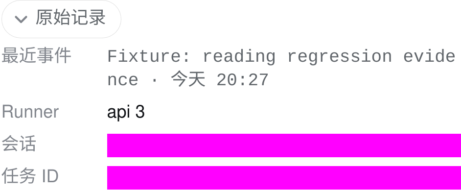
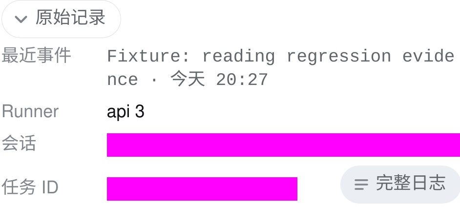

# Task chip 折叠详情的小修

与 patrol 主改动分开提交。结论是保留折叠结构，补出路、去空占位；不重做十段式详情。

| Before | After | Why |
| --- | --- | --- |
| 原始记录展开后只有文本 | 任务 ID 同行增加“完整日志”，走 dsh 已有文件预览 | 不再是死路。复用已有 `logDir` 和任务 ID，不新增 host 字段或 API；不依赖队列写入口 |
| 空摘要仍占一个带标题的区块 | 无摘要时不渲染该区块 | 空态没有行动信息；结束任务先看到状态与已有阅读入口 |
| 收尾摘要只看到最多 800 字 | 有摘要时，其下增加同一个完整日志入口 | 保留有界摘要，原文在日志；不把长日志塞进 chip |
| 最新日志行、runner、session 与 task id 折叠 | 全部保留在原始记录中 | 最新事件没有被删。收紧后的 P1 是轻量修复，不为最新事件另加常驻区块；在需要诊断时一次展开可读，并有完整来源可开 |

`summary` 的原生元素、内部详情 section、摘要函数是不同语境；本轮不改名、不动契约。保留 live/ended 两个视图各自的 raw 折叠，它们不是同时叠在一个任务详情里；主列表的旧巡检轮次和 journal 两个折叠也原样保留。没有增加动效，继续用既有 native details、焦点环与 reduced-motion 行为；按 UI skills 的频率和功能判据，无新增动效机会通过，motion review：Approve。

## 临时实例改前 / 改后

沿用独立 3097 端口与隔离 DSH_HOME。真实构建 bundle、构造任务、固定时钟、WebKit/iPhone 13（390px），没有生产服务重启。下面每张都已打开检查。洋红色块是截图阶段的遮罩：session 与 task id 即使是构造值也遮住；没有展示宿主路径，背景隐藏。原始记录的最新事件是构造文本。

| 改前 | 改后 |
| --- | --- |
|  |  |
|  |  |

## 验证与限制

已实测：rebuild；相关 6 个定向插件测试通过。测试覆盖原始记录仍折叠、动作归属表、完整日志使用宿主 logDir（不硬编码用户目录）、不走队列写操作、旧 host 缺 logDir 时不猜路径、无摘要不占区块、有摘要的完整来源入口，以及 no-session 反馈。临时 DOM 点过完整日志：该隔离实例没有会话，正确显示“先进入任意会话，再点一次”的可见反馈。

待核：在生产真实会话里打开宿主完整日志；本次没有读取生产日志或建立生产会话。文件预览使用既有经过测试的 session file resource 通路，正文由宿主分页加载。手机真实触屏体验未实测；按钮复用已有 44px 触屏热区。

生产面板要等宿主安排一次 dsh 重启才会完整生效；本任务不重启 dsh、gateway 或 clawock-patrol。新版客户端落盘后，旧 host 如果没有 logDir，会明确提示更新/重启。收尾摘要的 800 字上限不变。
