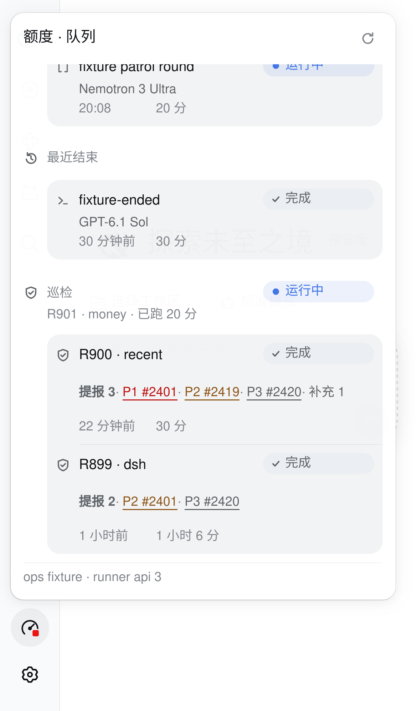
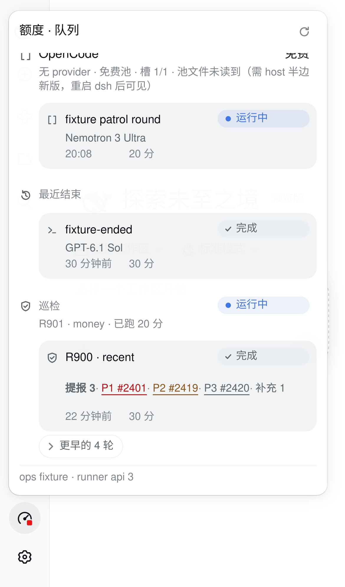
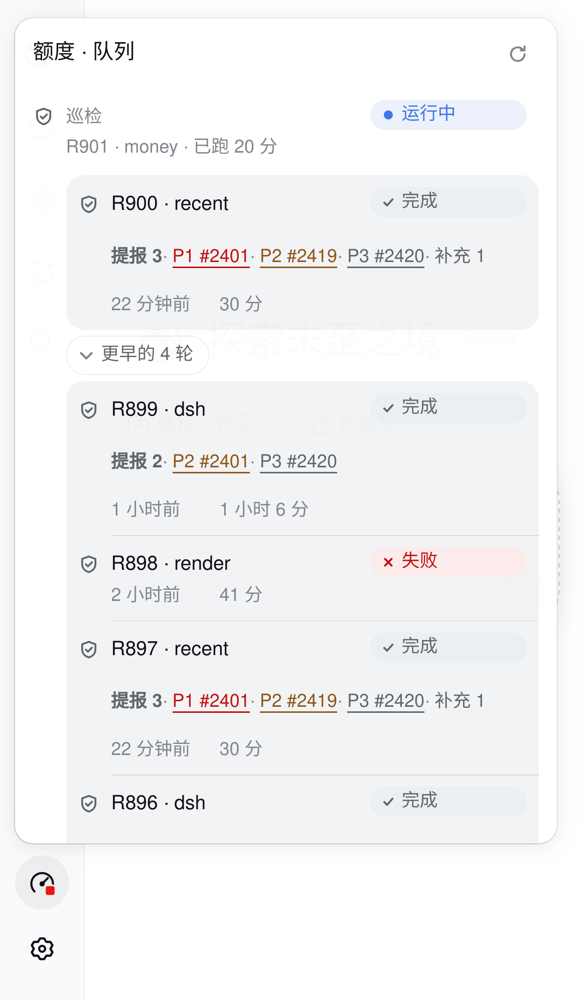

# Task chip：短历史平铺、长历史一个展开区

先复核 #2425 与 #2426：保留提报数、P0–P3 文字/色彩与原生 issue 链接，以及任务详情的摘要、最新事件和完整日志入口。

巡检历史四轮以内全部平铺；五轮起显示最新一轮，所有更早轮次放进一个原生 details。边界是“巡检历史”这一类内容，成功、失败、让路都在同一组，按宿主提供的倒序排列，不按数量或结果再拆段。结束任务仍全部常驻。文本面板采用同一阈值。

删除 raw supervisor log 展开区：它是进程输出，不是任务结论；组头已有运行、等待、下一轮与让路信息，轮次已有结果与可点击提报证据。再拼一个摘要会重复这些已结构化信息。任务详情的原始记录与完整日志入口仍保留。

## WebKit / iPhone 13 DOM 实拍

独立端口 3098、隔离 DSH_HOME、空派发/巡检目录，加载本分支真实 bundle。API 注入构造轮次 R896–R901（编号和链接仅演示），固定时钟；单引擎 WebKit，Playwright iPhone 13 设备配置，390 CSS px。没有重启生产 dsh、gateway 或 patrol。截图是浏览器实际渲染，不是示意图，也不是实体 iPhone 摄影。

| 两轮平铺 | 五轮折叠 | 五轮展开、混合结果仍同组 |
| --- | --- | --- |
|  |  |  |

展开后面板可滚动，第五轮的末行在当前帧下方；DOM 核实五行都在同一展开区。原生 summary 的 tap 展开/收起均通过。按压效果不靠合成 `:active` 判断：读 CSSOM 确认 active transform、transition 和 reduced-motion 豁免；26px 控件加上下各 9px 伪元素热区为 44px。

本地 build 与五个相关定向测试通过，覆盖 0–6 轮边界、混合结果、提报链接、任务详情完整日志入口及文本面板同阈值；全量交给 PR CI。

未验证：实体 iPhone/Safari 的真实手指操作、深色模式、生产真实会话的完整日志文件预览。没有新增 host API；客户端可不重启安装。文本面板的 host/gateway 代码完整生效等待宿主安排重启。
