
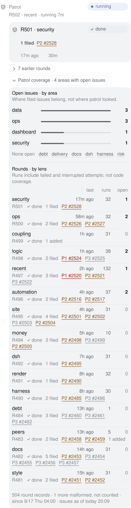
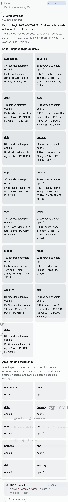
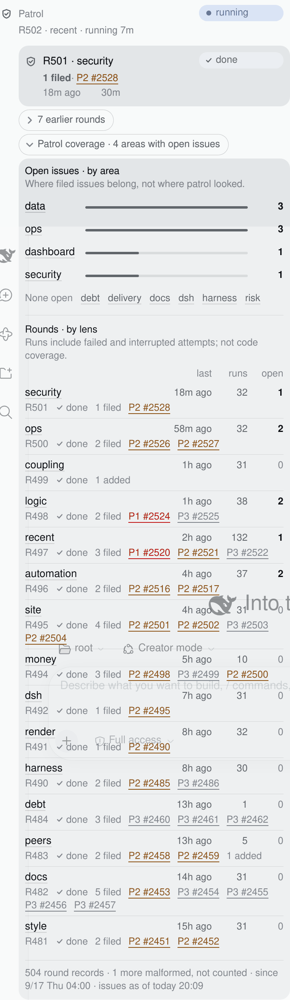

# Task chip 巡检覆盖区与 `/dispatch-list` 列表重设计

2026-10-04。起因是 kcn 看完 #2518 上线后的面板：「task chip 那个明显 area 那个做的就很多很杂乱」，
以及随后的「微信版本的 dispatch list 也一起改……正常的那些 list 可以好看一点，area 是 task chip 关心的」。

两个渲染器关注点不同，本文分开论证：**侧栏**负责巡检档案（area 是重点之一），**微信**负责把
额度 / 队列 / 最近结束 / 巡检轮次这几组列表排清楚，不带 area。

## 1. 先看：实拍与实测

WebKit（playwright-core 1.60 / webkit-2287）、light、reduced-motion，借生产 dsh 的只读页面，
只打开芯片与 `
`，没有任何队列写操作。「改后」是把页面里的 client bundle 换成本分支产物，
宿主数据是同一份生产读数（快照时刻不同，数字会变）。

| | iPhone 13（390px，面板内容宽 336px） | 桌面（820px 视口，面板内容宽 356px） |
|---|---|---|
| 改前，覆盖区收起 | 67px | 67px |
| 改前，覆盖区展开 | **3465px**（约 5.2 屏） | 2409px |
| 改后，覆盖区收起 | 26px | 26px |
| 改后，覆盖区展开 | **1107px**（约 1.7 屏） | 1062px |
| 展开后的 lens / area 节点 | 15 / 10，改前改后相同 | 15 / 10 |

| 改前 iPhone | 改后 iPhone |
|---|---|
|  |  |

| 改前 桌面 | 改后 桌面 |
|---|---|
|  |  |

截图为拍到整段而解除了面板的滚动裁剪，底下透出的页面内容不是面板的一部分；图片做了调色板压缩。

## 2. 批判（侧栏）

**kcn 的判断成立，但要修正两处。**

第一，覆盖区**不是默认展开**的，#2518 默认收起。乱是展开之后的事。收起时的问题是另一个：它是一个
带边框的盒子，插在巡检组头和最新一轮**之间**，把「现在在跑什么 → 刚跑完什么」这条阅读线切断了。

第二，area **不是最乱的那块，只是最显眼的那块**。按高度算，15 张 lens 卡占了展开高度的大头，
10 张 area 卡是剩下的一截。area 之所以刺眼，是因为它把病暴露得最彻底：一张卡、一个数、十次重复。
病根是同一个，两块都得治。

逐条：

1. **area 为什么乱。** 四个原因叠在一起，按严重程度排：
   (a) 载体选错。10 个整数是一列数，不是 10 个对象；卡片是给「有多个属性的东西」用的。
   每张卡 66px 高，只为了说 `open 0`，其中 8 张说的是同一句话。
   (b) 没有排序、没有对比。10 个数的价值在**分布**（哪里堆了问题），按字母序铺开的卡片
   恰好把分布抹掉了，读者得自己看 10 次再在脑子里排序。
   (c) 免责声明长过数据。那句 54 个字的说明在窄栏里折成 4 行，比它限定的任何一张卡都大。
   (d) 视觉语言是外来的。覆盖区的 CSS 没有挂在面板的 `.pbc` 作用域下，用的是 `rem`、
   `--glass-border`、`--hover`，而面板其余部分是五轨栅格、底板（well）、`--tq-*` 角色 token。
   它看起来像贴上去的另一个产品。
2. **#2518 的论证站得住一半。**「area↔lens 没有可靠映射，所以不推断 area 的巡检时间」是对的，
   必须保留。但它从「只有 open 数是真的」直接跳到「所以每个 area 一张只印 open 数的卡」，
   这一步不成立。**数据边界决定能说什么，不决定用多大的版面说。** 诚实的做法是一句话说清边界，
   然后把那 10 个真数按它们真正的形状（一个分布）呈现。
3. **25 张卡对任务芯片不合理。** 这个芯片叫「额度 · 队列」，打开它是为了看额度够不够、
   任务卡没卡。巡检档案是参考资料，应该在，但应该排在最后、默认收起、展开后不超过两屏。
   改前展开一次要滑 5 屏，而且最新一轮的结果被压到 5 屏以下。
4. **留 / 删 / 挪。**
   留：15 个 lens 的上次时间、记录次数、未决数、上一轮结论与提报；10 个 area 的未决数；
   记录总数、损坏条数、起点、issue 快照时刻；所有 GitHub 链接。**一个数都没删。**
   删的只有重复：lens 名在每张卡里出现两次（标题和 `R496 · automation`）；`recorded attempts`
   写了 15 遍、`open` 写了 25 遍（改成列头各一次）；「最多缓存 5 分钟」（实现细节，快照时刻已经说明新旧）。
   挪：整块挪到巡检分节末尾；来源说明挪到页脚一行；读不到的告警只在真的读不到时出现在顶部。
5. **#2518 之前就有、被挤得更糟的问题。**
   (a) 八轮上限（#2482）加单组折叠（#2440）之后，常态是「1 轮常驻 + 7 轮折叠」，
   巡检分节本来就靠折叠控件收纳；#2518 没有复用这个现成的折叠药丸，另造了一个 `
` 盒子，
   于是同一个分节里有两种长相的展开控件。
   (b) 提报链接（#2425）在轮次行里是链接，到了 lens 卡里同样的 `P2 #2516` 变成了纯文本，
   同一个东西两种行为。
   (c) 轮次行里 `1 filed· P2 #2528` 的分隔点前面少一个空格（flex 子项的行首空格被折叠），
   这是 #2425 的旧毛病，本次只在覆盖表里避开，没有动轮次行，避免扩大范围。
   (d) 桌面端两列栅格由**视口**宽度触发，但面板在桌面是 380px 的浮层，结果在 356px 里硬排两列，
   `37 recorded attempts ·` 之后被迫断行。面板里的布局不该看视口。
   (e) 两处裸时间戳（`2026-09-17 04:00:19`、`2026-10-04T10:07:37.316Z`），同一面板其它时间都是
   `今天 22:59`、`15 分钟前`。

## 3. 设计决定（侧栏）

| 决定 | 改前 | 改后 | 为什么对 kcn 更好 |
|---|---|---|---|
| 位置 | 组头与最新一轮之间 | 巡检分节最后，轮次与「更早的 N 轮」之后 | 先看正在跑的和刚结束的，档案在最后；不再切断阅读线 |
| 控件 | 自造的带边框 `
` | 复用既有折叠药丸（`renderFold`） | 一个分节一种展开控件；按压、焦点环、44px 热区、reduced-motion 全部继承 |
| 默认 | 收起，标签是 `499 条轮次记录` | 收起，标签是结论：`巡检覆盖 · 4 个 area 有未决` | 不展开也知道有没有事；「499 条记录」对读者没有意义 |
| area | 10 张卡，字母序 | 一张按数量排序的表：名字、相对最大值的细条、数字；为 0 的合成一行 | 10 个数全在，但读到的是分布；0 的不占行但仍有名字和链接 |
| area 的边界 | 54 字声明 | 标题下一行：`只说明已提报的问题归谁，不说明巡检过哪里。`（21 字，336px 内一行） | 诚实保留，放在它限定的数字正上方 |
| lens | 15 张卡，字母序，三段文字 | 15 行，按上次运行从近到远；`上次 / 记录 / 未决` 三列右对齐；第二行是上一轮编号、结论、带链接的提报 | 「哪个 lens 很久没跑」沿着时间列往下读就是答案；数字上下对齐可比 |
| 未决数强调 | 无 | 非 0 加粗、0 用三级墨色 | 眼睛落在有事的行上，不靠颜色（粗细 + 数字本身） |
| 来源说明 | 3 段，位于数据之前 | 页脚一行：`504 条轮次记录 · 另有 1 条损坏未计 · 自 9/17 周四 04:00 起 · issue 快照 今天 20:09` | 数据先于出处；损坏条数、起点、快照时刻都还在 |
| 异常 | 与常态混排 | `alerts`：历史 / 清单 / issue 查询读不到时在顶部以警示色出现，常态不占位 | 告警只在异常时出现才有信号 |
| 时间戳 | 原始 ISO | 走面板既有的 `resetStampOf` / `agoOf` | 全面板一种时间写法 |
| 动效 | 无 | 无 | 见下 |

排序用「上次运行从近到远」而不是字母序，是有代价的：每完成一轮，那一行会跳到表头。
一小时左右才发生一次，而换来的是不用比较 15 个相对时间就能看出轮转缺口，值得。

**字数与宽度预算**（iPhone，底板内宽 298px，12px 字）：area 说明 21 字 ≈ 252px，一行；
lens 表四轨 `1fr / 64px / 36px / 36px`，`64px` 直接用面板的 `--tq-when`，所以覆盖表里的时间列
和轮次行的时间一样宽；最长的 lens 名 `automation` 在 `1fr`（约 138px）里不截断。

### 各 skill 的视角

| skill | 用在哪里 |
|---|---|
| apple-design（Purpose / Simplicity≠minimalism / 字阶 / 分组） | 「决定不做什么」：不做 25 张卡。简化不是删数，是让最重要的最显眼：折叠标签给结论，表头给列名。层级靠字重和墨色三级，不加新颜色。说明贴着它限定的数据（proximity） |
| emil-design-eng（隐形细节、好的默认值） | 复用折叠药丸而不是新控件；lens 行的提报恢复成链接；未决 0 降墨色；换行不以分隔点开头；触屏热区用行内 padding 扩大而不撑高行距 |
| align | 数字右对齐、`tabular-nums`、两张表共用右缘与 8px 左缘；时间列复用 `--tq-when` |
| animate / review-animations / find-animation-opportunities / improve-animations | 第一关「该不该动」：不该。读数每 15 秒刷新，是用户正在读的数据；折叠是偶发操作但内容高度上千像素，高度动画只会拖慢。新增动效为零；折叠药丸既有的箭头旋转与按压反馈（已受 reduced-motion 约束）原样继承 |
| animation-vocabulary | 没有需要命名的新动效 |

### 没有改的

宿主数据（`taskqueue.ts`、`PatrolProgress`）、RPC schema、巡检文件、派发行为都没动。
`panel.ts` 的 `progressView` 仍是唯一把数据变成字的地方，只是产出从「卡片文案」改成「表格的格」，
并把异常（`alerts`）和出处（`footnote`）分开。#2425 链接、#2440 单组折叠、#2482 八轮上限在侧栏原样保留。

## 4. 微信 `/dispatch-list`

### 4.1 格式边界：实测了什么、没实测什么

对本机实装的微信通道（`@tencent-weixin/openclaw-weixin` 2.4.8）出站路径上的
`StreamingMarkdownFilter` 逐类喂探测串（脚本对该文件的逐字节副本运行，`cmp` 校验一致）：

| 构造 | filter 结果 | 本设计用不用 |
|---|---|---|
| H1–H4 标题 | 原样通过 | 用 H1、H2 |
| H5 / H6 标题 | 井号被剥掉，只剩文字 | 不用 |
| 粗体 `**…**` | 原样通过 | 用（provider 名、窗口标签） |
| 斜体包中文、粗斜体包中文 | 标记被剥掉 | 不用 |
| 斜体包 ASCII | 原样通过 | 不用（任务名里的 `_` `*` 一律转义，避免误触发） |
| 行内代码、代码块 | 原样通过 | 不用（不依赖等宽） |
| 无序 / 有序列表 | 原样通过 | 用平铺无序列表 |
| 嵌套列表、行首缩进、全角空格缩进 | 原样通过 | 不用，见下 |
| 表格、管道符 | 原样通过 | 不用，见下 |
| 引用、分割线、删除线、链接、裸 URL | 原样通过 | 不用 |
| 图片 `` | 整个删除 | 不用 |
| 空行、超长行、`⚠ ● ○ ☾ ⌛ ✓ ◐ ✕ ⊖ ▓░ ↻` | 原样通过 | 用 |

**这张表只证明「通道不会改写或吞掉这些字符」，不证明微信客户端把它们画成什么样。**
没有可用的测试会话或回显端，唯一的真实收件人是 kcn；按「不要刷屏」的要求，**没有向真实通道
发送任何探测消息，也没有手机端渲染截图。客户端渲染未经真实通道验证。**

因此设计只用两类构造：filter 明确保留、且 kcn 已在真实消息里读过的（标题、粗体、平铺列表，
来自 #2518 上线后的实际输出）；以及即使客户端完全不渲染 Markdown 也仍然可读的。表格和嵌套列表
虽然通过了 filter，但客户端表现未知、不渲染时会塌成一堆竖线，所以不用。

### 4.2 批判（微信）

1. **标题墙。** 一条消息 9 个标题（1 个 H1、7 个 H2、1 个 H3）。标题是给「换了一类内容」用的，
   五个 provider 是同一类内容的五个实例，不该各占一个标题。
2. **状态埋在行中间。** `progress-views-and-dispatch-ui  ●运行中 · …`：任务名长短不一，
   状态字形的横向位置每行都不同。聊天里没有列，**行首是唯一每行都对得齐的位置**，
   而它被最不需要扫的东西（名字）占了。
3. **`⚠0%` 像坏了。** 警示来自周窗口用到 100%，却挂在显示 5h 读数的标题上。
4. **`更早的 7 轮` 是死路。** 聊天消息不能展开。而且它是跟在列表项后面的一行裸文本，
   按 Markdown 规则会被并进上一个列表项。改前的额度提示（`额度用尽，今天 20:22 恢复…`）同理。
5. **覆盖块 4 行声明、0 行数据**，还带一个裸 ISO 时间戳。
6. 已取消任务的字形 `–` 紧跟列表符号，变成 `- –已取消`，像打错了。

### 4.3 设计决定（微信）

| 决定 | 改前 | 改后 | 为什么 |
|---|---|---|---|
| 层级 | 9 个标题 | 3 个：H1 标题、`## 最近结束`、`## 巡检` | 标题只标记「换了一类内容」。provider 是一行粗体 |
| provider 头 | `## Claude  ⚠0%` + 下一行说明 | `**Claude** 0% · Anthropic 订阅 · 槽 1/1` | 名字、读数、计划、槽位一行读完；组与组之间靠空行 |
| 警示位置 | 标题上 | 真正到线的窗口行：`- **周** ▓▓▓▓▓▓▓▓▓▓ 100% ⚠ ↻今天 20:00` | 警示指着原因。没有窗口行的 provider（余额类）仍在头上标 |
| 行的开头 | 任务名 | 状态字形 + 状态词：`- ●运行中 redesign-task-chip-ui · …` | 行首成为状态列，往下一扫就知道有没有失败 / 受阻 |
| provider 下的每一行 | 列表项与裸行混排 | 全部是平铺列表项 | 裸行跟在列表项后会被并入上一项；全用列表项则渲染与否都是一行一事 |
| 巡检轮次 | 1 轮 + `更早的 7 轮` | 宿主给的轮次全部列出（最多 8 轮） | 聊天不能展开；「巡检有没有发现新问题」正是这几行在回答。宁可长一点 |
| 覆盖 | 4 行声明 | 常态不出现；历史 / 清单 / issue 读不到时一行 `- ⚠ …` | area 是侧栏的事（kcn 明确）；微信没有覆盖数字，也就不需要限定它们的声明 |
| 页脚 | 粗体 | 普通文字 | 粗体留给 provider 名和窗口标签，页脚是最不重要的一行 |
| 已取消字形 | `–` | `⊖` | 仍是侧栏那条横杠的形状，不再和列表符号连成两个短横 |

信息对照：改前有的任务、额度窗口、回执、费用、轮次提报，改后全部还在；多了 7 轮巡检记录；
少了覆盖块的 5 行（记录条数、起点、损坏条数、快照时刻、area 声明），它们在侧栏的覆盖折叠里。
行数 47 → 41，字符数 1513 → 1777（多出来的是那 7 轮）。

`text.ts` 与侧栏仍共用 `panel.ts` 的同一个 view model：行、词、顺序都来自模型。
微信侧自己决定的只有绘制：状态放行首、provider 用粗体、不折叠、不画覆盖表。

### 4.4 证据

同一份生产队列快照（2026-10-04 20:14 HKT 读取）分别经改前（live checkout 的 `lib/chat.js`）
和改后（本分支）渲染，再过本机实装的 filter，四份输出均与输入逐字相同：

- [改前（中文）](wechat-before.txt)
- [改后（中文）](wechat-after.txt)、[改后（英文）](wechat-after-en.txt)

额度读数取自当天 16:23 的余额快照（任务没有为取证再去读各 provider），所以额度数字与重置时刻
偏旧；队列、最近结束与巡检是取证时的实时读数。

## 5. 验证

- `node tests/decision_studio_plugin.spec.js`：51 通过。`/dispatch-list` 那条用例新增了对本次设计的断言：
  覆盖折叠在分节末尾且默认收起、标签是结论、area 排序与零值合并、lens 顺序、lens 行提报是链接、
  无裸时间戳、页脚出处；聊天至多 3 个标题、列表项后无裸行、行首是状态、轮次全部列出、
  无覆盖块、读不到时有告警、警示在到线的窗口行上。
- WebKit 实拍：两个视口 `scrollWidth` 等于面板宽度（无横向溢出），15 / 10 个节点齐全，无 pageerror。
- 没做的：微信手机端渲染截图（原因见 4.1）；Chromium / 其它引擎截图矩阵（本机约定单引擎）。
