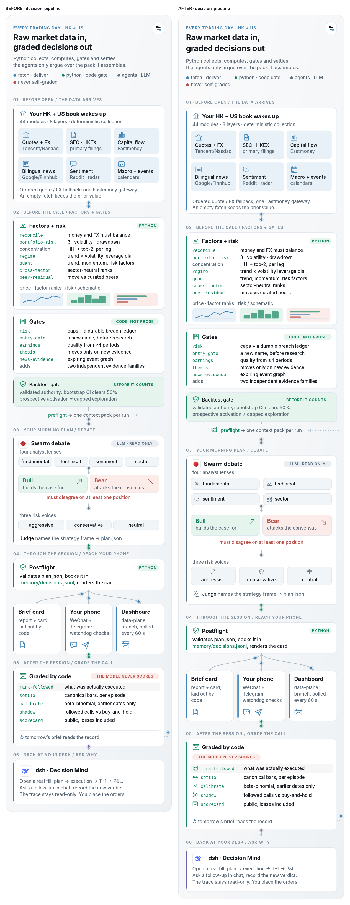
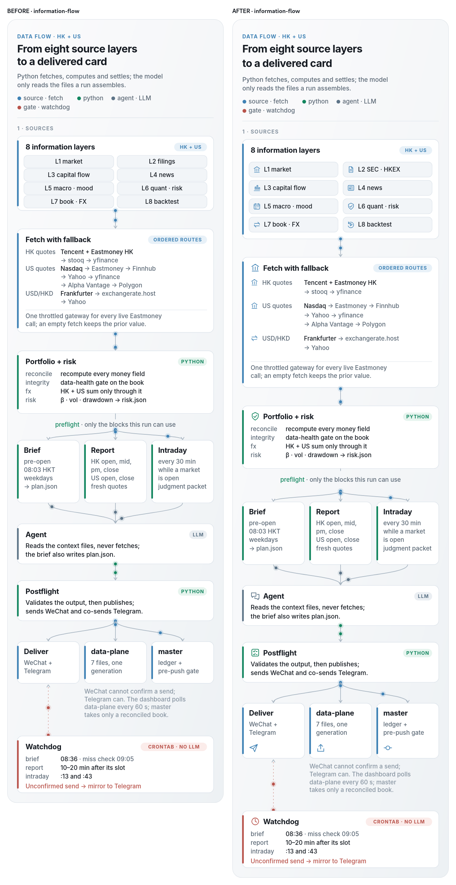
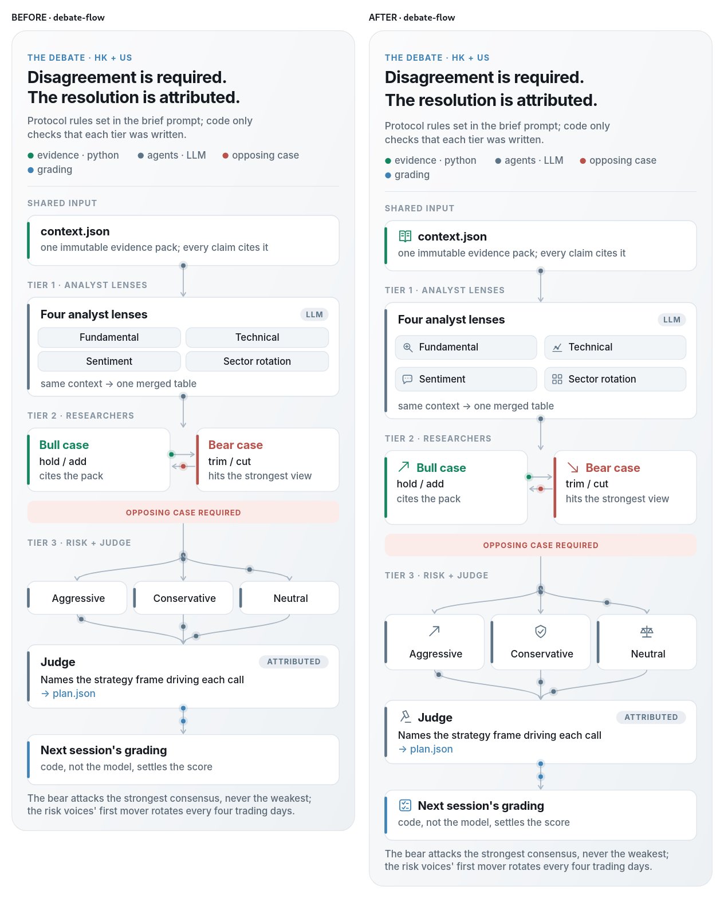
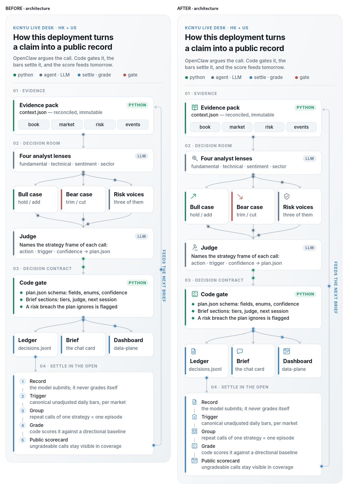
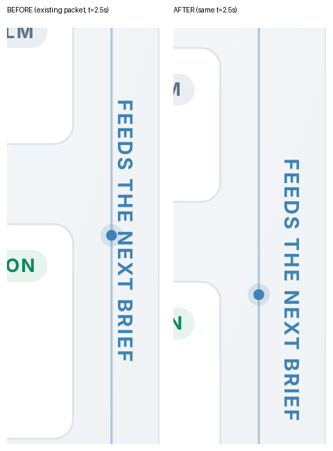
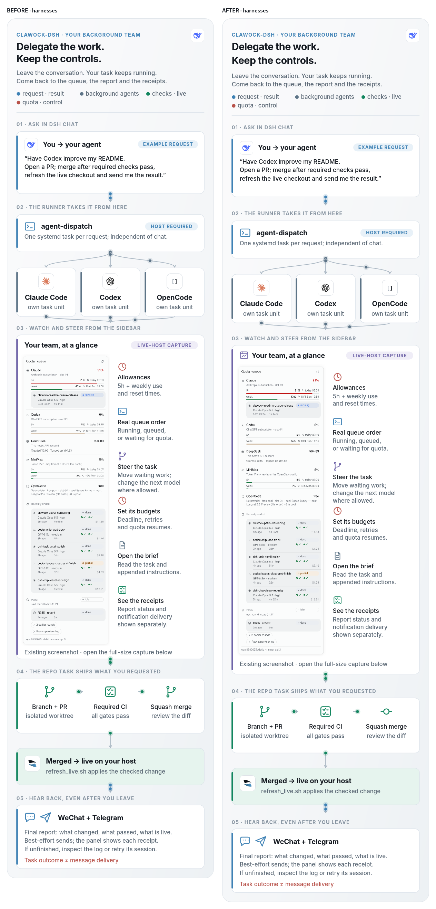
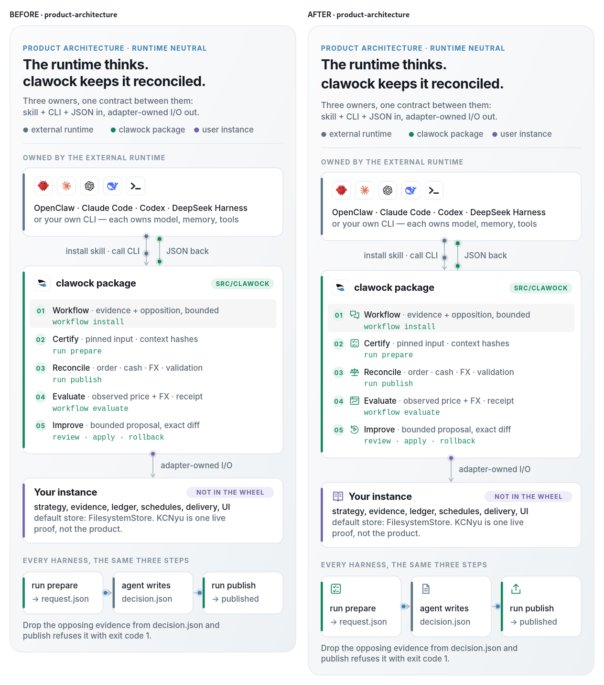
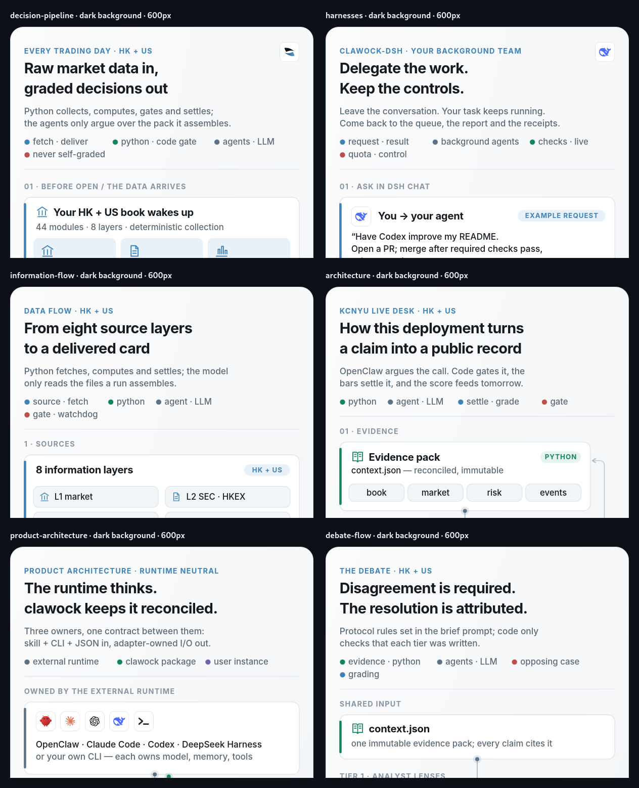
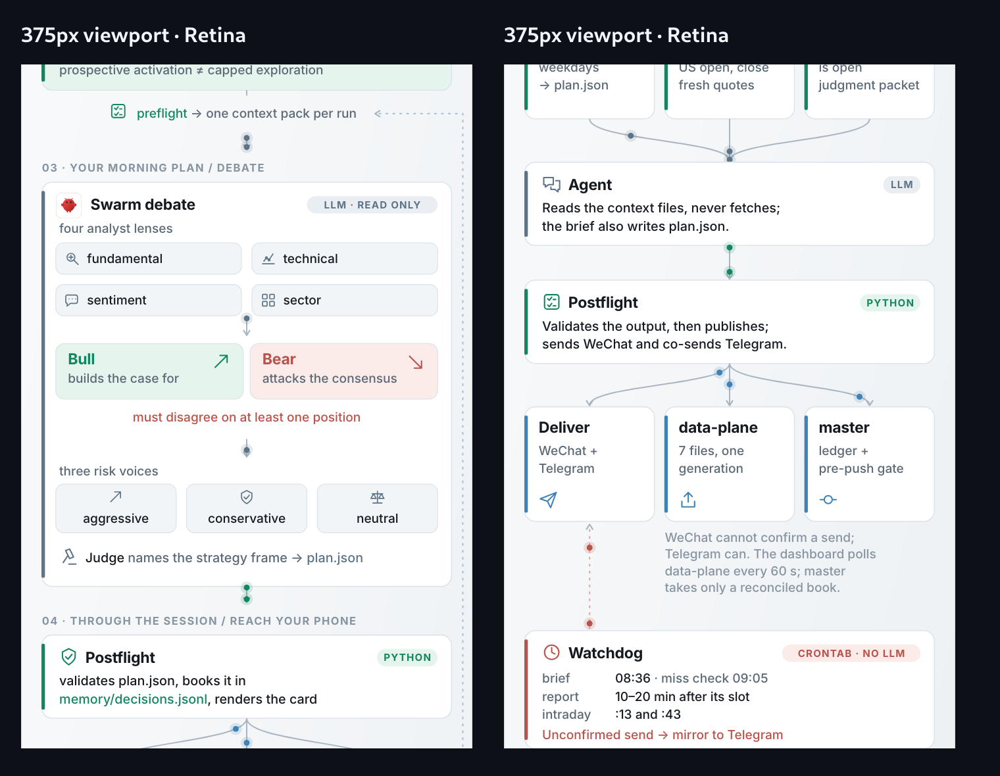

# README 六张 hero：保持风格，修碰撞，补图形

本次基线为 `7278ee86736f`（2026-10-03）。交付保留 pearl 底、白色圆角卡、左侧角色色条、原有主色和字体族、520 单列与原有信息顺序。六张图各一个实现 commit；统一报告和校验另一个 commit。对应 PR 的范围是六张 SVG、现有 builder、定向校验与本报告。

## 先复核事实

**已实测：** 六张图已有 `site/tools/build_readme_diagrams.py`、漂移测试和部分原创图标。不是六张无源手写成品。现有 harness 图标也不是 56×56：五个文件均为 `viewBox="0 0 96 96"`，白底 94×94 tile、`rx=22`、2 单位边框，无 `currentColor`。没有新建生成器，也没有引入图标库、外部字体或外部图片。

**已实测：** 当前默认字体与强制 Inter / Arial 后备字体下，六图均无正文互相相交、正文溢出所属节点框或跨入邻框。问题集中在连接线上的既有光点碰字、局部芯片间距和字号/行高的容错余量，不能统称成“文字节点已直接重叠”。

## 具体定位与根因

下表的行号都指**改前** `site/assets/` 下文件；坐标、距离均为 SVG viewBox 单位，600px 展示时乘 `600/520`。没有 ID 的元素用类名和文字定位。框的刻意包含不算重叠；移动光点的外圈半径为 7，线宽为 1.5。

| 改前 file:line / 元素 | Before | After | Why |
| --- | --- | --- | --- |
| `architecture.svg:151` `#w13`；`:156` `.kick` `FEEDS THE NEXT BRIEF` | 回路线 x=490；旋转后文字 bbox x=491…506、y=738.05…901.95；间隔 **1**，光点侵入文字范围 **6** | 回路线 x=478；文字仍 x=491…506；间隔 **13**，光点外圈留 **6** | 回流轨道与说明共用太窄边栏；收窄内卡 12 单位、线向内移，保持说明位置与构图 |
| `decision-pipeline.svg:124` `#w3`；`:122` `.m` preflight | 文字 bbox `(133.31,1243,253.38,17)`；线从 `(260,1263)` 起，仅 **3** 距离，7 单位光点会碰文字底部 | 文字 y=1291…1308；线起点 y=1327；间隔 **19**，光点留 **12** | preflight 的文字占位没有算进下段连线；增大局部节奏，不缩字体 |
| `information-flow.svg:86` `#w4`（及 `#w5/#w6`）；`:84` `.m` preflight | 文字 bbox `(115.14,962,289.72,17)`；三条分叉从 y=982 起；间隔 **3** | 文字 y=1094…1111；分叉从 y=1130 起；间隔 **19** | 三条分叉的光点同时挤向文字；把分叉起点下移 |
| `harnesses.svg:39` `#w1`；`:38` `.kick` 第二节 | 线终点 `(260,460)`；标题 bbox y=465.98…481；距离 **5.98**，光点外圈侵入约 **1.02** | 线终点 y=468；标题 bbox 起点 y=481.98；距离 **13.98** | 章节标题占位未计入连接通道；交接增加 8 单位、箭头提前结束 |
| `information-flow.svg:27/:31`（同列四行 `.m` 芯片） | 首框 `(40,326,216,30)`；下一框 y=358，净距 **2**，各行重复 | 首框 y=342、高 36；下一框 y=386；净距 **8** | 卡片数值留白不足；行距 32→44、高度 30→36，外卡随内容变高 |
| `decision-pipeline.svg:164/:166/:168/:170` 四分析师芯片 | 四列、宽 **105.5**、间隔 **6**；fundamental bbox x=49.17…136.33，左右余量约 **9.17** | 内层两列、宽 **214**、间隔 **12**，两行 pitch=48、高 36；每个标签配 18 单位图标 | 同一层四长标签太挤，加图标会更挤；在原卡内分配为 2×2，保留整体单列阶段结构 |
| `debate-flow.svg:35/:39`（及 `:37/:41`）分析师行 | 芯片高 30、pitch=36；行间 **6** | 高 36、pitch=48；行间 **12** | 原有 2×2 卡适合小图标；增加明确槽位，未把图标塞进原文字余量 |
| `decision-pipeline.svg:54` `#w1`；`:59` `.kick` 第二节 | 线端 y=602；标题 bbox 起点 y=610；距 **8**，光点仅余 **1** | 距 **14**，光点余 **7** | 属于近碰撞而非已相交；留出描边/抗锯齿余量 |
| `harnesses.svg:85` `#w6`；`:91` `.kick` 第三节 | 中路合流终点 y=762；标题 bbox 起点 y=769.98；距 **7.98** | 距 **15.98** | 已有光点外圈仅余 0.98；与其他章节交接采用同样安全间隔 |

根因是**局部布局数值及连接轨道忽略光点尺寸**。没有发现需要靠文字截断、缩字号或固定 viewBox 压缩内容解决的情况。viewBox 高度由 builder 随内容增长，这次相应增加高度；没有硬挤进原高度。

路径距离按不超过 1 单位采样，文字 bbox 经变换换算到根 viewBox；回路线直线段的 1→13 距离是精确计算。正文相交容差 0.15 单位，避免把字体行框边界小数误差写成肉眼碰撞。以下完整测量文件含逐图最小框间距、同类文字 y 坐标间隔分布、线条近接坐标、字体回退检查与渲染宽度：

[测量数据 measurements.json](measurements.json)。同类文字间隔是按 `.m/.h/.b` 等角色分别去重统计，跨卡也会进入分布；不能把不同字阶 bbox 顶部相差 3–4 单位误当成正文行距。具体同层行距以表中芯片坐标为准。

## 逐图成品与视觉对比

截图使用 GitHub Markdown API 实际生成的 README `` 标签，只把图片源替换为改前/改后的自包含 SVG；用单个 WebKit 引擎逐张截图。每栏实际宽 600 CSS px，点开原图可看全文。SVG 的原有动效没有新增，整图截图的光点相位不同；局部碰撞截图使用原 SVG 的 SMIL `t=2.5s` 固定相位。

| 图 / 独立实现 commit | 改了什么与原因 | viewBox 高度 / 最小非包含框间距 | 原创 outline 图标数量 |
| --- | --- | --- | --- |
| decision-pipeline / `6836b371b` | preflight 与章节连接通道；分析师 2×2；三风险声音、judge、mark-followed / settle / calibrate / shadow / scorecard 配图；最长标签独立一行 | 2493→2767 / 6→8 | 18→32 |
| information-flow / `4657af0e4` | 八来源层配类别图标；SEC/HKEX 保留可见名称；报价/FX 按类别分组拉开；Tencent、Eastmoney、Nasdaq、Frankfurter、stooq、yfinance 等路由名称不被 logo 代替；publish/commit/watchdog 图形提示 | 1876→2056 / 2→8 | 0→19 |
| debate-flow / `45e8a0bf3` | 四 analyst、bull/bear、三 risk、judge/结果均有图标；给图形独立空间，原说明保留 | 1212→1296 / 6→10 | 0→12 |
| architecture / `d43df24f6` | 修回流光点与竖排文字相交；加 evidence / judge / gate / publish / settle 的类别提示 | 1406→1472 / 6→6 | 0→15 |
| harnesses / `c5e9c16a6` | 章节交接与 screenshot caption 留安全间隔；sidebar 增 dashboard 图标；Squash merge 使用 commit 图形；现有 Claude Code / Codex / OpenCode 和 DeepSeek 标识保留 | 2157.04→2217.04 / 12→12 | 12→13 |
| product-architecture / `580ad049b` | 五阶段语义图标、instance 与三步 contract 图形；已有五 harness 标识不变 | 1136→1178 / 18→18 | 0→9 |

新增图标共 **70** 个实例；密集图仍只在角色/阶段/结果层使用图形，不给每个计算项再添一枚。图标计数不包含既有品牌标识、装饰或迷你图表。

### Decision pipeline



### Information flow



### Debate flow



### Architecture



**已截图证明：** 同一原有光点相位，改前光点外圈覆盖竖排文字，改后有净空。局部图为 600px 展示、2× Retina。



### Harnesses



### Product architecture



## Skillhub 检索结果

按现行 skills-store-policy，先实跑配置中的 primary `skillhub`：

```text
skillhub search svg diagram design
skillhub search 排版 architecture diagram
```

第一组返回泛开发 `dev-expert`（2.0.3 / 1.17.0）、育儿、腾讯文档、find-skills、agent-browser、搜索引擎、去 AI 味等；第二组类似，另有 `smart-charts`（8.4.0）、GitHub、skill-vetter。**没有专门匹配此 README SVG 布局任务的设计 skill。** 有泛开发和图表技能，不声称整个榜单完全没有设计相关能力，也未安装不相关项。

按 policy fallback 实跑 `clawhub search 'svg diagram design'`，出现 `dark-architecture-diagram`、`diagram-design`、`architecture-diagram` 三候选；进一步 `clawhub inspect diagram-design` 返回 `Skill not found`，无法核验正文和版本，未安装。实际加载并采用本机已有 `emil-design-eng`：隐形细节、留白、层次、克制。不是拿外部暗色图风格套过来。

## 设计研究：可用的当代思路与反例

**已阅读网页，检索日 2026-10-03。** 通用搜索同时尝试 2026 文档架构图、annotated flow / progressive disclosure / 泳道，以及 icons / clutter / 过度设计和 GitHub SVG 限制。Google 返回脚本挑战页，DuckDuckGo/Brave 返回验证码，Yahoo 无结果，Bing 多组结果不相关；没有把这些搜索输出包装成有效证据。继续读取设计方法原文及架构图产品的当年文章/索引，得到以下可核查线索。厂商文章是趋势观察，不是独立用户研究。

| 检索到的思路与来源 | 本次采用 | 不采用 / 反面证据 |
| --- | --- | --- |
| [IcePanel 2026-08-25：The death of architecture diagrams](https://icepanel.io/blog/death-of-architecture-diagrams)、[2026-07-13：How to automate your architecture diagrams](https://icepanel.io/blog/how-to-automate-your-architecture-diagrams) | 2026 的重点是“模型/源码为真值，图为可审阅输出”。继续用现有 builder 和 CI 漂移检查 | 不把这当成必须新建中央模型/新工具的理由：当前六图的生成源已经存在 |
| [IcePanel 2026-09-01：IcePanel vs Mermaid](https://icepanel.io/blog/icepanel-vs-mermaid)、[C4 多层视图](https://c4model.com/diagrams) | 面向读者拆层、每图一个目的；现有六图已经分别讲交易日、数据、部署、产品、辩论、委派 | 厂商原文也明确简单工程师 repo 场景不必过度思考；保持静态图，不换工具或构图范式 |
| [Annotated Flow 的实际演进：A fresh new way to Flow](https://icepanel.io/blog/a-fresh-new-way-to-flow) | 短标题/说明分离、步骤尺寸增大、角色颜色一致。沿原有时序加强局部层次 | 网页 play/edit、点击展开不能搬进 README ``；泳道只用在报价/FX 的原有行组，不引入横向大画布 |
| [NN/g：Progressive Disclosure](https://www.nngroup.com/articles/progressive-disclosure/)、[Visual Hierarchy](https://www.nngroup.com/articles/visual-hierarchy-ux-definition/) | 首眼看阶段和角色，细读才看命令/来源；留白建立分组；报告中把测量数据留在独立文件 | 渐进披露不是 2026 新发明，原文明确是多年成熟方法。正文图不做伪交互，关键约束不被隐藏 |
| [NN/g：Icon Usability](https://www.nngroup.com/articles/icon-usability/)、[C4 notation/checklist](https://c4model.com/diagrams/notation) | 简单 schematic 图标始终伴随文字；保持原 legend、角色配色；来源以类别图形而非一堆新商标表现 | 图标识别不等于理解；不删除文字，不往每行塞图标 |
| [反例：Why AWS diagrams don’t work](https://icepanel.io/blog/why-aws-diagrams-dont-work) | 避免单层铺满 provider/service logo，让分层先于装饰 | 原文点名“heavy use of icons + minimal categorisation”会令非架构师难以解读；因此没有做品牌 logo 大墙或追求图标数量 |

结论：现有视觉语言已适合任务；“更酷炫”采用清楚的角色图形、可追踪的线条和均匀留白来实现。无需动主色、字体族或全图单列范式。没有可核查证据说明必须追随所谓 2026 霓虹/玻璃风。

## GitHub SVG 能力边界（本次先查证再改）

[GitHub Camo/图片文档](https://docs.github.com/en/authentication/keeping-your-account-and-data-secure/about-anonymized-urls)、[GitHub Markdown diagrams](https://docs.github.com/en/get-started/writing-on-github/working-with-advanced-formatting/creating-diagrams)、[MDN SVG as an image](https://developer.mozilla.org/en-US/docs/Web/SVG/Guides/SVG_as_an_image)、[MDN use（2026-08-14 更新）](https://developer.mozilla.org/en-US/docs/Web/SVG/Reference/Element/use)、[MDN color](https://developer.mozilla.org/en-US/docs/Web/SVG/Reference/Attribute/color)。

**已实测：** 抓取公开仓库 README 页面，六张 hero 的真实 `img src` 都是 raw.githubusercontent SVG。HTTP 200、`image/svg+xml`，返回字节与基线文件逐张完全一致，内嵌 CSS 与 SMIL 都在。不是把 SVG markup 直接塞进 Markdown HTML 的场景；不要把 HTML sanitizer 和图片内部 SVG 的浏览器限制混为一谈。

| 特性 | 判断 / 实测范围 | 本次实现 |
| --- | --- | --- |
| 内部 `<use href="#id">` / `<symbol>` | 浏览器 `` 隔离上下文的本地像素探针已实测两者可用；raw 图片传输未改字节。未把专用 probe 发布到公开 README，也不声称测试了所有 GitHub 页面 | 新图标继续 inline 几何，不依赖 sprite，便于编辑与排查 |
| SVG 内部 `<style>` / CSS | 当前 GitHub 六图的真实字节保留 CSS；浏览器 IMG 探针已测 CSS 填充有效 | 保留原字阶与 CSS；新增图形用明确 stroke/fill |
| 外部 CSS / 外部图片 / 外部字体 / 外部 `<use>` | MDN 说明 IMG 安全环境会限制外部资源；同源也不能当作可用绕法 | 不使用 |
| `currentColor` | SVG 自身的 `color`→`currentColor` 已实测可用；不能期待继承 GitHub 文档正文颜色 | 既有 tile 与新增图形保持明确现有色板值，不靠父网页主题 |
| script / 交互 | SVG IMG 环境禁脚本；GitHub 支持 Mermaid 不等于 SVG IMG 可互动 | 未添加 script、交互或动效；原有动效保持 |

## 验证与实际限制

**已实测：** XML 解析、builder `--check`、`git diff --check`；定向 `tests/test_readme_diagrams.py` 三项通过，包括新加的通用非包含节点间距闸，防止来源行退回 2 单位。默认字体、Inter、Arial 三次 bbox 检查均为 0 正文相交 / 溢框 / 出 viewBox / 图标压字。

**已实测：** 六张 600px 图逐张截图并目视检查；深底图如下。图内 pearl 背景是实色，所以 GitHub 深色页上保持浅色卡片插图；文字不因页背景变暗而消失。没有暗色主题变换，这是保持风格的有意结果。



**已实测：** 375px viewport（343px 内容宽）六图都解码成功，无横向溢出；以下是两张密集图的 2× Retina 局部。600px 下正文 14.5–15 viewBox 单位对应 16.7–17.3 CSS px，没有缩字体或 filter 栅格化文字。SVG 保持向量，放大无 bitmap 字形模糊。



**实际限制 / 未实测：** 窄屏整体缩放时正文约 9.6–9.9 CSS px，细读仍需点开原图；手机显示健康不等于手机正文达到网页字号。未做真机全浏览器/全字体测试，也未做用户识别测试。默认/Inter/Arial 测量能证明本次范围内的容错，不能证明所有未知字体的宽度都一样。

## 图标来源、许可与可编辑性

新增 `lens / sector / balance / judge / publish / commit / replay / book` 为本次从 SVG path/rect/circle 原创绘制，沿用项目 MIT 许可及 builder 既有 24 单位 outline 系统：1.7 描边、圆端/圆连接、18–22 单位渲染、角色色板。没有下载第三方素材；没有新导出、描摹或修改 OpenAI、Anthropic 等商标标识。既有 harness 图形与其 attribution 注释完整保留，仍由 `D.logo()` 使用原文件。

## 本次没有做的事

- **无需新生成器提案。** 可重生成源与漂移校验已存在，本次继续补源和测试；没有提出纯重构或新注册表。
- **没有替换 harnesses 的真实截图。** 改前 PNG 原图 800×2618；SVG 中实际宽 224，600px README 展示时宽 **258.46 CSS px**，Retina 2× 约 517 像素，小于源宽 800。它不是 800→600 的强制非等比拉伸，`preserveAspectRatio` 保持比例；确有缩小后小字难读和约 91% 体积占比的问题。
- **后续具体建议：** 真截图保留独立全尺寸入口，hero 优先以已有矢量控制/结果节点传达信息。若继续处理体积，应对真实截图做无损优化并实测读字/体积收益，或用明确标注的矢量示意替换 hero 内嵌截图；不能伪造产品实拍，也不能简单改成 SVG 内的外部图片引用（IMG 环境受限）。这属于单独资产任务，本次没有降采样、截图重绘或改主色。
- **没有越过三项风格红线。** 如果以后要让手机免放大细读，需要另做短图或分图并改变 README 叙事密度；判据应是 375px 下正文至少接近正常文档字号且无需读完整长图。本次不借此改变已认可的构图。
