# 六张 hero 第二轮：接对目标，再做视觉迭代

基线为已合并首轮的 `72d01443d0f9` / 首轮图来自 `ea757167d`，不是更早的 2493 高版本。保留主色、两套字体族、pearl 底白色圆角卡、520 单列范式、四 lens 的 2×2、上一轮图标。一个 PR 内六张 SVG 各一 commit，公共 builder / 判据 / 报告另提交；共享 helper 同时影响六张，不拆成互相依赖的 PR。

## 验收方法与方法失效记录

先在未动图时写并运行 [audit_readme_diagrams.py](../../../../site/tools/audit_readme_diagrams.py)，再修改 builder。首次“无目标声明”检查判红 68 条；进一步人工核对每条旧线的意图，保存 [baseline-targets.json](baseline-targets.json)，在内存中标注旧目标，再验证实际几何，得到 **68 个未入目标端点 + 3 个未拆分扇出 = 71→0**。旧映射用旧 SVG 的元素行号，禁止按离终点最近的外卡猜目标，也没有编辑改前资产来制造红项。

复用首轮的 WebKit `getBBox` + CTM 到根 viewBox、≤1 单位路径采样、非包含节点间距及同类文字 y 分布基础。新判据遍历**所有** text，含嵌套、旋转、`.kick/.m`；样本同时包含线宽、V 箭头几何。路径/line 全部有类别清单；图标、logo、色条、分割线、schematic 路径也做文字相交检查，只有语义连接线才要求目标。图中 `w*` 是语义连接，不把全部 path 数量当接线数。

新线必须声明 `data-source/data-target`，目标必须是具体阶段、角色、规则节点或操作 glyph；不能以 page 或任意碰巧包含终点的大外卡兜底。终点严格进入 bbox；圆角矩形再用 `isPointInFill` 验证。按 source 输出逐项扇出目标，重复/未声明目标判红。移动光点的 7 单位外圈对整条路径扫掠，覆盖所有相位。新增 CI 测试验证图声明、严格入框、圆角和 debate 的四 lens / 双案 / 三 risk 分配，浏览器测量是独立视觉验收工具。

**记录首轮失效原因：** “线离文字的最小距离”无法回答它应该连谁；仅检查注意到的正文清单会遗漏章节标题。文字距离零缺陷不是接线零缺陷的证明。本轮以显式目标和所有文字为验收基础。

**已实测 / 必须如实区分：** 当前合并基线的静态 path、箭头及全路径光点与文字相交计数也是 0；本机未复现用户描述的 C/D 划字现象。改前 decision 的 sha256 为 `e8320bf335bc40fea22c603b5350d3f38de20651f2b162c07cd2b6340b52a8cd`，与用户确认的线上版本一致。没有把手机红圈描述伪造为本机 bbox 相交证据，也没有声称旧 C/D 已正确：其线停在空白区且没有连接 postflight/risk。成品把 C 的规则变成可见节点，D 的持续路径从 judge 绕到 postflight，所有文字与标题都有几何净空。用户原始红圈截图未作为本次文件附件提供；对比中的 before 是这个已合并版本的实际 IMG 渲染。

## A–D 坐标与成品

以下行号/坐标指 `site/assets/decision-pipeline.svg`；SVG 单位在手机 343px 内容宽下乘 `343/520`，600px 下乘 `600/520`。

| 位置 | 改前实测定位与根因 | 本次落实 |
| --- | --- | --- |
| A | `:125 #w3` 终点 `(260,1341)`，Swarm 外卡 `:131` 顶部 y=1379，fundamental `:165` 框 `(40,1449,214,36)`。终点离真实 lens 顶部 **108**，是停在空白区的断头；章节 `.kick :130` bbox `(24,1354.86,256.31,15.19)` | preflight 成实节点；分别进入四 lens 的内部边缘，左右通道绕章节和卡内标题 |
| B | `:177 #w4` 终点 `(260,1555)`；Bull `:180` 框 `(40,1565,216,64)`，Bear `:184` `(264,1565,216,64)`。x=260 在两卡之间的 **8** 单位接缝，y 又在其顶部 **10** 单位外；单一箭头没分配双目标 | 四 lens 明确合到 merged evidence table，再分别进入 Bull/Bear；两卡间距保留并扩大到 12 |
| C | `:189 #w5` 终点 `(260,1695)`，三个 risk 框顶部 y=1727，相差 **32**；红字 `.m :188` bbox `(128.64,1640.59,262.72,18.20)`。本机静态相交未复现；线却没有目标 | 两案进入带原红字的 opposition 规则框上部；从框下缘沿 x=260 下行，随后分别进入三个 risk，线与文字占位分开 |
| D | `:204 #w6` 终点 `(260,1863)`，Postflight `:210` 顶部 y=1901，相差 **38**；章节 `.kick :209` bbox `(24,1876.86,362.14,15.19)`。本机静态相交未复现；judge 当时只是文字，向下线从外卡底起，未接 postflight | judge 成独立可见节点；其输出在 x=12 的外侧通道绕过章节，连续进入 postflight 内部；拐角半径 8，与卡片 rx12 同族 |

- **A 新线实例：** `decision-pipeline.svg:274` `#w3` → `fundamental`，终点 `(48,1490)`，目标 `{'x': 40, 'y': 1483, 'w': 214, 'h': 36}`
- **B 新线实例：** `decision-pipeline.svg:282` `#w11` → `bull`，终点 `(147,1666)`，目标 `{'x': 40, 'y': 1661, 'w': 214, 'h': 64}`
- **B 新线实例：** `decision-pipeline.svg:283` `#w12` → `bear`，终点 `(373,1666)`，目标 `{'x': 266, 'y': 1661, 'w': 214, 'h': 64}`
- **C 新线实例：** `decision-pipeline.svg:284` `#w13` → `opposition`，终点 `(147,1754)`，目标 `{'x': 40, 'y': 1749, 'w': 440, 'h': 36}`
- **C 新线实例：** `decision-pipeline.svg:287` `#w16` → `conservative`，终点 `(260,1844)`，目标 `{'x': 190.66700744628906, 'y': 1837, 'w': 138.66700744628906, 'h': 64}`
- **D 新线实例：** `decision-pipeline.svg:292` `#w21` → `postflight`，终点 `(32,2079)`，目标 `{'x': 24, 'y': 2069, 'w': 472, 'h': 96}`

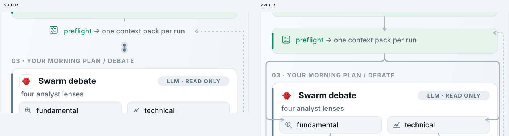

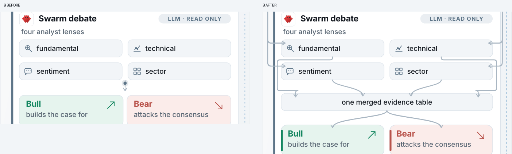

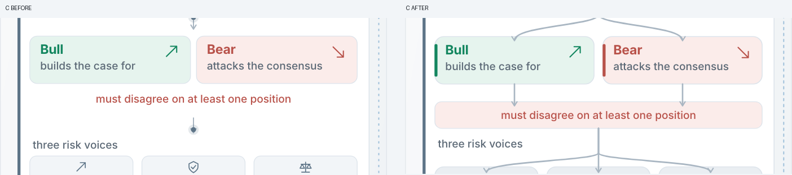

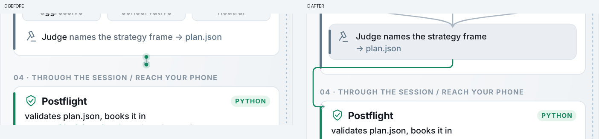

回流虚线保留其“下一次 preflight”语义，明确进入 preflight 的右侧内部；没有悬空蓝点。内部密集线路取消 pulse 实例，外部主流程保持既有动效；没有新增动画或交互。

## 六图逐项汇总

“修了几处”按旧线端点/扇出条目计数，不是肉眼重叠次数；文字相交没有被虚增。

| 图 / 图片 commit | 修了几处 | 改了什么 | 高度 before→after / 最小同层净距 | 新文字相交 / 坏终点 / 扇出错误 |
| --- | --- | --- | --- | --- | --- |
| decision-pipeline / `e32fda258` | 12 端点 + 2 扇出 | A：preflight 分给四 lens；B：四 lens→merged table→Bull/Bear 两目标；C：两案→可见 opposition 规则→三 risk 目标；D：judge→postflight 绕章节；回流接入 preflight，圆角、减少密集区光点 | 2767→2935 / 8 | 0 / 0 / 0 |
| information-flow / `c1b5264e8` | 14 端点 + 0 扇出 | preflight 变成实节点；保留三分叉下移；14 个箭头入框，watchdog 上行进入 Deliver | 2056→2090 / 8 | 0 / 0 / 0 |
| architecture / `3e302529b` | 13 端点 + 0 扇出 | 两处跨标题交接走圆角外侧通道；13 个箭头入框；回流进入 evidence，保持回流与竖排说明 13 单位距离 | 1472→1472 / 6 | 0 / 0 / 0 |
| harnesses / `1774f4cea` | 12 端点 + 0 扇出 | 全部交接接上；两个交付箭头指向具体操作 glyph；嵌 PNG 改为明确标注的矢量队列概览、控制说明两列 | 2217.04→2080 / 12 | 0 / 0 / 0 |
| debate-flow / `abda81880` | 12 端点 + 1 扇出 | analysts 明确分到 Bull/Bear；两案连到 opposition；risk 三目标逐一分配，章节绕行、圆角 | 1296→1296 / 10.00 | 0 / 0 / 0 |
| product-architecture / `d25c4e3aa` | 5 端点 + 0 扇出 | 五条方向箭头进入 runtime/package/instance 或具体 contract 卡；保留三层构图及原图标 | 1178→1178 / 18 | 0 / 0 / 0 |

正文/图标互相相交、内容出 viewBox、装饰路径压字、pulse 扫字也逐图为 0。完整 y 间距分布、每条端点与目标 bbox、最小文字距离、path 分类和最小框距见 [改前测量](before-measurements.json)、[改后测量](after-measurements.json)。同类文字 y 分布不是“跨字阶的正文行距”，没有据此误改字号。

## N→0 原始输出与复现

[改前完整 stdout（含每个 END 条目）](before-output.txt) / [改后完整 stdout](after-output.txt)。输出如下（保留汇总行）：

```text
decision-pipeline: text-intersections=0 invalid-endpoints=12 undeclared-edges=12 fanout-errors=2 halo-intersections=0 min-gap=8.00 outside=0 text-overlaps=0 icon-overlaps=0 decorative-path-hits=0
information-flow: text-intersections=0 invalid-endpoints=14 undeclared-edges=14 fanout-errors=0 halo-intersections=0 min-gap=8.00 outside=0 text-overlaps=0 icon-overlaps=0 decorative-path-hits=0
architecture: text-intersections=0 invalid-endpoints=13 undeclared-edges=13 fanout-errors=0 halo-intersections=0 min-gap=6.00 outside=0 text-overlaps=0 icon-overlaps=0 decorative-path-hits=0
harnesses: text-intersections=0 invalid-endpoints=12 undeclared-edges=12 fanout-errors=0 halo-intersections=0 min-gap=12.00 outside=0 text-overlaps=0 icon-overlaps=0 decorative-path-hits=0
debate-flow: text-intersections=0 invalid-endpoints=12 undeclared-edges=12 fanout-errors=1 halo-intersections=0 min-gap=10.00 outside=0 text-overlaps=0 icon-overlaps=0 decorative-path-hits=0
product-architecture: text-intersections=0 invalid-endpoints=5 undeclared-edges=5 fanout-errors=0 halo-intersections=0 min-gap=18.00 outside=0 text-overlaps=0 icon-overlaps=0 decorative-path-hits=0
TOTAL: 71 acceptance violations
```

```text
decision-pipeline: text-intersections=0 invalid-endpoints=0 undeclared-edges=0 fanout-errors=0 halo-intersections=0 min-gap=8.00 outside=0 text-overlaps=0 icon-overlaps=0 decorative-path-hits=0
information-flow: text-intersections=0 invalid-endpoints=0 undeclared-edges=0 fanout-errors=0 halo-intersections=0 min-gap=8.00 outside=0 text-overlaps=0 icon-overlaps=0 decorative-path-hits=0
architecture: text-intersections=0 invalid-endpoints=0 undeclared-edges=0 fanout-errors=0 halo-intersections=0 min-gap=6.00 outside=0 text-overlaps=0 icon-overlaps=0 decorative-path-hits=0
harnesses: text-intersections=0 invalid-endpoints=0 undeclared-edges=0 fanout-errors=0 halo-intersections=0 min-gap=12.00 outside=0 text-overlaps=0 icon-overlaps=0 decorative-path-hits=0
debate-flow: text-intersections=0 invalid-endpoints=0 undeclared-edges=0 fanout-errors=0 halo-intersections=0 min-gap=10.00 outside=0 text-overlaps=0 icon-overlaps=0 decorative-path-hits=0
product-architecture: text-intersections=0 invalid-endpoints=0 undeclared-edges=0 fanout-errors=0 halo-intersections=0 min-gap=18.00 outside=0 text-overlaps=0 icon-overlaps=0 decorative-path-hits=0
TOTAL: 0 acceptance violations
```

改前目录可从 `72d01443d0f9` 的 `site/assets` 导出，保持原行号。浏览器工具使用本机已有 Python Playwright/lxml 和单引擎 WebKit；不引入产品运行依赖，也不依赖 SVG 外部资源。

```sh
python3 site/tools/audit_readme_diagrams.py --assets /path/to/baseline/assets --legacy-targets docs/design/hero-diagrams-2026-10-03/iteration-2/baseline-targets.json --output before.json
python3 site/tools/audit_readme_diagrams.py --output after.json
python3 site/tools/build_readme_diagrams.py --check
python3 -m pytest tests/test_readme_diagrams.py -q
```

若工具环境预装的 WebKit revision 与 Playwright 包默认不同，使用 `--webkit-executable` 指向已安装的 launcher；不必为本任务下载第二引擎。测试为定向 **5 passed**；全量交由 PR CI，不能用本机截图替代 CI。

## 六组手机对比与深浅背景

实测 375px viewport / **343 CSS px** 内容宽，2× Retina。使用 README 原有 `<p align="center">`，配合文档 `max-width:100%`，源为实际自包含 SVG；没有把 600px 桌面图缩成手机证据。各栏 PNG 宽 686 设备像素，截图中字体仍是向量 SVG 在当前宽度的实际输出。截图的既有 SMIL 相位随 IMG 加载时刻变化，重点验收不依赖某一帧；路径和光点全相位已由脚本量化。

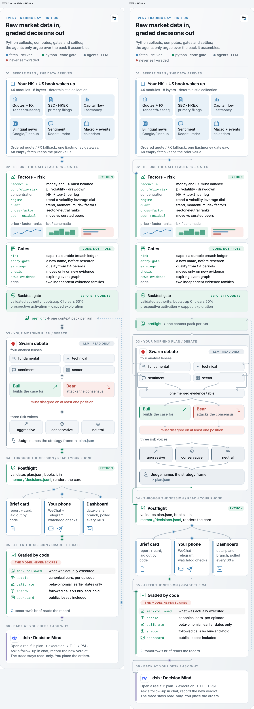

[同图深色页面、手机原始截图](decision-pipeline-dark.png)

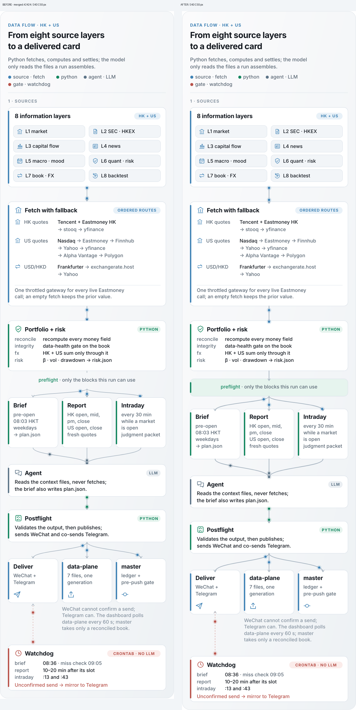

[同图深色页面、手机原始截图](information-flow-dark.png)

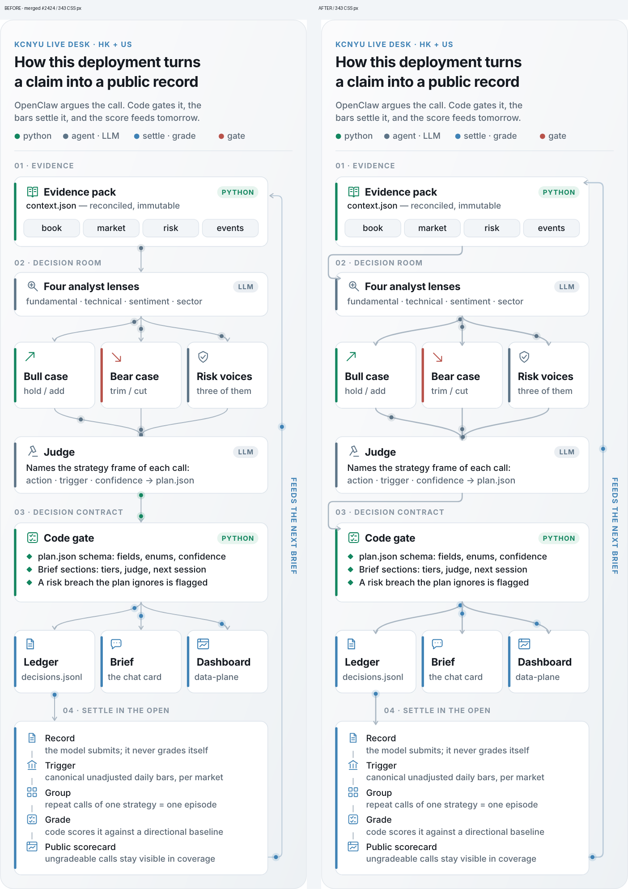

[同图深色页面、手机原始截图](architecture-dark.png)

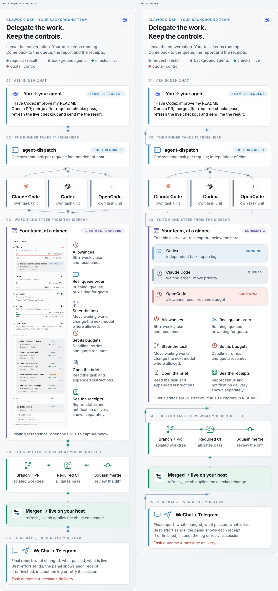

[同图深色页面、手机原始截图](harnesses-dark.png)

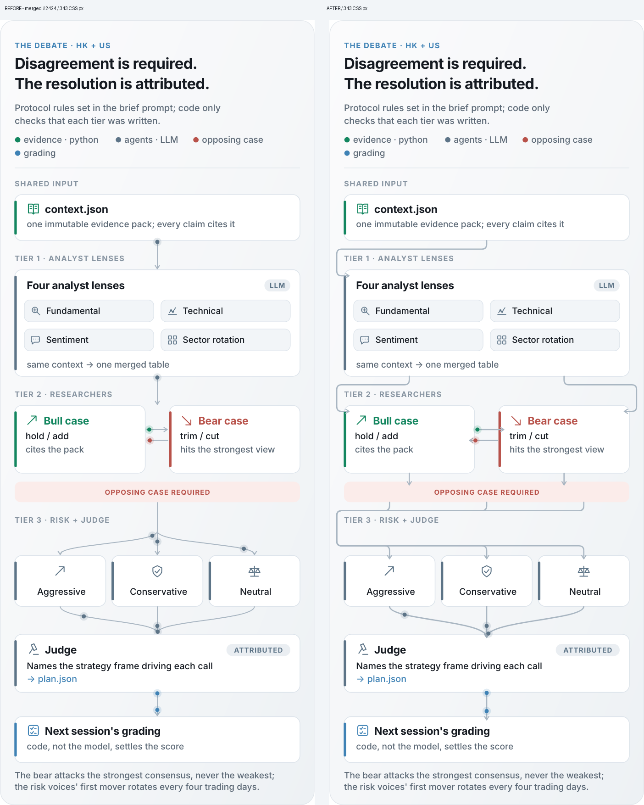

[同图深色页面、手机原始截图](debate-flow-dark.png)

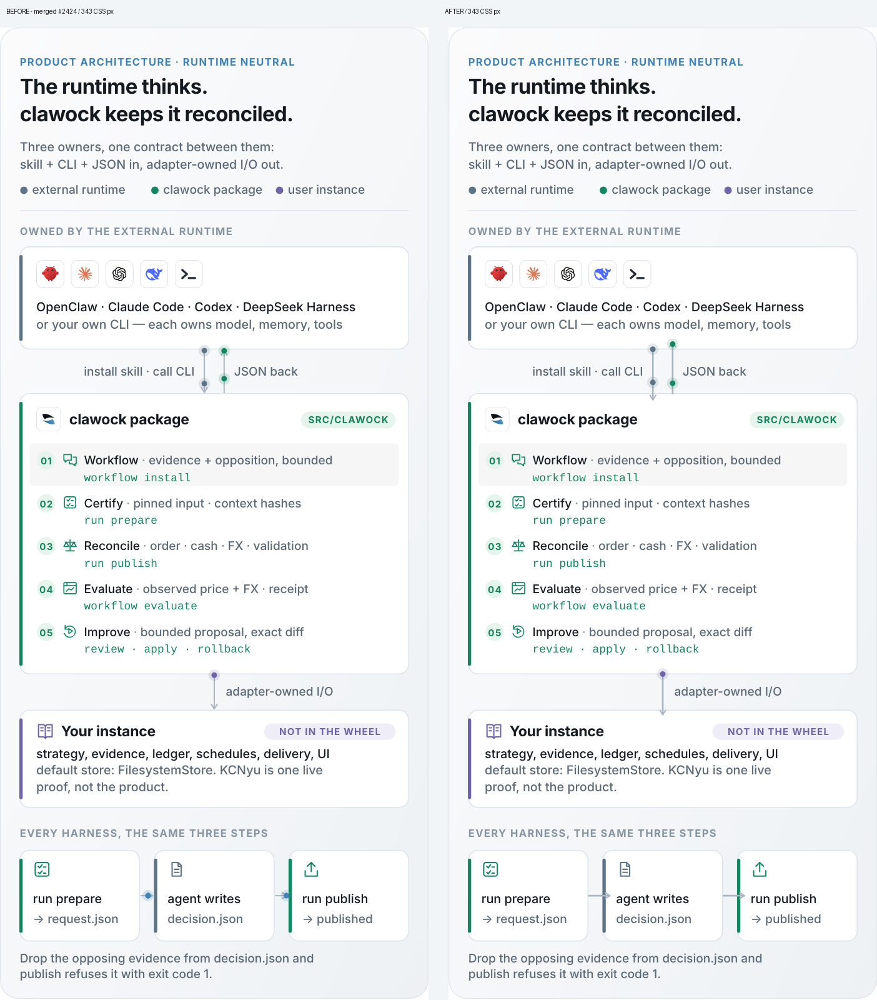

[同图深色页面、手机原始截图](product-architecture-dark.png)

深色页面保持浅色插图：背景是原本的实色 pearl，而不是透明白字；本轮没有改变主题策略。下图为六张实际手机深底截图的概览，逐图原图由上面的链接打开。

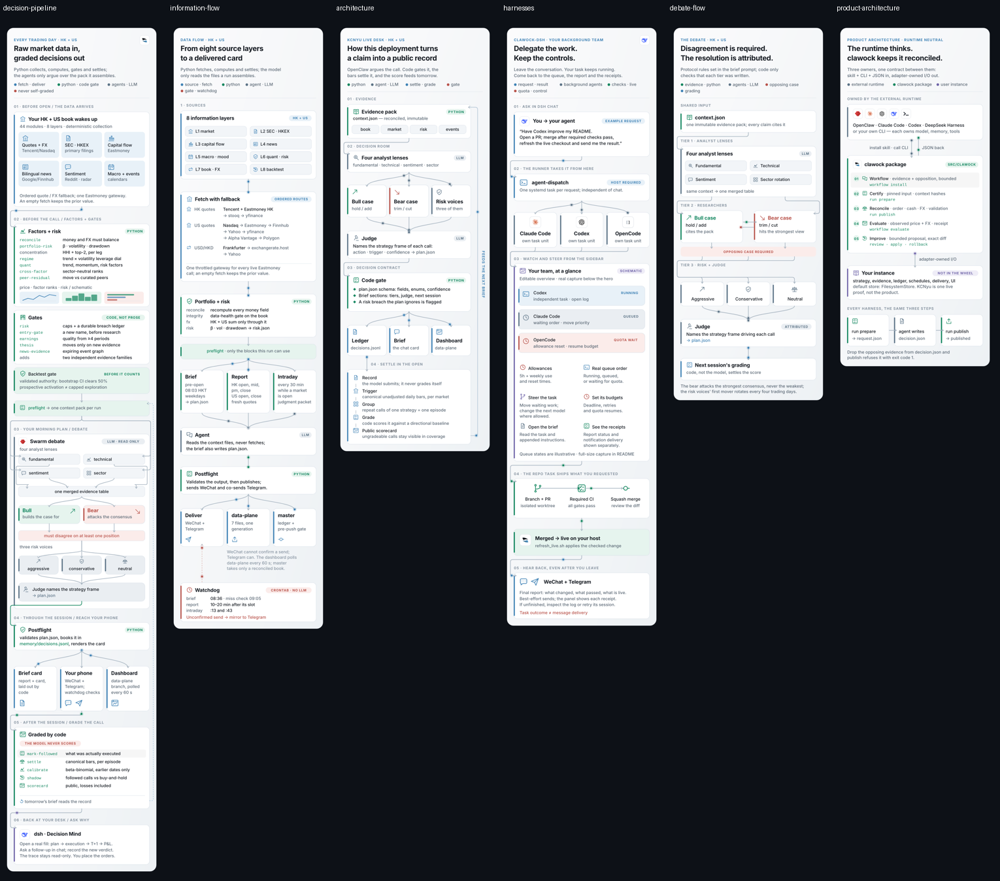

**已实测：** 默认字体 343px、Inter 343px、Arial 600px 三组所有验收为 0；[Inter 输出](inter-output.txt)、[Arial 输出](arial-output.txt)及[字体检查汇总](font-checks.json)在同目录。600px 截图逐图生成，作为字体与空间验收的补充。600px 的正文约 16.7–17.3 CSS px；手机整图缩放后约 9.6–9.9 CSS px，仍需打开原 SVG 放大细读。没有缩字、SVG filter 或位图字形。未做真机全浏览器/全字体测试，不能将 WebKit 结果等同所有手机环境。

## 加了什么 / 牺牲了什么

| 加了什么 | 牺牲与控制 |
| --- | --- |
| preflight 与 judge 成实节点；merged table / opposition 构成可追踪的中间层；四 lens、双案、三 risk 均有独立目标 | decision 高度 2767→2935，语义连接 12→27；接受增加局部面积，避免缩字或删原规则。新密集分支没有 pulse，减少视觉噪声 |
| 主线 1.5→2；辅助回流仍 1.5 + 虚线；章节绕行用 8 单位圆角，角色卡沿用 rx12 / 原色条 | 线比首轮明显，但所有目标在框内有小段可见入线；线路统一最后绘制，不能靠白卡遮掉末段伪装干净 |
| Bull/Bear、risk/judge 的角色层次用既有 tint / accent，preflight 为既有绿；harness 控制 glyph 统一 22 单位槽位和 1.7 round stroke | 不增加新主色，不给每行加图标；文字、箭头方向、形状与语义标签重复编码，颜色不是唯一信息载体 |
| harness 的可编辑 schematic + 两列控制说明，取消 hero 内嵌位图 | hero 不再是完整产品实拍，明确写 SCHEMATIC / illustrative；原 README 完整实拍与其入口保留，细节移到其合适的展示尺寸 |

## 嵌入 PNG 的明确结论

本轮选定并落实：**hero 改为自绘可编辑矢量概览，原始真实截图保留为 README 的独立完整实拍入口**。不是待决建议，也不是伪造界面。

`harnesses.svg` **468,879→43,317 bytes（减少 90.8%）**，不再包含 `<image>` 或 base64 位图，高度 2217.04→2080。没有改动 `site/assets/dsh-dispatch-queue.png` 的 800×2618 原实拍，也没有外部资源引用、重新描摹商标或降采样后再放大。代价是 hero 不供核对逐像素 UI；完整实拍承担这一用途。

## 研究、skillhub 与 GitHub 能力（复用首轮已核验结果）

首轮已经完成要求的 skillhub 实跑和网页研究，本轮沿用 [完整研究与许可记录](../README.md#skillhub-检索结果)，没有为扩大改动重新挑视觉风格。实跑 `skillhub search svg diagram design` 和 `skillhub search 排版 architecture diagram` 未发现专门匹配本任务的设计 skill；fallback 候选 inspect 返回 Skill not found，未安装无关 skill；已应用本机 emil-design-eng 的留白、主次、克制原则。

2026 架构图文章强调模型/源为真值、分层 flow 和读者导向；C4 的方向/边界/图例、annotated flow 的步骤节奏适用于本轮。NN/g 图标可用性与 heavy icons + minimal categorisation 的反例提醒不要往每个文本项塞图标。本轮采用可追踪分叉、显式中间节点、圆角流线与可编辑 schematic；保持原图的单列叙事。来源外链留在首轮仓库文档，PR 正文不放第三方 URL 或跨仓引用。

GitHub README 的 SVG IMG 与 Markdown 内嵌 SVG markup 是不同环境：首轮 raw 实测字节未 strip，内部 CSS / use / symbol 的浏览器 IMG 探针有效；外部 CSS/图片/字体受 IMG 安全环境限制，currentColor 不继承网页颜色。本轮继续 **inline 几何、显式现有色板**；六 hero 没有 symbol/use、没有新外依赖。原创 schematic 的 rect/path/circle 沿用项目 MIT；现有品牌图形及 attribution 原样内联，没有新导出或仿制商标。

## 可核验边界与交付

没有三项判据互相冲突：标题绕行的代价是明确的侧边通道，新增中间层的代价是 decision 多 168 单位高度；均在原构图/色板/字体内实现。六图已有 builder，本轮没有提出或新建无关生成管线。没有更改投资、投递、队列或执行逻辑。

本报告与六组截图是提交内的验收证据。PR required CI、作者自审、合并和本机刷新状态以最终交付消息为准；不能用旧首轮 4,778 tests 或旧 CI 替代本轮 head 的检查。
