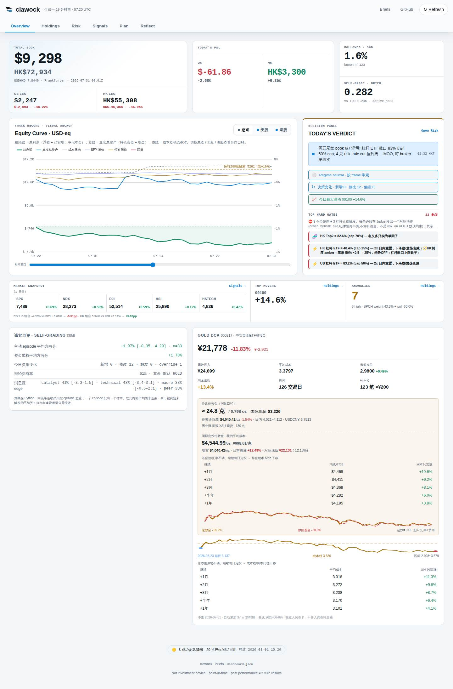
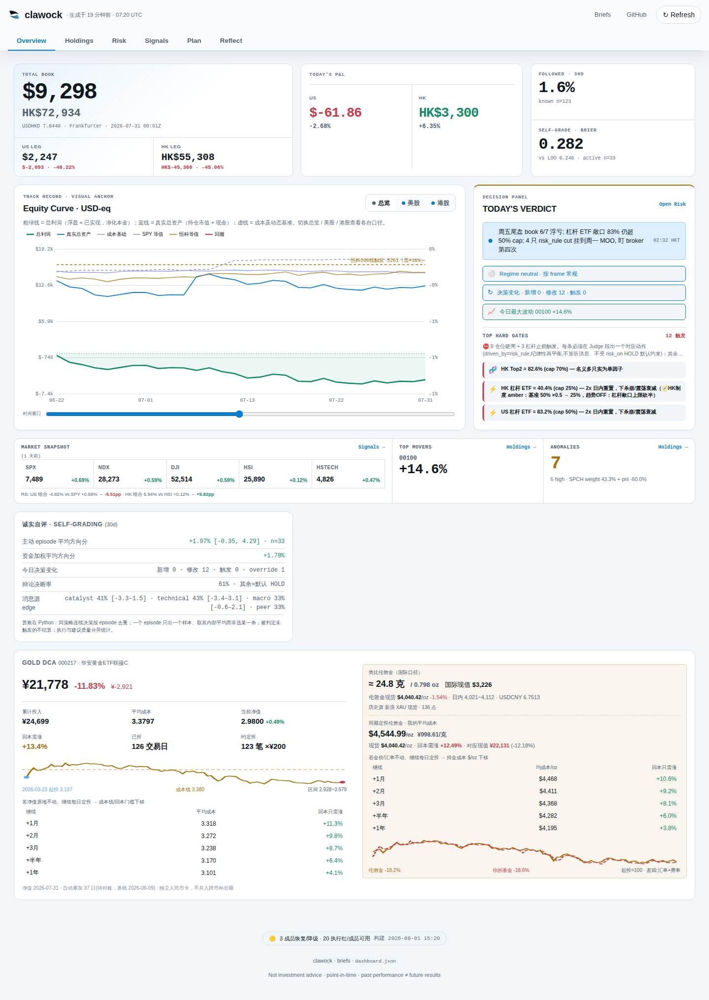
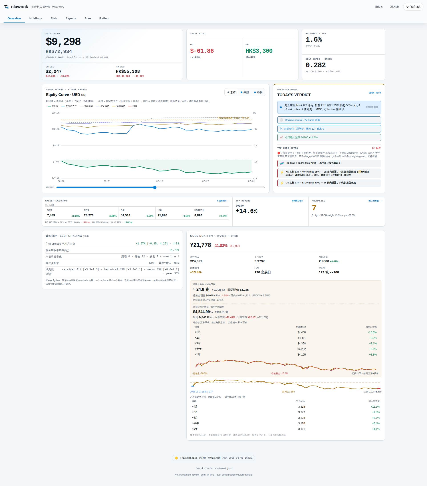
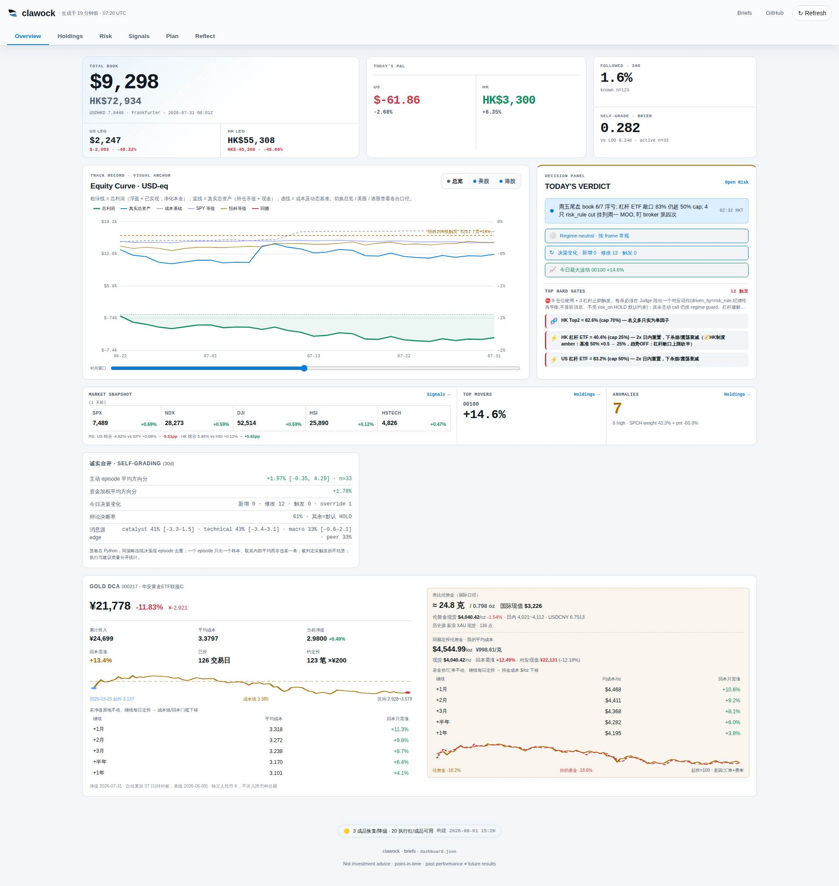
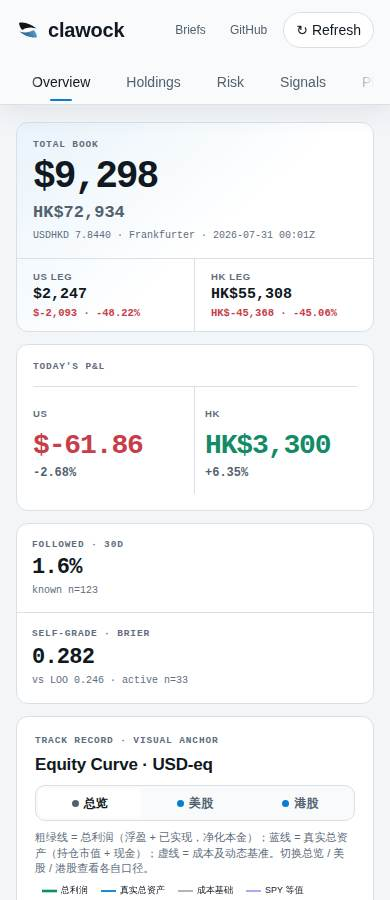

# Issue #206 · Overview Gold DCA desktop composition

Captured locally from the committed dashboard payload with Chromium at CSS-pixel
viewports. The before capture restores the previous `5 / 7` card rule; the after
capture uses this change. Device scale factor is 1 and the page reports no
horizontal overflow (`scrollWidth == clientWidth`) at every measured width.

| Viewport | Before geometry | After geometry |
|---|---|---|
| 1440×900 | self-grade `567×265` at `(28,1060)`; Gold `801×946` at `(611,1060)`; lower-left void `681px` tall | self-grade unchanged; Gold `1384×508` at `(28,1341)` |
| 1920×900 | self-grade `634×265` at `(188,1055)`; Gold `894×946` at `(838,1055)`; lower-left void `680px` tall | self-grade unchanged; Gold `1544×508` at `(188,1336)` |
| 390×900 | self-grade `358×334`; Gold `358×994`; document width `390` | unchanged: self-grade `358×334`; Gold `358×994`; document width `390` |

## 1440px

| Before | After |
|---|---|
|  |  |

## 1920px

| Before | After |
|---|---|
|  |  |

## 390px mobile regression

The desktop media query does not apply. Card order, widths, pager behavior, and
the Gold table's horizontal-scrolling rules are unchanged.

